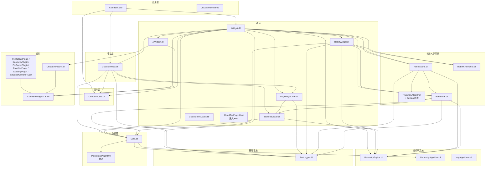
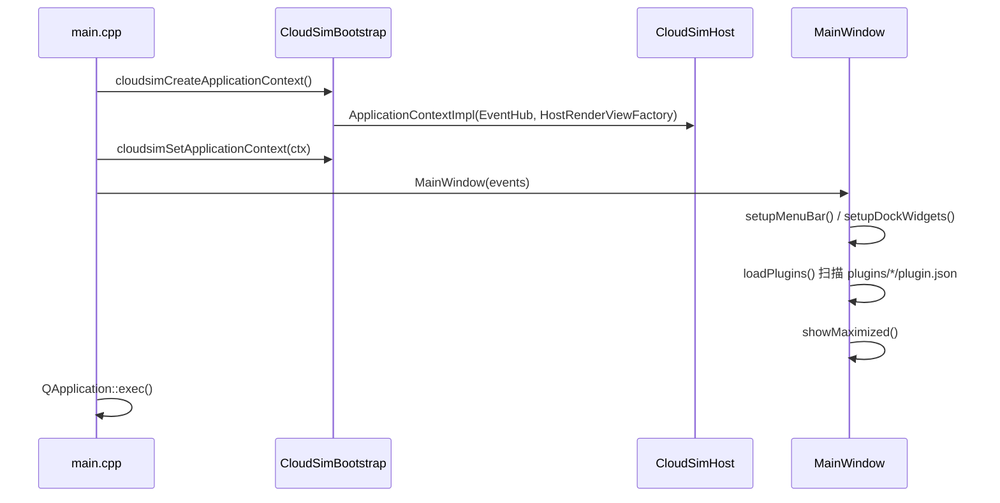
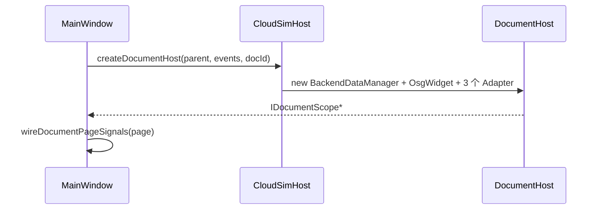
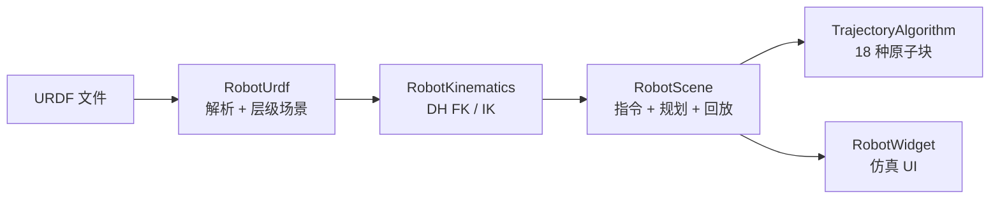
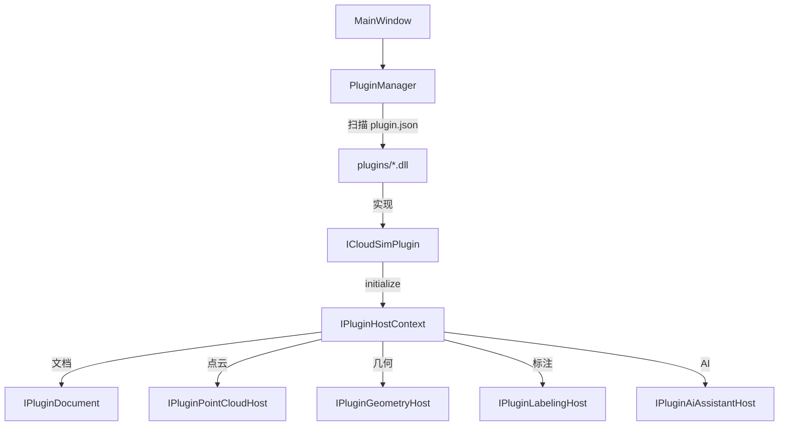

# CloudSim 架构总览

> 目录布局见 [`docs/DIRECTORY_LAYOUT.md`](docs/DIRECTORY_LAYOUT.md)；各子模块开发文档见 [`docs/MODULE_DEVELOPER_GUIDES.md`](docs/MODULE_DEVELOPER_GUIDES.md)；源码格式约定见 [`docs/SOURCE_CONVENTIONS.md`](docs/SOURCE_CONVENTIONS.md)；文档索引见 [`docs/README.md`](docs/README.md)；空间坐标契约见 [`docs/spatial_contract_world_pose.md`](docs/spatial_contract_world_pose.md)。

---

## 1. 系统定位

CloudSim 是面向工业机器人仿真的桌面应用，核心能力：

| 能力域 | 说明 |
|--------|------|
| 三维场景 | OSG 渲染、拾取、gizmo 变换、标注 |
| 机器人 | URDF 导入、DH FK/IK、指令编程、轨迹规划与回放、品牌程序导出 |
| 几何引擎 | OCC B-rep、CGAL 点云、VCG 网格后处理 |
| AI 助手 | LLM 对话、轨迹特征识别、分域专模 |
| 插件体系 | 动态加载 DLL 插件，扩展几何/点云/PLC/标注能力 |

技术栈：**Qt 5.14.2** + **OpenSceneGraph 3.6.5** + **OpenCASCADE** + **CGAL** + **Eigen** + **nlohmann/json**。

---

## 2. 分层架构



### 2.1 层次职责

| 层 | 模块 | 职责 |
|----|------|------|
| **应用** | `CloudSim.exe` | 入口、`main` 生命周期、DLL 搜索路径 |
| **应用** | `CloudSimBootstrap` | 组合根 API 头文件（实现于 Host） |
| **契约** | `CloudSimCore.dll` | 前后端解耦契约：`IDataService`、`IRenderView`、`IRobotService`、`EventHub`、DTO |
| **宿主** | `CloudSimHost.dll` | 文档宿主、Core 适配器、组合根、`OsgWidget` 编译、`CloudSimPluginHost` |
| **UI** | `Widget.dll` | 主窗口、文档页、属性面板、仿真协调；Help 菜单打开内嵌 HTML 帮助 |
| **UI** | `OsgWidgetCore.dll` | OSG 场景核心、拾取、gizmo、绑定索引 |
| **UI** | `BackendVisual.dll` | Data → OSG 分支构建策略 |
| **UI** | `RobotWidget.dll` | 仿真/设备 Dock、轨迹编辑、CAD 轨迹生成 |
| **UI** | `AiWidget.dll` | AI 助手 Dock、`AiAssistantCoordinator` |
| **数据** | `Data.dll` | 后端对象模型、属性、DAG 层级、跟随求解 |
| **机器人** | `RobotScene.dll` | 指令模型、规划、回放、轨迹流水线 |
| **机器人** | `RobotUrdf.dll` | URDF 解析、层级场景、per-link 后端 |
| **机器人** | `RobotKinematics.dll` | DH 串联 FK / 数值 IK |
| **几何** | `GeometryEngine.dll` | `RigidTransform`（Eigen）、坐标适配 |
| **几何** | `GeometryAlgorithm.dll` | OCC/CGAL 离散、求交、布尔、曲面重构 |
| **几何** | `CollisionAlgorithm.dll` | 网格碰撞（AABB+三角；可选 coal） |
| **几何** | `VcgAlgorithms.dll` | VCG 网格简化/平滑/修复/重网格 |
| **基础设施** | `RunLogger.dll` | 文件/控制台/UI 日志 |
| **插件** | `CloudSimPluginSDK.dll` | 插件 ABI：`ICloudSimPlugin`、`IPluginHostContext` |
| **插件** | `IndustrialCameraSDK.dll` | 工业相机：`ICamera`、海康/梅卡/模拟、OpenCV 板检测、手眼 Ensemble（含 MechOfficial）、位姿源 |
| **宿主** | `CloudSimHost.dll` | 文档宿主、Core 适配器、组合根、`OsgWidget` 编译、`CloudSimPluginHost` |

---

## 3. 组合根与启动流程



每文档创建时：



---

## 4. 核心接口

### 4.0.1 `ICloudSimContext`（应用上下文）

| 方法 | 说明 |
|------|------|
| `events()` | 全局 `EventHub`（UI 线程发布/订阅） |
| `renderFactory()` | `IRenderViewFactory` |
| `createDocumentScope()` | 创建文档作用域 |

### 4.1 `IDataService`（数据服务）

面向单文档的后端数据 CRUD：

| 能力 | API |
|------|-----|
| 注册 | `registerObject`、`unregisterSubtree` |
| 查询 | `findByName`、`className`、`displayName`、`listChildren` |
| 层级 | `attachChild`、`parentsOf`、`topoOrder` |
| 属性 | `propertyRows`、`applyPropertyChange` |
| 变换 | `applyWorldPoseMm`、`worldPoseMm`、`applyColor` |
| 几何 | `boundingBox`、`hasVisualBranch`、`geometryKind` |
| 序列化 | `saveObjectToJson`、`loadObjectFromJson`、`importFromFile` |
| 跟随 | `applyFollowTargetByName`、`followTargetId`、`markFollowDirtyFromMove`、`requestFollowSolveForced`、`runFollowSolveAndSync` |

### 4.2 `IRenderView`（渲染视图）

| 能力 | API |
|------|-----|
| 变换 | `setWorldMatrix`、`getWorldMatrix` |
| 可见 | `setVisible`、`removeVisual`、`hasVisualBranch` |
| 拾取 | `setPickHandler`、`setObjectSelectionMode`、`setPointPickMode` |
| 相机 | `focusCameraOnBackend`、`setCameraFollowBackendId` |
| Gizmo | `commitGizmoPoseToBackend`、`setTransformGizmoFrame` |
| TCP 示教 | `beginTcpDragTeach`、`updateTcpDragTeachFromTarget`、`endTcpDragTeach` |
| 叠加 | `setInstructionPoseAxes` / `setRawTrajectoryOverlayFrames`（万级路点：单 Geode 批点+线）、`setRawTrajectoryOverlay`、`setRobotFrameOverlays` |
| 注释 | `setAnnotationVisible`、`removeAnnotation`、`clearAllAnnotations` |

### 4.3 `IRobotService`（机器人服务）

| 能力 | API |
|------|-----|
| URDF | `registerUrdfRobot` |
| FK | `applyJointAnglesRad` |
| 规划 | `planInstruction` |
| 程序 | `robotProgramsJson` / `setRobotProgramsJson` |
| 属性 | `instructionPropertyRows` / `applyInstructionPropertyChange` |
| 轴配置 | `queryFeasibleMotionAxisOptions` |

### 4.4 `EventHub`（事件总线）

类型擦除的 UI 线程发布/订阅：

```cpp
hub.subscribe<SelectionChangedEvent>([](const SelectionChangedEvent& e) { ... });
hub.publish(SelectionChangedEvent{backendId});
```

核心事件类型（`CoreEvents.h`）：

| 事件 | 触发时机 |
|------|----------|
| `SelectionChangedEvent` | 选中对象变化 |
| `PoseCommittedEvent` | gizmo 松手 / 属性提交 |
| `BackendObjectRegisteredEvent` | 新对象注册 |
| `BackendObjectRemovedEvent` | 对象移除 |
| `ProjectLoadedEvent` | 工程加载完成 |
| `RobotKinematicsAppliedEvent` | FK 应用完成 |

---

## 5. 数据流

### 5.1 模型导入

```
用户拖放文件
  → MainWindow::registerBackendObject()
    → DocumentImportFacade::importFileIntoDocument()
      → BackendFileImport::importMeshFile()
        → MeshBackendData::loadFromFile()          [Data]
        → BackendDataManager::registerData()        [Data]
        → OsgWidget::loadMeshFromBackendData()      [OsgWidgetCore]
      → publishBackendObjectRegistered()             [EventHub]
    → MainWindow 订阅 → refreshBackendTree()
```

### 5.2 机器人 FK

```
用户拖动关节滑块
  → RobotSimulationController::onRobotAxisJointAnglesChanged
    → IRobotDocumentHost::applyJointAnglesRad
      → doc->robot().applyJointAnglesRad()              [IRobotService]
        → RobotSceneKinematics::applyJointAnglesForInstance()
          → applyJointAnglesViaLinkBackends()           [Mat4 ↔ OSG 仅在 PoseSink/OsgWidget]
          → IRobotSimulationDocument::notifyRobotKinematicsAppliedToScene()
            → 脏集标记（连杆 + 场景根）
            → data().runFollowSolveAndSync()            [同步求解并清空脏集]
        → publishRobotKinematicsApplied()               [EventHub]
```

**跟随求解约定（2026-07）**

| 项 | 约定 |
|----|------|
| FK 后跟随 | 仅在 `notifyRobotKinematicsAppliedToScene` 内同步求解一次；`RobotServiceAdapter` 不再二次 `notify` |
| per-frame hook | 仅兜底 gizmo 拖动 / 属性 dirty / `requestFollowSolveForced`；FK 路径已清空脏集则跳过 |
| `basePlacementWorld` | 默认 `PlanContextDto::identityMat4()`；禁止 `Mat4{}` 全零（否则 FK/跟随目标坍缩） |
| URDF 位姿所有权 | `sourceType=URDF` 连杆禁止作 Follow follower；求解前 `stripKinematicsOwnedFollowAttachments` |

### 5.3 属性编辑

```
用户编辑属性面板
  → QtVariantPropertyManager::valueChanged
    → MainWindow::onVariantPropertyValueChanged()
      → doc->data().applyPropertyChange(id, key, value)  [IDataService]
        → BackendDataBase::applyPropertyChange()
        → BackendVisualSync::afterDataServicePropertyChange()
          → OsgWidget::syncOuterPatFromBackend()
          → publishPoseCommittedFromBackend()         [EventHub]
```

`follow.*` 属性变更另经 `afterFollowPropertyEdited` 反算 local 并脏标记；由属性提交或 per-frame hook 触发 `runFollowSolveAndSync`。

### 5.4 品牌程序导出

```
用户点击 Export
  → BrandProgramExportDialog（选程序 + 品牌）
  → 选最终程序路径
  → RobotCanonicalProgramExport（Canonical v1 紧凑 JSON，不做万级全量 IK）
  → PythonScriptCaller → resource/Python/ExportPython/{Brand}Export.py
```

支持品牌：ABB / AIR / FANUC / INOVANCE / LineHeating / ROKAE。设计文档：[`docs/_archive/机器人程序品牌导出/`](docs/_archive/机器人程序品牌导出/)。

---

## 6. 子系统

### 6.1 机器人子系统



**指令模型**：`RobotInstruction::Base` 派生类型：

| 指令 | 说明 |
|------|------|
| `PtpInstruction` | 点到点运动 |
| `LineInstruction` | 直线运动 |
| `WaitInstruction` | 等待 |
| `IfInstruction` / `WhileInstruction` | 逻辑流 |
| `SetDigitalOutputInstruction` / `SetAnalogOutputInstruction` | I/O 控制 |
| `PathPlanInstruction` | 轨迹规划（含流水线） |

**轨迹流水线**：`ITrajectoryOp` → `TrajectoryPipelineEngine` 链式处理 `UnifiedTrajectory`。

18 种原子块：`Translate`、`Rotate`、`Mirror`、`Delete`、`Duplicate`、`Reorder`、`Approach`、`Retract`、`Resample`、`OffsetAlongNormal`、`OffsetLateral`、`SmoothPose`、`AssignBlend`、`AssignSpeedZone`、`Weave`、`ReachabilityFilter`、`ExternalAxisSearch`、`ProjectToGeometry`。

**品牌导出**：`RobotScene` 产出 Canonical v1 → `RobotWidget` 经 pybind 调用品牌脚本；编排在 `RobotSimulationController`。

### 6.2 几何子系统

| 模块 | 底层库 | 能力 |
|------|--------|------|
| `GeometryEngine` | Eigen | `RigidTransform`、坐标适配（OSG 行 ↔ Eigen 列） |
| `GeometryAlgorithm` | OCC + CGAL | B-rep 离散/求交/布尔、曲面重构、特征识别 |
| `CollisionAlgorithm` | 内置（可选 coal） | 多体 mesh 碰撞、安全余量、ACM 排除；几何取自后端 Mesh/B-rep |
| `PointCloudAlgorithm` | CGAL | 点云下采样/裁剪/法线/ICP/重建 |
| `VcgAlgorithms` | VCGlib | 网格简化/平滑/修复/重网格 |

### 6.3 插件体系



**ABI 稳定性**：`IPluginHostContext` vtable 仅追加；版本门控 `hostVersion()`；插件仅链接 `CloudSimPluginSDK.dll`。

当前宿主版本：`0x00011000` = 1.16.0。

### 6.4 AI 助手

| 组件 | 说明 |
|------|------|
| `CloudSimAiSDK.dll` | AI 插件 ABI、分域 Handler |
| `AiWidget.dll` | AI Dock UI、`AiAssistantCoordinator` |
| `ai_config.json` | LLM 端点与模型配置 |
| 轨迹特征 | `trajectory.feature` 会话 → CAD 特征识别 → 轨迹规划 |

### 6.5 工程持久化（v4）

工程文件格式：`.pcp`（zip 包含 `project.json` + `objects/*.ply` + `*.brep`）。

`project.json` 结构：

| 字段 | 说明 |
|------|------|
| `version` | 固定 `4` |
| `componentsSchemaVersion` / `language` | 组件 schema、语言快照 |
| `objects[]` | 后端对象数组（含 `id`、`className`、`pose`、`rotation`、`worldMatrix`、`propertyBag`、`components[]`、`geometry`） |
| `edges[]` | 父子关系边 |
| `robotKinematics` | 机器人运动学快照 |
| `robotKinematicsInstances[]` | per-link 关节角 |
| `robotPrograms` | 机器人程序 JSON |
| `robotCollision` | 碰撞设置（有机器人时） |
| `annotations[]` | 标注快照 |
| `camera` | 相机状态 |
| `processFlow` | 工艺流程图侧车（空图不写；插件 `com.cloudsim.processflow`） |
| `geometricModeling` | 几何建模 UI 态侧车（如 `activeBodyId`；Body 在 `objects[]`） |

侧车键登记与空写策略：[docs/后端对象与软件模式/DESIGN_后端对象与软件模式.md](docs/后端对象与软件模式/DESIGN_后端对象与软件模式.md) §3。

### 6.6 工作区模式 vs 后端对象

| 概念 | 含义 |
|------|------|
| **Workspace mode** | `IPluginHostContext::claimWorkspaceMode(modeId)`：工艺流程 / 几何建模等与默认三维 **互斥切换 UI**（中央页、侧栏、Ribbon） |
| **Backend 对象** | `Data` 场景真源；类型由 `BackendRegistry` 的 **className** 决定，与当前 UI 模式无关 |

**强制约定：** Mode ≠ Backend 类型过滤器。切模式不得卸载他模式对象；开工程须完整恢复 `objects[]` 与已登记侧车。工艺图 / DES **不**派生 `BackendDataBase`；参数化 Body 用内置 `ParametricBrepModel`。类型三键与侧车键代码真源 [BackendTypeIds.h](src/Contracts/CloudSimCore/inc/BackendTypeIds.h)；说明见 [Data/DEVELOPER_GUIDE.md](src/Data/Data/DEVELOPER_GUIDE.md) §4.0；专题 [docs/后端对象与软件模式/](docs/后端对象与软件模式/)。

---

## 7. 空间坐标契约

> 权威说明：[`docs/spatial_contract_world_pose.md`](docs/spatial_contract_world_pose.md)

| 要点 | 约定 |
|------|------|
| `pose` | 模型坐标原点在世界中的位置 (mm) |
| `rotation` | 内禀 ZYX 内旋（`R=Rz·Ry·Rx`）；主动旋转 |
| 变换 | `p_world = R×p_model + pose`（列向量） |
| 几何 | `geometry` 存世界绝对坐标 |
| 权威 API | `engine::rigidTransformFromBackendPoseEuler` / `backendPoseEulerFromRigidTransform` |
| URDF per-link | q0 单次 Tbind 烘焙顶点；FK：`M = M0·inv(T0)·Tq·P`；禁止双重烘焙 |
| `core::Mat4` / `BackendMat4` | 列主序 `index = c*4+r`；与 OSG 互转禁止 `osg::Matrixd::ptr()` 行主序直拷 |
| DocumentPage FK 绑定 | `fkMeshWorldT0` / `outerWorldAtBind` / `basePlacementWorld` 存 `core::Mat4`；OSG 切片仅 `RobotPerLinkKinematicsSliceOsg.h` |

---

## 8. DLL 导出约定

| 工程 | x64 产物 | 构建时定义 | 导出宏 |
|------|---------|-----------|--------|
| RunLogger | `RunLogger.dll` | `RUN_LOGGER_LIB` | `RUN_LOGGER_API` |
| GeometryEngine | `GeometryEngine.dll` | `GEOMETRY_ENGINE_LIB` | `GEOMETRY_ENGINE_API` |
| RobotKinematics | `RobotKinematics.dll` | `ROBOT_KINEMATICS_LIB` | `ROBOT_KINEMATICS_API` |
| RobotUrdf | `RobotUrdf.dll` | `ROBOT_URDF_LIB` | `ROBOT_URDF_API` |
| RobotScene | `RobotScene.dll` | `ROBOT_SCENE_LIB` | `ROBOT_SCENE_API` |
| BackendVisual | `BackendVisual.dll` | `BACKENDVISUAL_LIB` | `BACKENDVISUAL_EXPORT` |
| OsgWidgetCore | `OsgWidgetCore.dll` | `OSGWIDGETCORE_LIB` | `OSGWIDGETCORE_EXPORT` |
| Data | `Data.dll` | `DATA_LIB` | `DATA_EXPORT` |
| Widget | `Widget.dll` | `WIDGET_LIB` | `WIDGET_EXPORT` |
| CloudSimHost | `CloudSimHost.dll` | `CLOUDSIM_HOST_LIB` | `CLOUDSIM_HOST_EXPORT` |
| CloudSimCore | `CloudSimCore.dll` | `CLOUDSIM_CORE_LIB` | `CLOUDSIM_CORE_EXPORT` |
| CloudSimPluginSDK | `CloudSimPluginSDK.dll` | `PLUGIN_SDK_LIB` | `PLUGIN_SDK_EXPORT` |
| IndustrialCameraSDK | `IndustrialCameraSDK.dll` | `INDUSTRIAL_CAMERA_SDK_LIB` | `INDUSTRIAL_CAMERA_SDK_EXPORT` |
| PointCloudAlgorithm | `.lib`（静态） | `POINT_CLOUD_ALGORITHM_STATIC` | — |
| TrajectoryAlgorithm + Builtins | `.lib`（静态） | `TRAJECTORY_ALGORITHM_LIB` | — |
| CloudSimUiAssets | `.lib`（静态） | `UIASSETS_LIB` | `UIASSETS_EXPORT` |

---

## 9. 构建配置

### 9.1 统一输出目录（x64）

根目录：仓库根（`CGAL5.5.2\`，即 `CloudSim\` 的上一级），由 [`Directory.Build.props`](Directory.Build.props) 定义：

| 属性 | Debug\|x64 | Release\|x64 |
|------|------------|--------------|
| `$(CloudSimRepoRoot)` | `$(MSBuildThisFileDirectory)..\`（仓库根） | 同左 |
| `$(CloudSimBinDir)` | `bin\x64d\` | `bin\x64\` |
| `$(CloudSimIntRoot)` | `bin\x64dmiddle\` | `bin\x64middle\` |

工程约定：

| 类型 | OutDir | IntDir |
|------|--------|--------|
| 普通 DLL / LIB / EXE | `$(CloudSimBinDir)` | `$(CloudSimIntRoot)<工程名>\` |
| 插件 | `$(CloudSimBinDir)plugins\<plugin.id>\` | `$(CloudSimIntRoot)<工程名>\` |

- **禁止** x64 产物路径依赖 `$(SolutionDir)../bin`（单独编 `.vcxproj` 时易落到 `src/Plugins/bin` 等错误目录）。
- 产物直接链出到上述目录；**不**再「编到别处再拷到 bin」。
- 保留的 PostBuild 仅用于 sidecar / 第三方运行时（如 `plugin.json`、`plctag.dll`、MechEye/OpenCV DLL），不是本工程 DLL 二次搬迁。
- 调试工作目录：`bin\x64d\` 或 `bin\x64\`。

### 9.2 第三方 SDK 路径

头文件、库目录、SDK 源文件引用统一为：

```text
$(CloudSimRepoRoot)bin\SDK\<包名>\...
```

例如 OSG、OCCT、Eigen、onnxruntime、python311、`libplctag-2.6-vc14-64` 等。

**属性求值顺序**：`Directory.Build.props` 经 `Microsoft.Cpp.props` 导入后才有 `CloudSimRepoRoot`。自定义宏（如 `LibPlcTagRoot`）须写在 **`Import Microsoft.Cpp.props` 之后**，不可放在文件最顶部。

### 9.3 其它

- 推荐生成顺序：`CloudSimCore` → `Data` → `CloudSimHost` → `Widget` → `CloudSim`
- 源码格式：UTF-8 with BOM + CRLF；头卫 `工程名_文件名_H`；详见 [`docs/SOURCE_CONVENTIONS.md`](docs/SOURCE_CONVENTIONS.md)
- VS 筛选器：两层 `inc` / `src`，按功能分子组
- 筛选器日常同步：`python scripts/generate_vcxproj_filters.py --sync --project <工程名>`（新增源文件后必做）；全量按功能重分类用 `--full`
- 目录说明亦见 [`docs/DIRECTORY_LAYOUT.md`](docs/DIRECTORY_LAYOUT.md)；本次收口记录见 [`docs/_archive/统一VS输出目录/`](docs/_archive/统一VS输出目录/)

---

## 10. 插件宿主

`CloudSimPluginHost` 源码编入 `CloudSimHost.dll`（非独立 DLL；`CloudSimPluginHost.vcxproj` 仅作可选单独编译参考），提供：

| 组件 | 说明 |
|------|------|
| `PluginManager` | 扫描 `plugins/*/plugin.json`、`QPluginLoader` 加载 |
| `PluginHostContext` | 实现 `IPluginHostContext`，桥接文档/场景/UI |
| `PluginSceneBridgeAdapter` | 实现 `IPluginSceneBridge`（OSG-free 场景操作） |
| `PluginDocumentAdapter` | 实现 `IPluginDocument` |

插件集成路径：

```
PluginManager::loadPlugins()
  → QPluginLoader(pluginDll)
    → qobject_cast<ICloudSimPlugin*>(instance)
      → plugin->initialize(hostContext)
        → hostContext->registerSidePanelTab(title, widget)
        → hostContext->registerDockWidget(title, widget, area)
        → hostContext->registerMenuPath(path)
```

---

## 11. 演进路线

| 阶段 | 内容 | 状态 |
|------|------|------|
| Host 收口 | Core 适配器、EventHub、导入/注册、工程 I/O | **已完成** |
| PluginHost 迁入 Host | `CloudSimPluginHost` 编入 `CloudSimHost.vcxproj` | **已完成** |
| Robot 运动学收口 | `IRobotDocumentHost` 委托 Host 实现 | **已完成** |
| per-link 收口 | `IPerLinkKinematicsHost` + `IPerLinkRobotStateAccessor` | **已完成** |
| BackendDataManager 收口 | `doc->data().topoOrder()` / `parentsOf()` | **已完成** |
| OsgWidget 双轨清理 | 删除 `Host/inc|source/osg` 平行副本；真源=`Widget/source`（编入 Host） | **已完成** |
| Follow 索引契约化 | `IDataService::followTargetId` + 反向索引经契约重建 | **已完成** |
| 基座位姿 Mat4 化 | `IRobotDocumentHost` / `IRobotUrdfImportContext` 基座与 bind 写接口改 `core::Mat4` | **已完成** |
| Host 工程 I/O 解耦 | Widget 直调 `RobotProjectIo::writeRobotKinematics`；Host 不再 include RobotWidget 写 kinematics | **已完成** |
| 视口工具栏经 render() | `DocumentPage` / 场景接线经 `IRenderView::widget()` | **已完成** |
| Host→RobotWidget 解耦 | `RobotProgramStore` 迁入 RobotScene；Host 不再链 `RobotWidget.lib` | **已完成** |
| IRobotOsgViewHost Mat4 化 | `getBackendRootWorldMatrix` / TCP teach 改 `core::Mat4` | **已完成** |
| RobotOsgUiTypes 上提 | 真源迁入 `OsgWidgetCore`；RobotWidget 保留转发头 | **已完成** |
| RobotOsgUi 去 osg | 叠加 DTO 改 `core::Vec3`/`Mat4`；OSG 仅在 `OsgWidget` 边界转换 | **已完成** |
| IRobotOsgViewHost mesh 高亮 | `showMeshTriangleHighlight` / 拟合面预览改 `core::Vec3` | **已完成** |
| IRobotSimulationDocument 去 osg | 接口仅 Core Mat4/DTO；OSG 切片迁入 `RobotPerLinkKinematicsSliceOsg.h` | **已完成** |
| IRobotBackendPoseSink Mat4 化 | get/set 世界矩阵改 `core::Mat4`；OsgWidget 保留 osg 重载 | **已完成** |
| DocumentPage FK 绑定存储 Mat4 | `HierarchicalRobotInstance` 的 T0/outer/base 改 `core::Mat4`；关节仍可持 `MatrixTransform*` | **已完成** |
| 碰撞检测一期 | `CollisionAlgorithm` + Dock 开关 + plan 抽样；后端 Mesh/B-rep 真源 | **已完成** |
| DocumentPage backend() 策略 | 保留存量白名单；新代码强制 `data()`；禁止再扩散 `BackendDataManager.h` | **策略闭环**（彻底去掉穿透 → 长期） |
| 跟随 FK 同步求解 | `notify` 内 `runFollowSolveAndSync`；`basePlacementWorld` 默认单位阵 | **已完成** |
| 跟随求解去重 | Adapter 不再二次 `notify`；per-frame hook 仅兜底 gizmo/属性/forced | **已完成** |
| 品牌程序导出 | Canonical v1 + pybind 品牌脚本（ABB/AIR/FANUC/INOVANCE/LineHeating/ROKAE） | **已完成** |
| OSG 头文件解耦 | Widget 主路径移除 OSG include（关节句柄等仍可含 `MatrixTransform*`） | 阶段 3.3-3.4 待定 |
| IRenderView 全面替代 | Widget 主路径走 `render()` | 阶段 3.3-3.4 待定 |
| RobotSimulationController 迁入 Host | 仿真编排逻辑下沉 | 长期规划 |

> **架构边界收口**（Sprint A–H）已闭环：公开契约去 osg、Host 无 `RobotWidget.lib`、OsgWidget 单轨、DocumentPage FK 存储 Mat4。  
> **跟随路径**（2026-07 回归修复）：FK → 单次 `notify` → 同步跟随求解；残余与长期项见 [`docs/_archive/架构边界收口/TODO_架构边界收口.md`](docs/_archive/架构边界收口/TODO_架构边界收口.md)、[`docs/_archive/架构边界收口/FINAL_架构边界收口.md`](docs/_archive/架构边界收口/FINAL_架构边界收口.md)。

### 11.1 新代码边界（强制）

| 层 | 允许 | 禁止（新代码） |
|----|------|----------------|
| Widget / RobotWidget UI | `doc->data()` / `render()` / `robot()` / `events()` | 直接 `#include BackendDataManager.h`（存量白名单除外：DocumentPage 运动学、`BackendSceneDocumentFacade`） |
| Host | 适配器内访问 `BackendDataManager` / `OsgWidget` | 在 `Host/osg/` 维护第二份 OsgWidget |
| OsgWidget 源码 | 仅 `src/UI/Widget/source/OsgWidget*`，由 `CloudSimHost.vcxproj` 编译 | Widget.vcxproj 再编一份；Host 下平行副本 |
| 矩阵 | `core::Mat4` 列主序 `c*4+r`；边界用 `osgMatrixFromCoreMat4` / `coreMat4FromOsgMatrix` | `osg::Matrixd::ptr()` 与 Mat4 逐元素直拷 |
