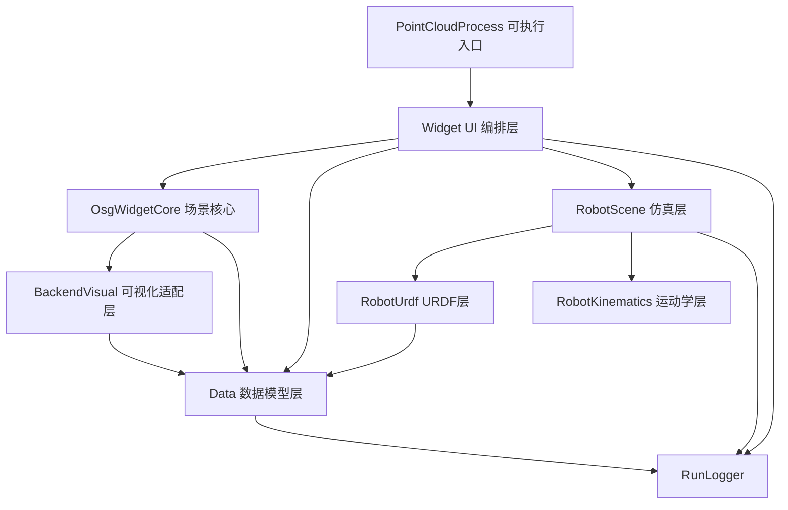
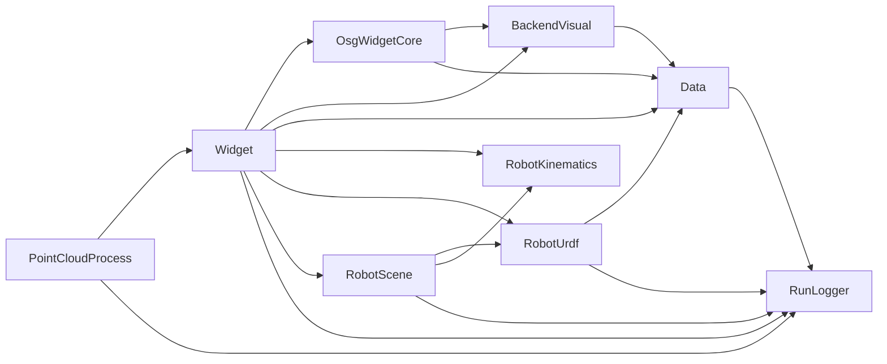
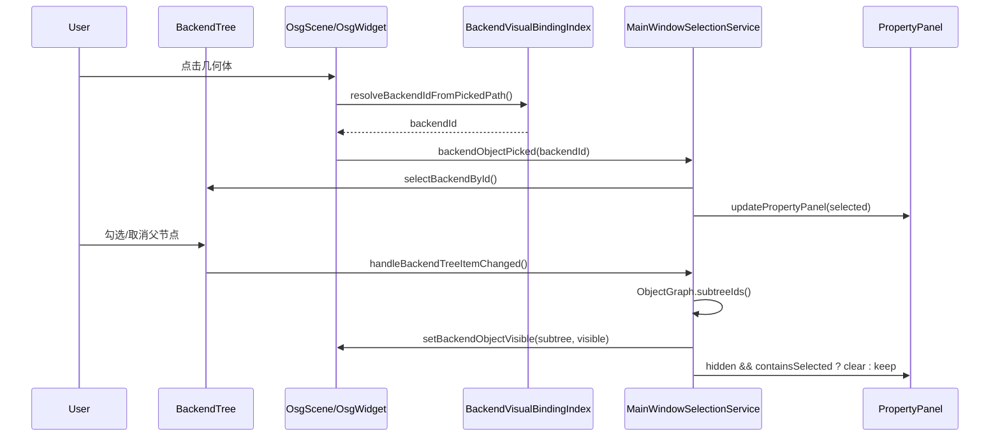

# PointCloudProcess 架构与模块总结

## 1. 项目定位

`PointCloudProcess` 是一个基于 **Qt + OSG + CGAL/OpenCascade** 的桌面端三维点云/网格处理与机器人仿真应用。  
它不是典型的 Web B/S 架构，而是 **单机 C++ 客户端**，内部采用“前端 UI + 后端数据/渲染/仿真引擎”的分层设计。

---

## 2. 前后端架构边界（本项目语义）

### 前端（UI 层）

- `Widget`：主窗口、文档页、菜单、树面板、属性面板、交互模式、仿真控制面板。
- 主要承担：用户输入、状态展示、工作流编排、跨模块协调。

### 后端（本地引擎层，不是远程服务）

- `Data`：统一后端对象模型（点云/网格）、属性系统、对象注册管理。
- `BackendVisual`：数据对象到 OSG 场景分支的可视化适配。
- `OsgWidgetCore`：与 Qt 无关的 OSG 场景核心（相机、拾取、标注、场景树）。
- `RobotKinematics`：串联机械臂运动学计算。
- `RobotUrdf`：URDF 解析与层级机器人场景构建。
- `RobotScene`：机器人指令模型、规划/回放引擎、仿真逻辑。
- `RunLogger`：运行日志基础设施。

> 结论：这是“**桌面前端 + 本地后端引擎**”架构，而非“前端 + 远程 API 服务”。

---

## 3. 总体分层视图

---

## 4. 模块级职责与当前架构

## 4.1 `PointCloudProcess`（应用入口）

- `main.cpp` 初始化 `QApplication`、Windows DLL 搜索路径、组织/应用名、日志系统。
- 创建并展示 `MainWindow`，承担应用生命周期管理（启动/退出）。
- 依赖 `Widget` 与 `RunLogger`，本身逻辑轻量，属于 bootstrap 层。

## 4.2 `Widget`（UI 与流程协调中心）

主要职责：

- 主窗口编排：菜单、停靠窗、文档标签、属性面板、运行信息面板。
- 文档隔离：`DocumentPage` 每个标签页维护独立 `BackendDataManager + OsgWidget`。
- 场景交互：对象选择、点拾取、边/面拾取、注释、变换 gizmo、主题/语言切换。
- 项目 I/O：保存/加载 `.pcp/.pcproj.json`，并打包/解包工程资源。
- 机器人仿真入口：连接指令编辑控件、轴控件与回放引擎。

当前内部子结构（已显式模块化）：

- `MainWindow.cpp`：主流程与核心逻辑（语言、仿真、同步等）。
- `MainWindowUiSetup.cpp`：窗口构造、菜单和 Dock 初始化（已拆分）。
- `MainWindowBackendTree.cpp`：后端树/场景树管理。
- `MainWindowPropertyPanel.cpp`：属性面板构建与属性同步。
- `MainWindowFileImport.cpp`：模型/点云/URDF 导入。
- `MainWindowProjectIo.cpp`：项目保存与恢复（含 sidecar/zip 打包）。
- `MainWindowImportCaptureRenderController.*`：导入捕获渲染协作控制器。
- `MainWindowSelectionService.*`：统一树选中、OSG 拾取回填、清理选择、可见性勾选传播。
- `MainWindowSelectionState.h`：`MainWindow` 侧选择状态容器（当前以 `selectedBackendId` 为真源）。
- `MainWindowObjectRepository.*`：后端对象查询门面（收敛 `activeBackend()` 调用）。
- `MainWindowObjectGraph.*`：对象层级只读关系图（节点/父子/子树查询），作为树构建与可见性传播的统一结构语义。
- `OsgWidget*.cpp`：将 Qt 事件与 OSG 场景能力做桥接。

当前 `Widget` 的关键演进点：

- 选择状态不再散落在多个 UI 事件中，而是通过 `SelectionService + SelectionState` 统一读写。
- backend 树勾选不再按 UI 节点递归推断关系，而是按 `ObjectGraph` 子树语义级联到 OSG。
- OSG 拾取得到的 backend id 会直接回填树与属性面板，形成稳定闭环。

## 4.3 `Data`（后端数据域模型）

核心设计：

- `BackendDataBase` 抽象统一对象：`id/name/className/pose/rotation/color/propertyRows`。
- `PointCloudBackendData`、`MeshBackendData` 提供具体几何与属性实现。
- `BackendDataManager` 管理对象注册/查询/删除（线程安全容器语义）。
- 属性编辑协议通过 JSON 行快照 + key/value 更新（便于 UI 解耦）。

模块定位：

- 所有上层模块共享的数据真源（single source of truth）。
- 承担持久化语义和几何属性语义，不直接处理 UI 事件。

## 4.4 `BackendVisual`（数据 -> 可视化适配）

核心设计：

- 通过 `IBackendVisual` 策略接口隔离不同后端类型的可视化逻辑。
- `BackendVisualRegistry` 按 `className` 注册/创建视觉构建器。
- 输出统一 `BranchBuildResult`（外层 PAT、模型中心、尺度）供交互层复用。

模块定位：

- 解决“数据模型”和“OSG可渲染节点”之间的转换问题。
- 使 `OsgWidgetCore` 不需要硬编码各类数据对象细节。

## 4.5 `OsgWidgetCore`（OSG 场景核心）

核心能力：

- 维护场景分层根节点：后端对象层、机器人装配层、轨迹层、标注层、staging 层。
- 相机与导航、世界坐标轴 HUD、拾取（点/线/面）、注释系统、gizmo 可视化。
- 后端层级关系、可见性同步、选中态缓存与同步。
- `BackendVisualBindingIndex` 维护 `backendId <-> osg::Node` 绑定关系，并提供拾取路径解析。

架构特点：

- 纯 OSG 核心，不依赖 Qt 事件循环；通过回调方式请求重绘。
- `Widget::OsgWidget` 作为 Qt 壳层，负责事件桥接与控件集成。
- 拾取链路已从“临时遍历/局部 userData 依赖”升级为“索引解析 + 统一信号回传”。

## 4.6 `RobotKinematics`（运动学基础库）

- 提供串联机械臂运动学计算能力（`SerialLinkKinematics`）。
- 为轨迹规划和回放阶段提供 FK/IK 或关节计算基础。
- 被 `RobotScene` 复用，保持独立、低耦合。

## 4.7 `RobotUrdf`（URDF 解析与机器人场景构建）

核心能力：

- 解析 URDF 关节与链路元信息（顺序、上下限、末端链路等）。
- 构建“动态层级法”机器人场景图：通过 `MatrixTransform` 驱动关节运动，而非改顶点。
- 提供关节矩阵/连杆矩阵计算接口，兼容旧路径。

架构特点：

- 明确三层分离：几何层、容器层、运动学层。
- 为多机器人实例并存提供 key 前缀约束，减少命名冲突。

## 4.8 `RobotScene`（仿真与指令执行层）

核心能力：

- 指令模型、属性、控制器（`RobotInstruction*`）。
- Planner 机制：按指令类型选择规划器并输出 `PlanResult`。
- 回放引擎：分段插值驱动关节，按定时 tick 更新场景。

模块定位：

- 承担“仿真业务逻辑”和“执行状态机”，不承载 UI。
- 通过接口与 `DocumentPage/OsgWidget` 交互（解耦仿真与表现层）。

## 4.9 `RunLogger`（日志基础设施）

- 封装统一日志 API（trace/debug/info/warn/error/critical）。
- 支持 UI sink 回调，既可写文件也可推送到界面输出。
- 被各模块复用，是横切关注点（cross-cutting concern）。

---

## 5. 模块依赖关系（工程级）

依赖特征总结：

- 依赖方向整体从 UI 向底层能力汇聚，层次清晰。
- `Data` 和 `RunLogger` 为共用基础层。
- `RobotScene` 组合 `RobotUrdf + RobotKinematics`，业务语义完整。

---

## 6. 关键业务流程（端到端）

## 6.1 导入与显示流程

1. 用户在 `MainWindow` 发起模型/点云/URDF 导入。  
2. `Widget` 通过控制器调用 `OsgWidget` 导入/捕获数据。  
3. 生成 `PointCloudBackendData` 或 `MeshBackendData` 并注册到 `BackendDataManager`。  
4. `BackendVisual` 根据数据类型构建 OSG 分支。  
5. `OsgWidgetCore` 将分支挂入场景，并同步更新 `BackendVisualBindingIndex`。  
6. `Widget` 通过 `ObjectRepository/ObjectGraph` 重建树，属性面板按当前选择刷新。  

## 6.2 属性编辑与场景同步

1. 用户修改属性面板（位置/旋转/颜色等）。  
2. `MainWindowSelectionService` 解析当前选择快照，`MainWindow` 写回 `BackendDataBase`。  
3. `OsgWidget/OsgScene` 同步更新对应场景节点。  
4. 树、属性、场景共享同一选择真源（`SelectionState`）。  

## 6.3 选择与可见性闭环（当前重构重点）

1. OSG 拾取发生后，`OsgScene` 通过 `BackendVisualBindingIndex` 解析 `backendId`。  
2. `OsgWidget` 发出 `backendObjectPicked(backendId)`。  
3. `MainWindowSelectionService` 统一执行：树选中、状态更新、属性面板刷新。  
4. 当树勾选变化时，`SelectionService` 基于 `ObjectGraph::subtreeIds()` 级联可见性。  
5. 若当前选中对象被所在子树隐藏，服务会自动清理选择并清空属性面板。  
6. 最终形成“结构（ObjectGraph）-可见性-选择”一致闭环。  

## 6.4 机器人仿真流程

1. 通过 URDF 构建机器人层级场景。  
2. 指令由 `RobotInstructionController` 校验与规划。  
3. `RobotInstructionPlaybackEngine` 按 tick 执行插值。  
4. 通过接口更新文档中的关节节点矩阵和后端姿态。  
5. UI 面板实时反馈执行过程。  

## 6.5 项目持久化流程

1. `MainWindowProjectIo` 采集文档对象、属性、标注和层级关系。  
2. 点云可写入 sidecar，工程可封装为 `.pcp`（zip STORE）。  
3. 加载时恢复后端对象与场景状态，重建树与标注。  

---

## 7. 当前架构状态评估（基于现有代码）

### 优点

- 模块边界总体明确，工程拆分清晰（UI/数据/渲染/仿真分层）。
- 数据模型和可视化逻辑分离，利于扩展新后端类型。
- 机器人链路从 URDF 到执行引擎闭环完整。
- 支持文档多实例、工程打包、标注与交互模式，产品能力较完整。
- 当前已形成“拾取映射索引 + 选择服务 + 对象关系图”的一致性基础设施，状态同步显著提升。

### 当前可持续演进点

- `MainWindowSelectionService` 仍包含部分渲染细节分支（点云/网格具体分支加载），后续可继续下沉到更细粒度应用服务。
- `ObjectGraph` 当前是按需构建的只读快照，后续可评估增量更新/缓存策略以降低大场景重建成本。
- `Widget/MainWindow` 仍是高复杂度协调中心，继续按“功能域”拆分有收益。
- 项目 I/O 已有独立文件，后续可再抽象版本迁移与格式兼容层。

---

## 8. 一句话结论

`PointCloudProcess` 当前属于 **“Qt 桌面前端 + 本地 C++ 后端引擎”** 的模块化架构，并已完成一轮关键闭环重构：  
以 `ObjectGraph` 定义结构语义、以 `BackendVisualBindingIndex` 保障拾取映射、以 `SelectionService + SelectionState` 统一选择与可见性传播，在不改变核心业务能力的前提下显著提升了可维护性与状态一致性。

