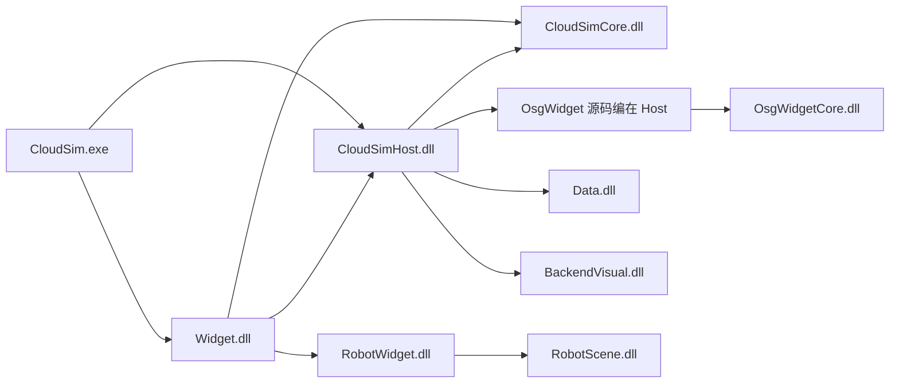
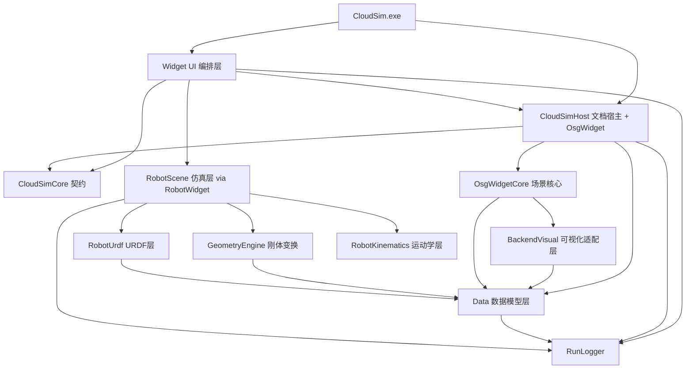
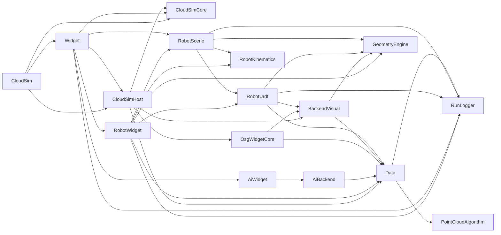
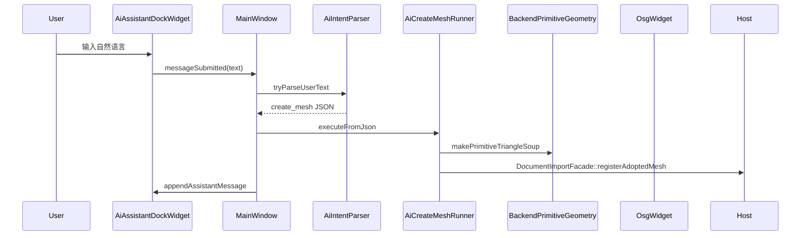
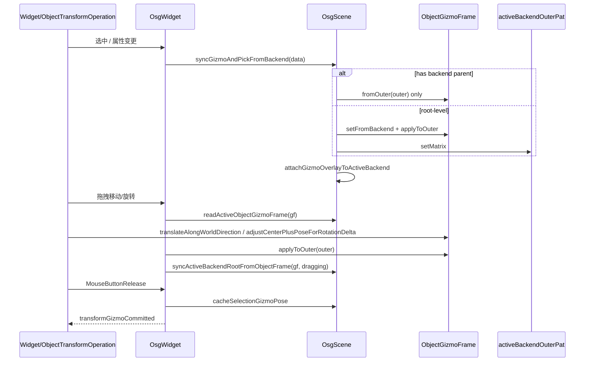
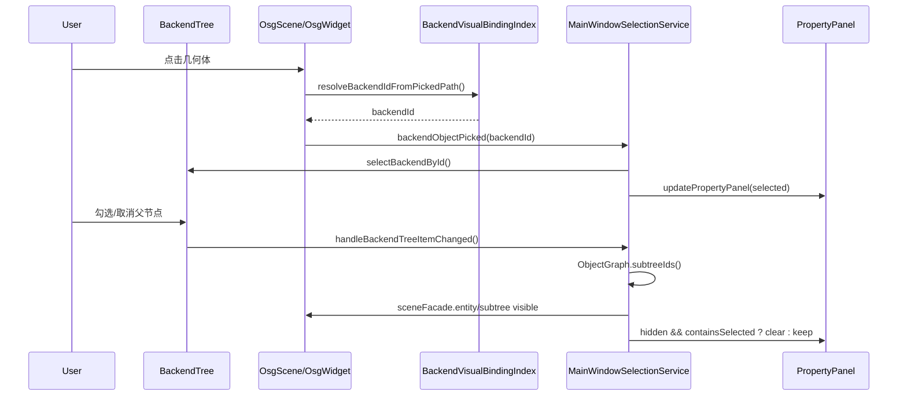
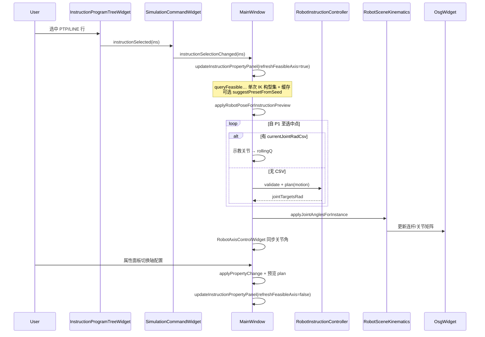
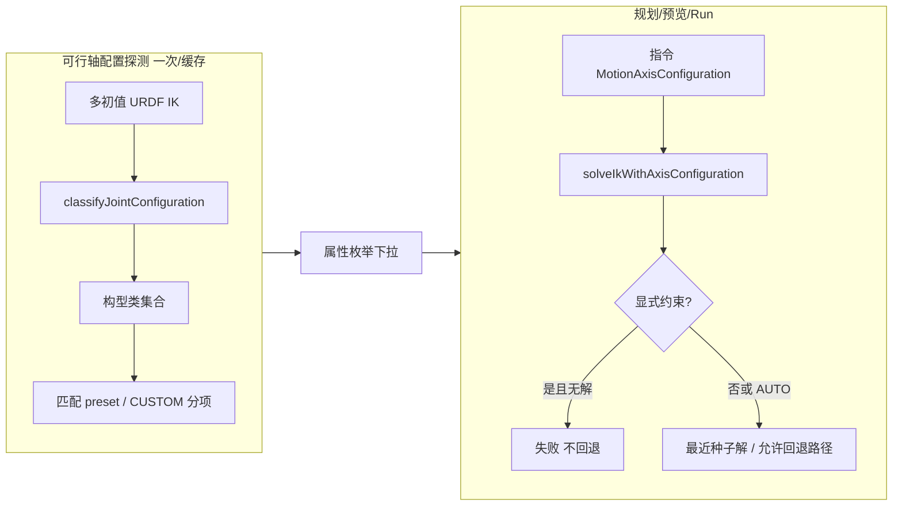

# CloudSim 架构与模块总结

> **目录布局**：源码在 `src/` 按功能域分组（App / UI / Robot / Geometry / Data / AI / Plugins / Infra），见 [`docs/DIRECTORY_LAYOUT.md`](docs/DIRECTORY_LAYOUT.md)。
>
> **子模块开发文档（类/接口详解）**：见 [`docs/MODULE_DEVELOPER_GUIDES.md`](docs/MODULE_DEVELOPER_GUIDES.md)。各工程目录下均有 `DEVELOPER_GUIDE.md`。

## 1. 项目定位

`CloudSim` 是一个基于 **Qt + OSG + CGAL/OpenCascade** 的桌面端三维点云/网格处理与机器人仿真应用。  
它不是典型的 Web B/S 架构，而是 **单机 C++ 客户端**，内部采用“前端 UI + 后端数据/渲染/仿真引擎”的分层设计。

---

## 2. 前后端架构边界（本项目语义）

### 前端（UI 层）

- `Widget`：主窗口、文档页、菜单、树面板、属性面板、交互模式、仿真控制面板。
- 主要承担：用户输入、状态展示、工作流编排、跨模块协调。
- **不直接编译** `OsgWidget` 等 OSG Qt 壳层源码；文档数据/视口经 **`CloudSimHost::DocumentHost`** 与 Core 接口访问（见 **§2.1**）。

### 契约与宿主（前后端分界，2025 重构）

| 模块 | 角色 |
|------|------|
| **`CloudSimCore`** | 稳定契约 DLL：`IDataService`、`IRobotService`、`IRenderView`、`EventHub`、`IDocumentScope`、`ICloudSimContext`；DTO（`PoseDto`、`Mat4` 等），**无** OSG/CGAL/Eigen 头文件。 |
| **`CloudSimHost`** | 本地引擎宿主 DLL：`DocumentHost`、`DataServiceAdapter`、`OsgRenderViewAdapter`、`RobotServiceAdapter`、`DocumentImportFacade`、`ProjectPackageIo`、`BackendVisualSync` 等；**编译** Widget 目录下 `OsgWidget*.cpp` / `QWidgetViewer.cpp`。 |
| **`CloudSimBootstrap`** | 仅 **头文件 API**（`CloudSimBootstrap.h` → `cloudsim_host_global.h`）；组合根 **实现** 在 `CloudSimHost.dll`，exe 只 include + 链接 Host。 |

边界约定：

- Widget / `CloudSim.exe` 链接 **`CloudSimCore.lib` + `CloudSimHost.lib`**（及 `Widget.lib` 等），不链 `CloudSimBootstrap.lib`。
- `DocumentPage` **继承** `cloudsim::host::DocumentHost`，并实现 `IRobotSimulationDocument`（机器人元数据、`osg::` 相关仍主要在 Widget，逐步 DTO 化）。
- `MainWindow` 构造注入 `cloudsimApplicationContext()->events()`；**`EventHub`** 已用于对象注册/删除、**`SelectionChanged`** / **`PoseCommitted`**（属性面板刷新）、gizmo 松手位姿提交。

### 后端（本地引擎层，不是远程服务）

- `Data`：统一后端对象模型（点云/网格）、属性系统、对象注册管理。
- `BackendVisual`：数据对象到 OSG 场景分支的可视化适配。
- `OsgWidgetCore`：与 Qt 无关的 OSG 场景核心（相机、拾取、标注、场景树）。
- `GeometryEngine`：Eigen 刚体变换（`engine::RigidTransform`）、工具链 `ToolKinematics`、OSG/`BackendMat4` 适配；示教/IK/指令位姿统一入口（见 [`GeometryEngine/DEVELOPER_GUIDE.md`](GeometryEngine/DEVELOPER_GUIDE.md)）。
- `RobotKinematics`：串联机械臂运动学计算。
- `RobotUrdf`：URDF 解析与层级机器人场景构建。
- `RobotScene`：机器人指令模型、规划/回放引擎、仿真逻辑。
- `RunLogger`：运行日志基础设施。

> 结论：这是“**桌面前端 + 契约层 + 本地宿主引擎**”架构，而非“前端 + 远程 API 服务”。

---

## 2.1 契约与宿主：调用关系



**单文档页（当前）：**

```text
DocumentPage (Widget)
  └─ DocumentHost (Host) ── IDataService / IRenderView / IRobotService (Core 接口)
        ├─ BackendDataManager (Data)
        ├─ OsgWidget + OsgWidgetSceneBridge (Host 编译)
        └─ RobotProgramStore 等（仍由 Host 持有，机器人仿真接口在 DocumentPage 转发）
```

---

## 3. 总体分层视图



---

## 4. 模块级职责与当前架构

## 4.0 `CloudSimCore`（契约 DLL）

- 路径：`src/Contracts/CloudSimCore/`；产物：`bin/x64(d)/CloudSimCore.dll`。
- 接口与 DTO 见 [`CloudSimCore/DEVELOPER_GUIDE.md`](src/Contracts/CloudSimCore/DEVELOPER_GUIDE.md)。
- `EventHub`：类型化发布/订阅，供 `MainWindow`、文档页与后续引擎事件贯通。
- `IDocumentScope`：每文档 `data()` / `robot()` / `render()`；由 `DocumentHost` 实现。
- 虚析构等在 `.cpp` 中导出，避免跨 DLL `LNK2019`。

## 4.0.1 `CloudSimHost`（本地宿主 DLL）

- 路径：`src/Host/CloudSimHost/`；产物：`bin/x64(d)/CloudSimHost.dll` + **`CloudSimHost.lib`**（Widget / exe 链接用）。开发文档：[`CloudSimHost/DEVELOPER_GUIDE.md`](src/Host/CloudSimHost/DEVELOPER_GUIDE.md)。
- **`DocumentHost`**：`QWidget` + `IDocumentScope`；持有 `BackendDataManager`、`OsgWidget`、`BackendSceneDocumentFacade` 相关桥接（`OsgWidgetSceneBridge`、`BackendFollowReverseIndex`）。
- **适配器**：`DataServiceAdapter`（真实 Data）、`OsgRenderViewAdapter`（`Mat4` ↔ `osg::Matrixd`）、`RobotServiceAdapter`（占位，URDF/规划仍主要走 `RobotWidget`）。
- **组合根**：`CloudSimApplicationContext.cpp` 实现 `cloudsimCreateApplicationContext()` / `cloudsimSetApplicationContext()`（头文件在 `CloudSimBootstrap/inc`，经 `cloudsim_host_global.h` 导出）。
- **OSG Qt 壳层**：`OsgWidget*.cpp`、`QWidgetViewer.cpp` 等自 `src/UI/Widget/source` **编入 Host**（`CLOUDSIM_OSG_IN_HOST`；Widget 侧 `OSG_WIDGET_API` 为 import）。`OsgWidgetCore` 仍为无 Qt 场景核心。
- **工程注意**：含 `Q_OBJECT` 的头（如 `DocumentHost.h`）在 vcxproj 中仅登记为 **`QtMoc`**，勿与 `ClInclude` 重复。

## 4.0.2 `CloudSimBootstrap`（组合根头文件）

- 路径：`src/App/CloudSimBootstrap/`；sln 中可为静态库工程，**产品 exe 不链接**其 `.lib`。
- 仅提供 `CloudSimBootstrap.h`（`cloudsimCreateApplicationContext` 等声明）；实现位于 **Host**。

## 4.1 `CloudSim`（应用入口）

- `main.cpp`：`cloudsimSetApplicationContext(cloudsimCreateApplicationContext())` 后创建 `MainWindow(cloudsimApplicationContext()->events())`。
- 初始化 `QApplication`、Windows DLL 搜索路径、组织/应用名、日志系统。
- 链接：`CloudSimCore.lib`、`CloudSimHost.lib`、`Widget.lib` 等；逻辑轻量。

## 4.2 `Widget`（UI 与流程协调中心）

主要职责：

- 主窗口编排：菜单、停靠窗、文档标签、属性面板、运行信息面板。
- 文档隔离：`DocumentPage` **继承** `cloudsim::host::DocumentHost`，每标签页一份 Host 侧 `BackendDataManager + OsgWidget`（Widget：`data()` / `robot()` / `render()`；OSG 经 `widgetOsgFromPage` → `render().widget()`；`backend()` 仍为存量直达）。
- 场景交互：对象选择、点拾取、边/面拾取、注释、变换 gizmo、主题/语言切换。
- 项目 I/O：保存/加载 `.pcp/.pcproj.json`，并打包/解包工程资源。
- 机器人仿真宿主：`MainWindowRobotHost` + `RobotSimulationController`（`RobotWidget.dll`）；**指令树选中预览**与 **Run** 对含 `context.currentJointRadCsv` 的运动点使用**示教关节角**（与拖动/添加指令一致），其余点仍链式 `plan`。`DocumentHost` 必须转发 `robotBackendManagerForKinematics()`（per-link FK）。仿真 Dock 在 **`RobotWidget`**，TCP 示教 OSG 在 **`Widget`**（`OsgWidgetTcpTeach`）。

当前内部子结构（已显式模块化）：

- `MainWindow.cpp`：主流程与核心逻辑（语言、仿真、同步等）。
- `MainWindowUiSetup.cpp`：窗口构造、菜单和 Dock 初始化（已拆分）。
- `MainWindowBackendTree.cpp`：后端树/场景树管理。
- `MainWindowPropertyPanel.cpp`：属性面板构建与属性同步；**仿真指令**属性含轴配置枚举（可行项过滤、`instructionEnumTokenFromProperty`、切换轴配置时轻量刷新）。
- `MainWindowFileImport.cpp`：模型/点云/URDF 导入。
- `MainWindowProjectIo.cpp`：项目保存与恢复（含 sidecar/zip 打包）。
- `MainWindowImportCaptureRenderController.*`：导入捕获渲染协作控制器。
- `MainWindowAiAssistant.cpp`：AI 助手 Dock 消息入口（自然语言 → 创建网格）。
- `MainWindowSelectionService.*`：统一树选中、OSG 拾取回填、清理选择、可见性勾选传播。
- `MainWindowSelectionState.h`：`MainWindow` 侧选择状态容器（当前以 `selectedBackendId` 为真源）。
- `MainWindowObjectRepository.*`：后端对象查询门面（收敛 `activeBackend()` 调用）。
- `MainWindowObjectGraph.*`：对象层级只读关系图（节点/父子/子树查询），作为树构建与可见性传播的统一结构语义。
- **OSG Qt 桥接**（`OsgWidget*.cpp` 等）已 **迁入 `CloudSimHost` 编译**；Widget 仅保留 UI 编排与对 Host 导出类的链接。
- **`ObjectTransformOperation`**：对象选择模式下罗盘平移/旋转的鼠标事件处理；读写路径统一为 `readActiveObjectGizmoFrame` → 修改 `ObjectGizmoFrame` → `applyToOuter` → `syncActiveBackendRootFromObjectFrame(..., dragging)`；`MouseButtonRelease` 时 `cacheSelectionGizmoPose` 并发出 `transformGizmoCommitted`。
- **`OsgWidgetTransformHierarchyController`**：选中 backend 时 `syncSelectionForBackendId` 内调用 `attachGizmoOverlayToActiveBackend` / `cacheSelectionGizmoPose`；层级变更后与 `OsgScene` 传播逻辑配合。
- **`OsgWidgetGizmoController`**：罗盘几何创建、高亮、屏幕轴拾取等对 `OsgScene` 的薄封装。
- **`RobotWidget`（x64 DLL，见 `RobotWidget/DEVELOPER_GUIDE.md`）**：
  - 页面：`DevicePageWidget`、`SimulationCommandWidget`、`RobotAxisControlWidget`、`RobotFrameSettingsWidget`、**`TrajectoryEditPageWidget`** 等。
  - 编排：`RobotSimulationController`；宿主契约 `IRobotMainWindowHost` / `IRobotDocumentHost` / `IRobotOsgViewHost`。
  - 工程 I/O：保存时 `ProjectPackageIo::mergeRobotKinematicsIntoProjectRoot`（内部 `RobotProjectIo::writeRobotKinematics`）；加载与 programs 仍经 Host `ProjectPackageIo` + `MainWindowProjectIo` 编排。
- **AI 助手（独立子系统，见 `AiBackend` + `AiWidget`）**：
  - **`AiBackend`（后端）**：`AiLlmConfig`、`AiIntentParser`、`AiCommandSchema`、`AiLlmClient`、`AiHttpsPost`（Windows WinHTTP HTTPS）；依赖 `Data`（`BackendPrimitiveGeometry`）。
  - **`AiWidget`（前端）**：`AiAssistantDockWidget`、`AiLlmSettingsDialog`、`AiAssistantCoordinator`（规则/LLM 编排、解析来源提示）。
  - **`Widget` 集成**：`AiCreateMeshRunner` → Host `DocumentImportFacade::registerAdoptedMesh`；`MainWindow::setupAiAssistantCoordinator` 注入 `JobSystem` 后台队列。
  - 配置：`ai_config.json`（exe 同目录）；默认 **LLM 优先**（`rule_parser_first=false`）。

当前 `Widget` 的关键演进点：

- 选择状态不再散落在多个 UI 事件中，而是通过 `SelectionService + SelectionState` 统一读写。
- backend 树勾选不再按 UI 节点递归推断关系，而是按 `ObjectGraph` 子树语义级联到 OSG。
- OSG 拾取得到的 backend id 会直接回填树与属性面板，形成稳定闭环。
- **URDF 每连杆 / 多机**：`DocumentPage::m_hierarchicalRobots`（`HierarchicalRobotInstance`）按台登记 URDF、关节前缀、`perLinkBackends` 与 `RobotPerLinkKinematicsSlice`（link 映射、`fkT0`、`outerBind`、`meshVerticesInLinkFrame`）；`appendHierarchicalRobotSimulationContext` **追加**实例、二次导入 **不** 调用 `clearRobotSimulationContext`。聚合字段 `robotLinkNameToBackendId` 等仍暴露给 `IRobotSimulationDocument`，由 `rebuildHierarchicalRobotAggregates` 合并各实例（兼容旧 UI）。
- **选择**：`handleBackendTreeSelectionChanged` 经 `sceneFacade().ensureSelectionVisualForBackend` 加载/同步几何，并 `publishSelectionChanged`；`MainWindowUiSetup` 订阅事件刷新属性面板。URDF 连杆首次加载仍 `skipInnerModelCenterRebase`。**层级子节点**在 `syncGizmoAndPickFromBackend` 内走 `fromOuter`（见 **6.2.0**）。

## 4.3 `Data`（后端数据域模型）

核心设计：

- `BackendDataBase` 抽象统一对象：`id/name/className/pose/rotation/color/propertyRows`。
- `PointCloudBackendData`、`MeshBackendData` 提供具体几何与属性实现。  
  - **URDF 每连杆导入**：在写入 `MeshBackendData` 后、挂 OSG 前，可对三角顶点执行 `transformVerticesColumnMajorHomogeneous4x4`（与 `RobotUrdf::meshFileToLinkFrameFromVisual` 同源的列主序 4×4），将顶点从 **mesh 文件系** 变换到 **连杆系**；并 `setTransformPivotAtOrigin(true)`，使 `modelCenterForData` 为 **(0,0,0)**，与 `skipInnerModelCenterRebase` 及 FK 写回一致。
- **`BackendPrimitiveGeometry`（程序生成基本体）**：`Data` 模块内将 box / cylinder / cone / sphere 参数化为 **三角 soup**（每三角 9 个 float：xyz×3），单位 **mm**，默认几何中心在原点，**Z 轴为高度方向**（圆柱/圆锥/长方体高度沿 Z）。`makePrimitiveTriangleSoup` 为统一入口；细分由 `PrimitiveMeshQuality`（`segments`、`rings`）控制。三角绕序按 **从外侧 CCW** 写入，与 `MeshBackendVisual` 中 `n = (p1-p0) × (p2-p0)` 及 OSG 正面一致，避免开启场景光照后整面发黑。
- `BackendDataManager` 管理对象注册/查询/删除（`std::shared_mutex`：只读查询共享锁，结构变更独占锁）。
- 属性编辑协议通过 JSON 行快照 + key/value 更新（便于 UI 解耦）。

模块定位：

- 所有上层模块共享的数据真源（single source of truth）。
- 承担持久化语义和几何属性语义，不直接处理 UI 事件。

### 4.3.1 文档级场景门面（`BackendSceneDocumentFacade`，由 `DocumentHost` 持有）

- 源码仍在 `src/UI/Widget/`，由 **`CloudSimHost` 工程编译**；`DocumentHost::sceneBridge()` / `DocumentPage` 转发访问。
- **`IBackendSceneBridge` / `OsgWidgetSceneBridge`**：`Data` 模块仍不包含 OSG 头文件；世界矩阵以 **列主序 16 double** 与 OSG 对齐，经桥接委托 `OsgWidget` 的 `setBackendRootWorldMatrixFromWorld`、`setBackendObjectVisible`、`removeBackendObjectVisual`、`syncOuterPatFromBackend`、`setBackendParent` 等。
- **`BackendSceneEntity`**：按 `backendId` 持有桥接器与 `BackendDataManager` 指针，提供 `show`/`hide`、世界矩阵读写、子对象 id（`BackendDataManager::childrenOf`）、**跟随者 id 列表**（见下）。
- **`BackendSceneDocumentFacade`**：由 `DocumentHost` 组合当前页的 `BackendDataManager`、桥接器、**`BackendFollowReverseIndex`**（从全表扫描 `FollowAttachmentComponent` 建立「目标 id → 跟随者 id」反向映射；在 `applyHierarchyFollowBinding`、`afterBackendFollowPropertyEdited`、`removeBackendSubtree`、工程加载恢复边与 follow JSON 后调用 `invalidateFollowReverseIndex()` 失效缓存）。
- **`poseSink()`**：返回 `OsgWidget*` 作为 `IRobotBackendPoseSink*`，供 `RobotSceneKinematics::applyJointAnglesFromDocument` 等机器人 FK 写回路径使用（与直接传 `OsgWidget*` 等价，入口统一在门面）。
- **推荐调用链**：树可见性级联、`runBackendFollowSolveAndSync` 中对 `syncOuterPatFromBackend` 的批量写回，优先经 `sceneFacade().entity(...)` / `bridge()`，避免在 UI 层散落裸 `OsgWidget` 场景细节。
- **删除与解绑**：视觉分支移除与拾取索引解绑仍由 `OsgWidget::removeBackendObjectVisual` 等实现；逻辑子树删除顺序保持「先场景/绑定、再 `unregisterData`」的现有约定；门面不替代 `removeBackendSubtree`，仅收敛显隐与变换的**对外 API**。

## 4.4 `BackendVisual`（数据 -> 可视化适配）

核心设计：

- 通过 `IBackendVisual` 策略接口隔离不同后端类型的可视化逻辑。
- `BackendVisualRegistry` 按 `className` 注册/创建视觉构建器。
- 输出统一 `BranchBuildResult`（**外层 `osg::MatrixTransform`**、内层 `PositionAttitudeTransform`、模型中心、对角线尺度）供交互层复用；外层存完整刚体局部矩阵，便于 FK / `setBackendRootWorldMatrixFromWorld` 避免 PAT 的 TRS 分解误差。
- `MeshVisualOptions`：`showWireOutline`、`useSceneLighting`；**`skipInnerModelCenterRebase`** 为真时不再做「外包络中心 + 内层 `-bboxCenter`」的通用网格去心（用于 **URDF 每连杆**：顶点已在连杆系且由 FK 写外层世界矩阵，与层级导入「仅 `meshToLink`、无去心 PAT」语义对齐）。
- **程序生成网格**：`MeshBackendData` 默认浅蓝材质色；`useSceneLighting=true` 时按 per-vertex 法线 + `applyLitPlastic` 渲染。若绕序与外侧不一致且无法线缓冲，会出现「几何正确但全黑」——基本体由 `BackendPrimitiveGeometry` 保证绕序；**STEP** 在 OCCT 导出时对 `TopAbs_REVERSED` 面翻转三角绕序；**OBJ 含 `vn`** 保留文件法线供光照（见 `Data` §4.2.1）；无 `vn` 的 OBJ/STL/PLY/OFF 走 CGAL `orient_polygon_soup` + 质心外向绕序修正。

模块定位：

- 解决“数据模型”和“OSG可渲染节点”之间的转换问题。
- 使 `OsgWidgetCore` 不需要硬编码各类数据对象细节。

## 4.5 `OsgWidgetCore`（OSG 场景核心）

核心能力：

- 维护场景分层根节点：后端对象层、机器人装配层、轨迹层、标注层、staging 层。
- 相机与导航、世界坐标轴 HUD、拾取（点/线/面）、注释系统、gizmo 可视化。
- 后端层级关系、可见性同步、选中态缓存与同步。
- `BackendVisualBindingIndex` 维护 `backendId <-> osg::Node` 绑定关系，并提供拾取路径解析。

架构特点：

- 纯 OSG 核心，不依赖 Qt 事件循环；通过回调方式请求重绘。
- **`OsgWidget`**（Qt 壳层，源码在 `Widget/`，**由 `CloudSimHost.dll` 编译导出**）负责事件桥接与控件集成；`OsgRenderViewAdapter` 对 Core 侧暴露 `IRenderView`。
- 拾取链路已从“临时遍历/局部 userData 依赖”升级为“索引解析 + 统一信号回传”。

**对象变换 Gizmo（`ObjectGizmoFrame` + overlay 挂载）：**

- **`ObjectGizmoFrame`**（`OsgWidgetCore/inc|source/ObjectGizmoFrame.*`）：集中 outer 分支位姿数学，约定与 `MeshBackendVisual::buildOuterBranch` 一致——外层局部矩阵为 **`T(trans) * R`**，`trans` = `centerPlusPose` = `modelCenter + pose`（行向量 OSG）。文件原点在 outer 父节点下为 **`(inner + trans) * R`**。`fromOuter` 用 **`trans = (fileInOuterParent - inner*R) * inv(R)`** 恢复（不可用 `decompose` 的平移分量）。提供屏幕/父空间旋转轴（`dragAxisDirectionSceneWorld` / `dragAxisDirectionOuterParent`）、`translateAlongWorldDirection`、`adjustCenterPlusPoseForRotationDelta`（保枢轴）等。
- **场景图位姿真源**：活动后端的 **`m_activeBackendOuterPat`**（`osg::MatrixTransform`）为唯一 OSG 位姿写入点；已移除与根级平行的 `m_selectedTransform` 及与之相关的双向同步 API。
- **Overlay 结构**：`initScene` 创建 `m_gizmoOverlayGroup`（含罗盘 `m_compassTransform`、拾取反馈 `m_pickFeedbackTransform`），默认不挂场景；选中时由 **`attachGizmoOverlayToActiveBackend`** 挂到 **inner PAT**（outer 的 child0，局部 `-modelCenter`）下，使罗盘枢轴与**网格/点云文件原点**一致。取消选择或导入替换场景时 **`detachGizmoOverlay`**。
- **同步入口**：`readActiveObjectGizmoFrame`、`syncActiveBackendRootFromObjectFrame`（非拖动时将旋转增量传播到 OSG 子树中的后代 backend outer）、`cacheSelectionGizmoPose`、`syncGizmoAndPickFromBackend`（选中/加载：无 `m_backendParentIds` 父节点时 `setFromBackend`+`applyToOuter`；**有父节点**时仅 `fromOuter`+挂 overlay，不覆盖 FK/层级局部矩阵）、`setBackendRootWorldMatrixFromWorld`（行向量：`local = world * inv(parentWorld)`，父矩阵优先 `m_backendParentIds`）。
- **诊断**：环境变量 **`POINTCLOUD_GIZMO_PIVOT_DIAG`** 非空且不为 `"0"` 时，`logGizmoPivotDiagnostics` 经 RunLogger 输出枢轴与文件原点对比（见 `OsgSceneGizmo.cpp`）。

## 4.6 `RobotKinematics`（运动学基础库）

- 提供串联机械臂运动学计算能力（`SerialLinkKinematics`）。
- 为轨迹规划和回放阶段提供 FK/IK 或关节计算基础。
- 被 `RobotScene` 复用，保持独立、低耦合。

## 4.7 `RobotUrdf`（URDF 解析与机器人场景构建）

核心能力：

- 解析 URDF 关节与链路元信息（顺序、上下限、末端链路等）。
- **层级场景（动态层级法）**：`buildHierarchicalRobotScene` — 几何层为 **`MatrixTransform(meshToLink)` → 网格节点**，关节由 **`MatrixTransform`** 驱动，**无** `buildOuterBranch` 的内层 `-bboxCenter` PAT。
- **每连杆后端（当前主推的轻量导入路径）**：不挂整棵 `RobotAssembly` 关节树；每个带 mesh 的 link 对应独立 `MeshBackendData` + OSG 分支，由 `RobotSceneKinematics::applyJointAnglesViaLinkBackends` 按拓扑序写各 link 外层世界矩阵。
- `computeMeshWorldMatrices(urdf, angles, out, err, meshVerticesAlreadyInLinkFrame)`：最后一参为 **true** 时表示网格顶点已在 **连杆系**，FK 内对 mesh 使用 **单位** `<visual>` 变换（避免与顶点烘焙重复乘 `meshFileToLinkFrameFromVisual`）。**false** 时与层级场景一致：累积 `worldFromLink × meshFileToLinkFrameFromVisual(vis)`。
- `linkMeshFileToLinkColumnMajor16`：按 link 名从缓存模型取首个 `<visual>`，输出与内部 FK 一致的 mesh 文件系 → 连杆系 4×4（列主序 16 double），供导入时烘焙顶点。

架构特点：

- 明确三层分离：几何层、容器层、运动学层。
- 多机并存：每台机器人独立 **`jointKeyPrefix`**（如 `RobotURDF_M-20iD-35::`）；`DocumentPage` 按实例切片调用 FK，不再要求全局仅一台。
- **层级 vs 每连杆**：层级用「关节 MT + 几何 MT」表达链；每连杆用「后端父子 + 外层 MT 世界矩阵」表达链；两者在 **mesh 文件系 / 连杆系 / 世界系** 上必须约定一致，否则会出现「日志中外层矩阵正确但模型散开」类问题。

## 4.8 `RobotScene`（仿真与指令执行层）

核心能力：

- 指令模型、属性、控制器（`RobotInstruction*`）。
- Planner 机制：按指令类型选择规划器并输出 `PlanResult`。
- **运动点编号**：`RobotInstructionProgram::renumberMotionPointIndices` 为 PTP/LINE 分配 `P1..Pn`（`motion.pointIndex` / JSON `pointIndex`），与 `collectMotionInstructionsRecursive` 遍历顺序一致。
- **运动轴配置（Axis Configuration）**：`RobotInstructionAxisConfiguration` 用跨品牌通用语义描述 PTP/LINE 的 IK 姿态选择；属性键 `motion.axisConfig.preset` / `.elbow` / `.wrist` / `.arm`；JSON 推荐对象字段 `axisConfiguration`（兼容旧字符串 `axisConfig`）。规划时 `solveIkWithAxisConfiguration(cmd, cfg)` 对多种关节初值做数值 IK，再按 `cfg.matchesClass(classifyJointConfiguration(...))` 筛选；**显式 preset/分项非全 AUTO 时**规划失败即报错，**不再**静默回退到无约束 IK。`AUTO` 在可行解集合中取距种子关节最近者。`suggestMotionAxisPresetToken` 由当前关节构型推断最具体 preset（新建/首次选中时用于默认，见 **6.4**）。
- **可行轴配置探测**：`RobotInstructionController::queryFeasibleMotionAxisConfigurationOptions` 对目标位姿**单次**多初值 IK，收集互不相同的构型类，再判定各 preset/CUSTOM 分项是否可行（避免对每种配置重复完整 IK）。`MainWindow` 按「指令 id + 目标位姿 + 前序滚动关节角」缓存结果；**仅**在选中指令、修改位姿/速度等非轴属性时刷新；**切换轴配置**时复用缓存并只跑预览规划，保证交互响应。
- 回放引擎：分段插值驱动关节，按定时 tick 更新场景。
- `RobotSceneKinematics::applyJointAnglesFromDocument`：按 `robotKinematicInstanceCount()` 循环各 `HierarchicalRobotInstance`，对 `perLinkBackends` 实例调用 `applyJointAnglesViaLinkBackends`（`RobotPerLinkKinematicsSlice`）。
- `applyJointAnglesViaLinkBackends`：按实例内 link→backendId 与 `fkMeshWorldT0` / `outerWorldAtBind` 计算 `Mnew = M0 * inv(T0) * Tq`，`setBackendRootWorldMatrixFromWorld` 后 `MeshBackendData::setWorldMatrix` 分解回 `pose/rotation`。`meshVerticesInLinkFrame` 为真时 FK 传入 `computeMeshWorldMatrices(..., true)`。

模块定位：

- 承担“仿真业务逻辑”和“执行状态机”，不承载 UI。
- 通过接口与 `DocumentPage/OsgWidget` 交互（解耦仿真与表现层）。

### 4.8.1 运动轴配置（通用术语与厂商对照）

同一 TCP 位姿通常对应多组关节解。UI 与 JSON **不**使用 FANUC/ABB 专有缩写作为主选项，而采用下列通用维度（与 ISO 8373 肘/腕等结构术语一致）：

| 通用维度 | 含义（6 轴典型） | FANUC | ABB | KUKA 等 |
|----------|------------------|-------|-----|---------|
| `elbow` 肘部 | 上臂/下臂折叠（常 J3） | Up `U` / Down `D` | robconf 象限 | A3 / CONFIG |
| `wrist` 腕部 | 腕翻转（常 J5） | Flip `F` / No-flip `N` | cf4/cf6 | A5 符号 |
| `arm` 臂形 | 腕相对基座前/后 | Front `T` / Back `B` | 象限组合 | 机型相关 |
| `turns` 转数 | J1/J4/J6 相对种子关节的**整圈数**（见 **4.8.2**） | Turn 0,0,0（FANUC 为 90° 分档 0–7，语义不同） | cf1,cf4,cf6,cfx | CONFIG 整型 |
| `AUTO` | 由当前关节种子选最近 IK 解 | — | — | — |

**预设（`motion.axisConfig.preset`）**：`AUTO`、`ELBOW_UP`、`ELBOW_DOWN`、`WRIST_FLIP`、`WRIST_NO_FLIP`、组合项（如 `ELBOW_UP_WRIST_NO_FLIP`）、`CUSTOM`（配合肘/腕/臂分项枚举 `motion.axisConfig.elbow|wrist|arm`）。

**实现要点**：

| 环节 | 行为 |
|------|------|
| 构型分类 | `classifyJointConfiguration(q, jointNames, seedQ*)`：肘由 J3 符号；腕 Flip 优先用相对 `seedQ` 的 Δ角；臂由 J1 与 `cos(J1)` 前/后 |
| IK 初值 | `buildIkSeedVariants`：种子翻转肘/腕 + 显式约束时的偏向初值（肘 ±1.2/±2 rad 等） |
| 规划 | `PtpPlanner` / `LinePlanner`：有 `MotionAxisConfiguration` 则 `solveIkWithAxisConfiguration`；`motionAxisConfigurationRequiresConstraint` 为真时禁止 DH/无约束 URDF/Legacy 回退 |
| 属性 UI | `MainWindowPropertyPanel`：枚举下拉仅展示 `queryFeasible…` 返回的 token；`m_propertyEnumTokens` 保证下拉索引与写入 token 一致（过滤列表与全量 schema 索引分离） |
| 默认 preset | 新建 PTP 或首次选中且仍为 `AUTO` 时：按当前/滚动关节角 `suggestMotionAxisPresetToken`，若落在可行列表则写入；`context.axisConfigSeeded=1` 避免覆盖用户后续手动选的 `AUTO` |
| CUSTOM 分项 | 仅 `preset=CUSTOM` 时在属性面板显示肘/腕/臂三行；各行同样只列可行枚举 |
| Turn 分项 | **始终**显示 `motion.axisConfig.turn.j1|j4|j6`（与 preset 独立）；枚举 `AUTO`、`-2`…`3`；可行值由 IK 构型集归纳 |

### 4.8.2 转数 Turn（J1 / J4 / J6）设计

**背景（厂商差异）**  
同一 TCP 位姿在肘/腕/臂构型确定后，绕基座（J1）、腕部（J4）、法兰（J6）的连续旋转轴仍可能存在多组等价关节角（相差 360° 整数倍）。FANUC 配置串末三位 **Turn**（常为 0–7，按 90° 分档）与 ABB **cf1/cf4/cf6/cfx**、KUKA **CONFIG** 整型均属此类信息；本工程采用**与 URDF 连续关节兼容**的通用表示，便于数值 IK，而非逐品牌复刻 90° 编码。

**语义（本项目）**

- **Turn 值** `k`：相对**规划种子关节角** `q_seed`，解向量中该关节满足  
  `round((q - q_seed) / 2π) = k`（`classifyJointTurnRevolutions`）。
- **`AUTO`（`kMotionAxisTurnAuto` / JSON 省略该轴）**：不约束该轴转数；IK 仍可在多圈中取距种子最近解。
- **显式 `k`**：`matchesClass` 要求观测构型上 `turnJ1/J4/J6` 与配置一致；与肘/腕/臂约束叠加。

**数据与 UI**

| 层 | 内容 |
|----|------|
| 结构体 | `MotionAxisConfiguration::turnJ1/turnJ4/turnJ6`；`JointConfigurationClass` 含观测转数 |
| JSON | `"turns": { "j1": 0, "j4": 1, "j6": 0 }`（`writeMotionAxisConfigurationToJson`） |
| 属性键 | `motion.axisConfig.turn.j1` / `.j4` / `.j6` |
| 默认 | 新建/首次选中且为 `AUTO` 时，由种子关节 `classifyJointConfiguration` 写入可行转数 |
| 树摘要 | 非 AUTO 时追加 `J1转0` 等片段 |

**与 FANUC 的差异说明**  
FANUC Turn 0–7 表示 90° 带宽而非简单 `round(Δ/2π)`；若未来需导出 FANUC 程序，可增加 `fanucTurnBandFromRevolutions(k)` 映射层，**规划内核仍用整圈数**。

## 4.9 `RunLogger`（日志基础设施）

- 封装统一日志 API（trace/debug/info/warn/error/critical）。
- 支持 UI sink 回调，既可写文件也可推送到界面输出。
- 被各模块复用，是横切关注点（cross-cutting concern）。

---

## 5. 模块依赖关系（工程级）

**x64 链接形态（2025 起）**：下列引擎模块在 x64 为 **独立 DLL**，运行时与 `Widget.dll` / `CloudSimHost.dll` / `Data.dll` / `RobotWidget.dll` **共享单实例**（不再静态嵌入多份）：

`CloudSimCore`、`CloudSimHost`、`RunLogger`、`GeometryEngine`、`RobotKinematics`、`RobotUrdf`、`RobotScene`、`BackendVisual`、`OsgWidgetCore`。

`PointCloudAlgorithm` 仍 **静态链入** `Data.dll`；`CloudSimPluginHost` 源码仍 **编进** `Widget.dll`。Win32 遗留路径仍可使用 `*_STATIC` 静态 `.lib`。

**构建输出**：`CloudSim/Directory.Build.props` 定义 `$(CloudSimBinDir)` → 仓库根 `bin/x64d/` 或 `bin/x64/`，各工程 `OutDir` / 链接库路径统一，避免 `$(SolutionDir)` 为空时 **LNK1181**（找不到 `CloudSimHost.lib`）。建议生成顺序：**CloudSimCore → Data → … → CloudSimHost → Widget → CloudSim**。

完整运行时布局见 **§10.2**；各模块 `*_LIB` / 导出宏见 [`docs/MODULE_DEVELOPER_GUIDES.md`](docs/MODULE_DEVELOPER_GUIDES.md)「x64 动态库约定」。



依赖特征总结：

- 依赖方向整体从 UI → **Host（OSG+文档）** → Core 契约 → 底层引擎，层次清晰。
- `Data` 与 `RunLogger` 为共用基础层；x64 下通过 **DLL 边界** 保证日志单例与代码单份加载。
- `RobotScene` 组合 `RobotUrdf + RobotKinematics + GeometryEngine`，业务语义完整。
- Widget 仍链 **Data / RobotScene** 等头文件用于属性面板与工程 I/O；中长期经 Core DTO 与 `IRobotService` 收敛。

---

## 6. 关键业务流程（端到端）

## 6.1 导入与显示流程

1. 用户在 `MainWindow` 发起模型/点云/URDF 导入。  
2. `Widget` 通过控制器调用 `OsgWidget` 导入/捕获数据。  
3. 生成 `PointCloudBackendData` 或 `MeshBackendData` 并注册到 `BackendDataManager`。  
4. `BackendVisual` 根据数据类型构建 OSG 分支。  
5. `OsgWidgetCore` 将分支挂入场景，并同步更新 `BackendVisualBindingIndex`。  
6. `Widget` 通过 `ObjectRepository/ObjectGraph` 重建树，属性面板按当前选择刷新。  

**URDF 每连杆导入（`MainWindowImportCaptureRenderController::registerUrdfRobot`）要点：**

0. **机器人根（无几何）**：注册 `MeshBackendData` 父对象，id 为 `RobotURDF_<模型基名>`（`makeUniqueBackendId` 冲突时 `_2`、`_3`…）；显示名为模型基名；**不**再附加时间戳或 `_link_` 段。二次导入 **不** 清空已有机器人/连杆。  
1. 对每个 link：id = `robotRootId + "_" + linkName`；`loadFromFile`（`.obj` 含 `vn` 时保留 `triangleVertexNormals`，见 Data §4.2.1）→ `linkMeshFileToLinkColumnMajor16` → **`transformVerticesColumnMajorHomogeneous4x4`**（顶点与法线一并旋转）+ **`setTransformPivotAtOrigin(true)`**。  
2. `loadMeshFromBackendData(..., useSceneLighting=true, skipInnerModelCenterRebase = true)`：避免与 FK 重复去心/平移；连杆网格依赖文件法线或绕序修正后的 soup。  
3. `BackendDataManager::attachChild`：无网格 URDF 父 link 挂到 **robotRootId**；有网格父 link 挂到对应 link backend。`OsgWidget::setBackendParent` 按拓扑序同步 OSG 父链；**不在** reparent 时强行恢复扁平布局世界（由后续 FK 拓扑写回）。  
4. 拓扑序 `setBackendRootWorldMatrixFromWorld` 写 bind 姿态，采集 `outerBind`（与 FK `Tq` 校验，`maxAbsDiff` 应 ≈0）。  
5. `appendHierarchicalRobotSimulationContext(..., robotRootId, robotRootId)`；`setRobotPerLinkKinematicsBinding(robotRootId + "_ctx", ...)`；`applyJointAnglesFromDocument` 首帧同步。相机 `focusCameraOnBackend` 仍对准 **根 link 网格** id，非 robot root。  

**DXF / STEP / OSG 层级网格（`HierarchyMeshImport` + `MainWindowImportCaptureRenderController`）要点：**

1. obj/stl/ply/off 仍走 `IDataService::importFromFile`；dxf/step 等走 Host `importMeshFileExtended`（`loadDxfHierarchyFromFile` / `loadStepHierarchyFromFile` 或 OSG 捕获）。  
2. 分件顶点多为 **世界坐标** 烘焙进 `triangleSoup`：每片 `skipInnerModelCenterRebase=true`；`linkOsgSceneParent=false` 时 `setBackendLogicalParent` 同步 `m_backendParentIds`，OSG 分支仍在 flat 组。  
3. **文件导入阶段不对分件** 调用 `applyHierarchyFollowBinding`（Follow 求解会把 `pose` 写成约负质心，与 skip-rebase 显示冲突）。工程加载的 `edges[]` 仍在 `MainWindowProjectIo` 中批量绑定并一次 `runBackendFollowSolveAndSync`。  
4. 导入结束：`focusCameraOnBackend(importParent->id())` 合并逻辑子树下全部分件包围球（见 `OsgWidgetCore` `worldBoundOfBackendRoot`）。  
5. 勿在层级导入后对最后一片再 `loadMeshFromBackendData(..., resetHome)`（`upsertMeshBranchInScene` 会把节点挂回 flat 组并破坏布局）。

## 6.1.1 AI 助手创建基本体流程（Phase 1 + Phase 2）

1. 用户在 **AI Assistant** Dock 输入自然语言（如「生成长方体，长 100mm，宽 50mm，高 100mm」或「圆柱 半径 30 高 80」）。  
2. **LLM 路径（默认）**：`rule_parser_first=false` 且 `enabled=true` 时，由 `JobSystem` 调用 `AiLlmClient::parseUserTextWithLlm` → `AiCommandSchema::tryParseCreateMeshCommandJson` 提取 JSON。  
3. **规则路径（可选）**：`rule_parser_first=true` 时先 `AiIntentParser::tryParseUserText`，成功则不调 LLM；LLM 未启用或失败时可作回退（需 `enabled=false` 时仅规则）。  
4. `AiCommandSchema::parseCreateMeshCommand` 校验 `primitive`、`dimensions_mm` 等，填充 `PrimitiveMeshParams` / `PrimitiveMeshQuality`。  
5. `BackendPrimitiveGeometry::makePrimitiveTriangleSoup` 生成 soup → 新建 `MeshBackendData`（可选 `pose_mm` / `rotation_deg`）→ Host `DocumentImportFacade::registerAdoptedMesh`（含 OSG 与 `BackendObjectRegisteredEvent`）。  
6. `MainWindow::focusBackendInTreeAfterImport` 选中树节点。  
7. 助手回复与 `RunInfoPage` 同步成功/失败信息。

**`ai_config.json`（与 exe 同目录）主要字段：**

| 字段 | 说明 |
|------|------|
| `enabled` | 为 true 时规则失败后可走 LLM |
| `rule_parser_first` | 默认 false（先 LLM）；为 true 时先规则、成功则不调 LLM |
| `base_url` | OpenAI 兼容 API 根，如 `https://api.openai.com/v1` |
| `api_key` / `api_key_env` | 密钥或环境变量名（如 `OPENAI_API_KEY`） |
| `model` | 模型名，如 `gpt-4o-mini` |
| `timeout_ms` | HTTP 超时 |

**支持的基本体与尺寸语义：**

| `primitive` | 主要尺寸字段 | 备注 |
|-------------|--------------|------|
| `box` | `length_mm`, `width_mm`, `height_mm` | 中心在原点，X/Y/Z 对应长/宽/高 |
| `cylinder` | `radius_mm`, `height_mm` | 轴沿 Z，底面在 z = -h/2 |
| `cone` | `radius_mm`（底）, `radius_top_mm`, `height_mm` | `radius_top_mm≈0` 为尖顶 |
| `sphere` | `radius_mm` | `segments` / `rings` 控制网格密度 |



## 6.2 属性编辑与场景同步

1. 用户修改属性面板（位置/旋转/颜色等）。  
2. 普通属性：`doc->data().applyPropertyChange` → Host `DataServiceAdapter` + `BackendVisualSync`（OSG 同步，必要时 `PoseCommittedEvent`）。  
3. pose/rotation 分量：`setPoseInFrame` / `setRotationInFrame` + `syncVisualAfterPropertyChange`（Widget 编排）。  
4. `MainWindowUiSetup` 订阅 `SelectionChanged` / `PoseCommitted` 刷新属性面板；树、属性、场景共享 `SelectionState` 真源。  

**嵌套后端写回 OSG（`OsgWidget::syncOuterPatFromBackend`）：**  
将后端 `pose/rotation` 与缓存的模型中心先拼为 **`backend_world_mat_from_pose`**，再 **`setBackendRootWorldMatrixFromWorld`**（`inv(parentWorld) * world`），避免在父级非单位矩阵时把「世界系平移」误当作外层局部矩阵（旧写法 `translate(center+pose)*rotate` 仅适用于挂在场景根下的物体）。

### 6.2.0 对象 Gizmo / 罗盘（位姿真源与场景图）

**设计原则：** 活动对象的 OSG 位姿只由 **backend outer `MatrixTransform`** 表达；UI 罗盘是挂在 **inner PAT** 上的可视化 overlay，不再维护根级 `m_selectedTransform` 平行树或 `syncSelectedTransformFromActiveOuter` 类双向同步。

**分支结构（与 `BackendVisual::buildOuterBranch` 对齐）：**

```text
m_activeBackendOuterPat          ← 唯一位姿写入：T(center+pose) * R
└─ inner PAT (child0)            ← 平移 -modelCenter，几何在文件原点
   ├─ 网格/点云 Geode …
   └─ m_gizmoOverlayGroup        ← attach 时挂入；局部恒等，罗盘/拾取反馈
        ├─ m_compassTransform    ← 仅姿态/高亮；位置由 inner 保证枢轴
        └─ m_pickFeedbackTransform
```

**`ObjectGizmoFrame` 字段语义：**

| 字段 | 含义 |
|------|------|
| `modelCenter` | 外包络中心（与 `m_backendModelCenters` 一致） |
| `centerPlusPose` | outer 平移 `trans`：`modelCenter + backend.pose`（非 `decompose` 的 `trans*R`） |
| `attitude` | outer 旋转 `R` |
| `backendPoseRelativeToCenter()` | 即后端 `pose`（相对几何中心） |
| 文件原点（枢轴） | outer 父空间：`(inner + centerPlusPose) * R` |

**主要 API（`OsgScene` / `OsgWidget` 委托）：**

| API | 作用 |
|-----|------|
| `readActiveObjectGizmoFrame` | 从 `m_activeBackendOuterPat` 分解当前帧 |
| `applyToOuter`（经 frame） | 将帧写回 outer 矩阵 |
| `syncActiveBackendRootFromObjectFrame` | 写 active outer；非拖动时向 OSG 后代 backend 传播旋转增量 |
| `attachGizmoOverlayToActiveBackend` / `detachGizmoOverlay` | overlay 挂接/卸载 |
| `syncGizmoAndPickFromBackend` | 选中/加载：无层级父时 backend→outer；**有 `m_backendParentIds` 父**时 `fromOuter` 只读 OSG，不 `applyToOuter` |
| `syncSelectionForBackendId` | 仅切换 active outer、挂 gizmo、缓存姿态与拾取点（无 backend→outer 写回） |
| `setBackendRootWorldMatrixFromWorld` | 属性/FK：`local = worldMat * inv(parentWorld)`（行向量 OSG） |
| `cacheSelectionGizmoPose` | 提交 `m_lastGizmoCenterPlusPose` / `m_lastGizmoAttitude` |

**端到端流程：**

1. **选中**：树/OSG 拾取 → `syncSelectionFromBackend` → `syncGizmoAndPickFromBackend`：根级或孤立对象 `setFromBackend`+`applyToOuter`；**URDF/层级子连杆** 若已有父 backend id，则 **`fromOuter` 保留当前局部矩阵**（FK 已写世界位姿，后端 `pose` 为世界分解值，不可直接 `applyToOuter`）→ `attachGizmoOverlayToActiveBackend`。
2. **拖拽**：`ObjectTransformOperation` — **LMB** `beginGizmoScreenDrag` + `gizmoScreenDragDs`（屏幕轴平移，避免平面求交发散）；**RMB** 冻结 `m_gizmoRotatePivotWorld` + `gizmoScreenRotateDeltaRad`（屏幕角），`adjustCenterPlusPoseForRotationDelta` 保枢轴，旋转轴经 `dragAxisDirectionOuterParent` 写入父空间四元数（屏幕法向经 `dragAxisDirectionSceneWorld`）。拖动中 `syncActiveBackendRootFromObjectFrame(..., true)`；**旋转不写** `selectedObjectPoseChanged`（仅平移写）。**跟随求解**对正在拖拽的 follower 跳过写回（见 **6.2.1**）。
3. **属性面板**：`selectedPosition` / `setSelectedRotation` 等经 `readActiveObjectGizmoFrame` 与 `applyToOuter`，与罗盘同一数学路径。
4. **松手**：`cacheSelectionGizmoPose` → `transformGizmoCommitted` → MainWindow 刷新属性面板。
5. **导入/清空选择**：`OsgWidgetImportController` 等路径调用 `detachGizmoOverlay`，避免 overlay 留在已卸载的 inner 上。



**调试：** 设置 `POINTCLOUD_GIZMO_PIVOT_DIAG=1` 可在 `syncGizmoAndPickFromBackend`、拖拽等时机对比枢轴世界坐标与 inner 局部原点，排查「罗盘与模型偏心」类问题。

## 6.2.1 跟随附着与变换真源（FollowAttachment）

1. 可选组件 `FollowAttachmentComponent`（`BackendDataBase` 组件，`componentType` = `FollowAttachment`）描述 follower 相对 target 的刚体局部位姿；`BackendFollowTransformSolver` 按 DAG 拓扑更新 follower 的 `pose/rotation`（与点云/网格外分支约定一致）。  
2. 目标世界矩阵优先取自 `OsgWidget::getBackendRootWorldMatrix`（与机器人 FK、gizmo 拖动一致），否则回退为几何中心 + 后端位姿构成的矩阵。  
3. `OsgWidget` 帧回调中**仅当**存在待处理跟随（`DocumentPage::followDirtyBackendIds` 非空）、已请求强制整图求解（`requestFollowSolveForced`，用于机器人 tick / 工程加载后首帧等）、或正在拖动对象 gizmo 时，才调用 `MainWindow::runBackendFollowSolveAndSync`；静止且无上述条件时跳过求解以降低 CPU。求解后按脏集子集（若启用）将 follower 位姿写回场景（`syncOuterPatFromBackend`，见 **6.2** 嵌套写法）。子集模式下求解器仍会为拓扑中的 follower 维护世界矩阵缓存，仅对脏 id 写回后端位姿，避免链式 follower 矩阵陈旧。用户用 gizmo 拖动**已启用跟随的选中物体**时跳过该 follower 的自动写回，避免与手动拖拽冲突。  
4. 工程 `project.json` 中每对象可含 `followAttachment`（含可选 `hierarchyDriven`）；根级可选 `cameraFollowBackendId` 驱动轨道相机 `setCenter` 跟踪目标世界原点。  
5. 属性面板仅暴露一项 **`follow.targetName`**（跟随目标的 **对象名称**，与 `BackendDataBase::name()` 精确匹配）；`BackendDataManager::findByName` 解析为 `targetId` 后绑定；名称留空则移除跟随组件。内部仍存 `targetId` 与局部刚体偏移；`follow.targetId` 等键仍可在程序化/旧脚本中 `applyPropertyChange`，但不再出现在默认属性行中。  
6. 当 `BackendDataManager::attachChild` / 工程 `edges` 建立父子关系时，`MainWindow::applyHierarchyFollowBinding` 会为子对象自动启用跟随（`hierarchyDriven=true`）并按当前世界位姿计算局部偏移；若该对象 JSON 中已有非空的 `followAttachment`，则以文件中的跟随配置为准而不被边覆盖。用户通过名称显式指定跟随目标会清除 `hierarchyDriven`。  
7. **属性提交刷新**：gizmo 平移/旋转在 `MouseButtonRelease` 时发出 `OsgWidget::transformGizmoCommitted`，由 `MainWindow` 单次 `updatePropertyPanel`；拖动过程中 `selectedObjectPoseChanged` / `Rotation` / `Color` 只写后端与 OSG，不重建属性浏览器。属性行编辑通过 `schedulePropertyPanelCommitRefresh` 防抖后统一刷新（`follow.targetName` 仍走原有独立防抖提交）。  
8. **脏集传播**：`DocumentPage::markFollowAttachmentDirtyFromBackendMove` 将种子 id、沿「target→followers」可达的 follower、以及 `BackendDataManager::childrenOf` 链上的子 id 并入脏集；属性提交、gizmo 释放、`applyHierarchyFollowBinding`、非 `follow.*` 的属性变更等路径置脏。显式 `FollowAttachment` 与层级边并存时，仍以组件与求解器为位姿真源；层级边通过 `applyHierarchyFollowBinding` 写入/清除 `hierarchyDriven` 跟随。  
9. **Transform 多态**：`BackendDataBase::supportsBackendTransform` / `applyBackendWorldPose` 为窄接口（默认 `hasPoseProperty()` 为真时委托 `setPose`+`setRotation`）。`MainWindow` 在 OSG 位姿写回点云/网格时使用该接口，便于后续在子类中扩展变换副作用而不散落 `setPose` 调用。

## 6.3 选择与可见性闭环（当前重构重点）

1. OSG 拾取发生后，`OsgScene` 通过 `BackendVisualBindingIndex` 解析 `backendId`。  
2. `OsgWidget` 发出 `backendObjectPicked(backendId)`。  
3. `MainWindowSelectionService` 统一执行：树选中、状态更新、属性面板刷新；mesh 已有分支时 `syncSelectionFromBackend`（内部见 **6.2.0** 层级分支）。  
4. 当树勾选变化时，`SelectionService` 基于 `ObjectGraph::subtreeIds()` 级联可见性。  
5. 若当前选中对象被所在子树隐藏，服务会自动清理选择并清空属性面板。  
6. 最终形成“结构（ObjectGraph）-可见性-选择”一致闭环。  



## 6.4 机器人仿真流程

1. **场景来源二选一**  
   - **层级**：`UrdfRobotLoader::buildHierarchicalRobotScene` → `OsgWidget::addHierarchicalRobotScene`，关节角写入各 `joint_*` 的 `MatrixTransform`。  
   - **每连杆后端（可多台）**：`registerUrdfRobot` 为每台注册 **robot root** + 各 link `MeshBackendData`（见 **6.1**）；`applyJointAnglesFromDocument` 按实例切片写各 link 外层世界矩阵。删除 robot root 或任一 link 时 `clearRobotSimulationIfContains` 移除对应实例。  
2. **程序编辑（`SimulationCommandWidget` + `InstructionProgramTreeWidget`）**  
   - 每台机器人独立程序：`DocumentPage::robotProgramStore()`，按 `sceneBackendId` 键控；`RobotProgramCatalog` 支持多程序与子程序分组（JSON v4）。  
   - 指令页 UI：**指令**分组框（PTP/LINE/逻辑/IO 插入）与 **功能**分组框（末端拖动/删除/清空）分两行；无顶栏「分组」下拉。  
   - 树控件展示层级（IF 的 Then/Else、WHILE 循环体）；**元数据分组以父节点嵌套**（Ctrl 多选根层级指令 → 右键创建/重命名/解散）；切换程序下拉仅显示当前程序指令与分组。  
   - 运动点显示 **P1、P2…**（`formatMotionWaypointSummary`）。  
2b. **轨迹编辑（`TrajectoryEditPageWidget`，Dock 第四页）**  
   - 装饰器流水线：Translate/Rotate/Delete/Duplicate 等块 + `OpScope`（全程序/分组/P 范围）。  
   - **Preview**：`reconcilePipelineScopes` → `TrajectoryEditSession` 临时改 store 中路点 `pose` → `syncPreviewRenderMatrices` → `refreshInstructionPoseAxes`；参数变更走 `updatePipelineOps` + 自动 `reapplyPreview`（结构变更才 `setPipeline`/`reset`）。  
   - **Apply**：`TrajectoryPipelineBuilder::buildApplyCommands` → `ProgramEditService` 撤销栈落盘。  
   - **Undo/Redo**：`revisionChanged` → `syncUiAfterProgramRevision`（`abandonPreview` + 失效分组 scope 回退顶栏分组或全程序）。  
   - 分组 scope 平移/旋转：`RobotProgramCatalog::expandToMotionWaypointIds` 展开 IF/WHILE 子树内运动路点。调色板拖放须 `kMimeType`（见 `RobotWidget` DEVELOPER_GUIDE §轨迹编辑）。  
3. **指令选中预览（非运行态）**  
   - `InstructionProgramTreeWidget::instructionSelected` → `RobotSimulationController::onSimulationInstructionSelectionChanged`（`MainWindow` 转发）。  
   - 选中 **PTP/LINE** 时：`updateInstructionPropertyPanel`（可行轴配置探测/缓存）→ `applyRobotPoseForInstructionPreview` 自 `m_motionPreviewProgramStartJointRad` 链式至该点。对链上每点：若存在 `context.currentJointRadCsv` 则**直接**用示教关节（跳过该点 IK）；否则 `prepareMotionInstructionForPlanning`（**不**覆盖指令 `pose`）+ `plan`。写回场景与滑块；`m_suppressMotionPreviewStartCapture` 防止误改程序起点。添加指令后首次选中用 `m_skipInstructionPreviewOnce` 避免立即预览拉离示教姿态。  
   - 仿真运行中不抢占预览；逻辑指令选中不改变机器人姿态。  
   - 属性面板修改 **位姿/速度** 等：失效轴配置缓存 → 全量刷新可行列表 + 预览。修改 **`motion.axisConfig.*`**：仅 `applyPropertyChange` + 预览 + **轻量**属性面板刷新（不重复可行 IK 探测）。  
4. **轴配置属性与规划一致性**  
   - 可行列表：`feasibleMotionAxisConfigurationOptionsForInstruction` 对选中点附加与前序点相同的 `context.currentJointRadCsv` / `context.urdfPath` / `context.tcpLinkName` 后调用 `queryFeasibleMotionAxisConfigurationOptions`。  
   - 用户切换 preset/分项后，`plan` 使用指令上已写入的 `MotionAxisConfiguration`；显式构型无解时 Run/预览均失败并提示（如「无满足轴配置的IK解」），与下拉仅展示可启动项一致。  
5. **Run**：`onSimulationStartTriggered` 构建 `PlanResult` 时同样优先 `context.currentJointRadCsv`；`initialAngles` 取自 `m_motionPreviewProgramStartJointRad`（首条运动指令加入时捕获，后续点不覆盖起点）。`RobotProgramExecutor` 按 tick 插值 `jointTargetsRad` 并 `applyJointAnglesFromDocument`。无示教 CSV 的点仍走 `RobotInstructionController::plan`。  
6. 通过接口更新文档中的关节节点矩阵（层级）或各 link 后端/OSG 矩阵（每连杆）。  
7. UI 面板实时反馈执行过程；`OsgWidget::setInstructionPoseAxes` 在世界系显示各运动点 XYZ 坐标轴；轴原点 **绿色=IK 可达**、**红色=不可达**（与 PTP/LINE 的 RGB 轴身颜色无关）。  
8. **调试**：环境变量 `ROBOT_KINEMATICS_DEBUG=1`（或启动参数 `--robot-kinematics-debug 1`）时，`applyJointAnglesViaLinkBackends` 输出 `[RobotKinematicsDBG]`（`T0`/`Tq`/`Mnew`/父世界/写回后 `outerWorld` 等）。  
9. **坐标系（基座 / 工具 / 用户）**：每台机器人 `HierarchicalRobotInstance::coordinateFrames`（`RobotCoordinateFrames`）；默认基座与 `sceneRootBackendId` 重合、工具与法兰/TCP link 重合、预置 `UFrame1`。仿真 Dock **坐标系** 页（`RobotFrameSettingsWidget`）编辑工具系与用户系（`T_flange_tool.positionMm` 为 **法兰连杆轴** mm，标签 `flange`）；3D 叠加（`OsgWidget::setRobotFrameOverlays`）与示教 FK 均经 `engine::toolOriginFromFlange`（`composeColumn`，勿裸 `linkWorld * toolMat`）。PTP/LINE 的 `pose/euler` 存 **基系工具原点**（`T_base_target`）；每点 `motion.tool.frameId` / `context.toolFrameMat4`；IK 前置 `flangeFromToolOrigin`。属性面板 `motion.target.frame` 为 `base` / `user` 示教（落盘仍基系）。指令 `extensions` 随 `robotPrograms` 持久化。  
10. **导出**：仿真 **Export…** → `RobotProgramExport` JSON/CSV（基座 mm/deg + `jointRad`），供后续 RAPID/KRL 等后处理。  





## 6.5 项目持久化流程

**格式**：根字段 **`version: 4`**（当前构建仅接受 v4；旧版 `version=3` 等会拒绝加载）。文件为 `project.json` 或 `.pcp`（zip STORE 打包，内含 `project.json`）。

**分层职责**：

| 层 | 职责 |
|----|------|
| `BackendDataBase` | 对象级多态序列化：`saveToJson()` / `loadFromJson()`；公共字段 + 派生 `geometry` + `propertyBag` + `components` |
| `BackendRegistry` | 按 `className` 创建对象（`ensureBackendBuiltinsRegistered`） |
| `BackendComponentCodecRegistry` | 组件编解码注册表（内建 `FollowAttachment`） |
| `MainWindowProjectIo` | 文档编排：遍历管理器、写 `edges`/标注/机器人元数据、OSG 加载与 follow 后处理 |

**保存（`onSaveProject`）**：

1. 遍历 `BackendDataManager::listData()`，对每个对象调用 `saveToJson()`，再附加 `sourcePath`、`sourceType`、`parentId`。
2. 几何内嵌在对象的 **`geometry`** 字段（点云/网格 Base64；不再写点云 PLY sidecar）。
3. 根级 **`edges`**：`parentId` / `childId`。
4. 根级 **`robotPrograms`**、**`robotKinematicsInstances`**（见下）、**`annotations`**、**`cameraFollowBackendId`** 等。

**加载（`onOpenProjectFile`）**：

1. 校验 `version == 4`；清空文档后端与机器人上下文。
2. `loadProjectObjectsFromJson` 遍历 `objects[]`（内嵌 / 文件 / Widget 点云兜底）；`finalizeProjectHierarchyAfterObjects` 写 `edges` 与旁路表。
3. 恢复 **`edges`** → `applyProjectEdgesToBackend`；`rebuildBackendParentIdMirror`；`syncOsgBackendParentsFromBackend`；无显式 `FollowAttachment` 的边 → `applyHierarchyFollowBinding`。
4. 恢复机器人元数据与程序 → `setRobotProgramsJson`；`restorePerLinkRobotKinematicsFromProjectJson`（Host）。
5. `invalidateFollowReverseIndex` → `runBackendFollowSolveAndSync`；重建树与标注。

**单对象 JSON（v4 要点）**：

- `id` / `name` / `className`
- `pose` / `rotation` / `color` / `worldMatrix` / `poseReferenceFrame`
- **`propertyBag`**：可编辑属性真源（非仅属性面板快照）
- **`geometry`**：`kind=points|triangles`，`xyzBase64` 等（派生类 `saveDerivedJson`）
- **`components`**：`[{ "type": "FollowAttachment", "data": { ... } }]`
- 兼容：无 `components` 时仍可读旧字段 **`followAttachment`**

**每连杆机器人元数据（`project.json`）：**

- **推荐**：根数组 **`robotKinematicsInstances`**，每项一台机器人，字段同下单机对象。  
- **兼容**：单对象 **`robotKinematics`**（首台实例的聚合快照）。  
- 每项字段：`mode: "perLink"`、`urdf`、`sceneRootBackendId`（**robot root** backend id）、`jointPrefixRoot`（与 root id 相同，关节键 `root::joint`）、`importKey`（`root + "_ctx"`）、`links`（link 名 → mesh 后端 id，形如 `RobotURDF_xxx_linkname`）。  
- **`meshInLinkFrame: true`**：顶点已在连杆系；加载时 `computeMeshWorldMatrices(..., true)`、`setRobotPerLinkKinematicsBinding(..., true)`、`skipInnerModelCenterRebase`。旧工程缺省为 **false**。  
- 旧工程若仍含带时间戳 / `_link_` 的 backend id，按 JSON 中 id 原样恢复，**不会**自动迁移为新命名；新导入才使用 `RobotURDF_<模型名>` 规则。  

---

## 7. 当前架构状态评估（基于现有代码）

### 优点

- 模块边界总体明确，工程拆分清晰（UI/数据/渲染/仿真分层）。
- 数据模型和可视化逻辑分离，利于扩展新后端类型。
- 机器人链路从 URDF 到执行引擎闭环完整。
- 支持文档多实例、工程打包、标注与交互模式，产品能力较完整。
- 当前已形成“拾取映射索引 + 选择服务 + 对象关系图”的一致性基础设施，状态同步显著提升。

### 当前可持续演进点

- ~~**`EventHub` 贯通（选择/姿态）**~~：已实现 `SelectionChanged` / `PoseCommitted` 发布与 `MainWindow` 订阅；属性改 pose 经 `IDataService` + `BackendVisualSync`。
- **`IRenderView` 全面替代**：`currentOsgWidget` 已走 `render().widget()`；其余路径可继续收口。
- **`IRobotService` 实装**：程序 JSON、URDF 注册、规划预览等从 `RobotWidget` 迁入 Host 适配器。
- **Widget 进一步瘦身**：减少直接 `#include` Data/OSG；机器人元数据 DTO 化。
- `MainWindowSelectionService` 仍包含部分渲染细节分支（点云/网格具体分支加载），后续可继续下沉到更细粒度应用服务。
- `ObjectGraph` 当前是按需构建的只读快照，后续可评估增量更新/缓存策略以降低大场景重建成本。
- `Widget/MainWindow` 仍是高复杂度协调中心，继续按“功能域”拆分有收益。
- 工程持久化已切 **v4 + 对象多态序列化**；后续可补 `componentsSchemaVersion`、更多组件类型注册与自动化回归。
- **AI 助手**：Phase 2 已接 LLM；后续可扩展「修改已有对象 / 布尔 / 导入」等命令 schema。

## 9. 异步任务与数据并发（演进）

- **JobSystem + ProgressManager（Widget）**：耗时 CPU 工作（首批接入：非 LAS/LAZ 点云的 CGAL `loadFromFile`）提交到 `QThreadPool`；`ProgressManager` 通过 `QMetaObject::invokeMethod` 将 `jobStarted` / `jobProgress` / `jobFinished` 投递到 UI 线程，避免在工作线程直接操作 `QWidget`/OSG。
- **主线程边界**：`BackendDataManager` 注册、`OsgWidget::loadPointCloudFromBackendData`、树与属性刷新仍在 **UI 线程** 完成；后台仅做几何解码与填充 `PointCloudBackendData`（与 ARCHITECTURE 中「Data 不碰 UI」一致）。
- **BackendDataManager**：容器与层级图由 `std::shared_mutex` 保护；只读查询使用 `std::shared_lock`，注册/注销/边变更/ `clear` 使用 `std::unique_lock`，提升多读场景下的并发度。**注意**：返回的 `std::shared_ptr<BackendDataBase>` 所指对象本身的字段并非每字段加锁；跨线程写同一后端对象仍需调用方序列化或由单线程（通常为 UI）修改。
- **后续可接 Job 的类型**：网格 CGAL/OCCT 管线、布尔、法线、机器人规划/IK 等可复用同一 `enqueue(title, work, onFinished)` 模式；**可行轴配置探测**（`queryFeasibleMotionAxisConfigurationOptions`）与长程序链式预览亦可迁入后台线程，结果回 UI 写缓存；**AI 助手 LLM 调用**（Phase 2）宜在 Job 中请求、UI 线程仅执行 `executeFromJson`；LAS/LAZ 仍走 OSG 导入路径，保持同步直至确认 OSG 上下文可安全离屏。

---

## 10. 动态插件系统

### 10.1 定位

- **CloudSimPluginSDK**：插件与宿主之间的稳定 ABI（`ICloudSimPlugin`、`IPluginHostContext`）。
- **CloudSimPluginHost**（`src/UI/CloudSimPluginHost/`，编译进 `Widget.dll`）：`PluginManager` 扫描 `plugins/**/plugin.json`；`PluginHostContext` 实现 `IPluginHostContext`。
- 插件 **仅链接 SDK**；导入/网格注册经 **`DocumentImportFacade`** / **`IDataService::unregisterSubtree`**；场景经 **`PluginSceneBridgeAdapter` → `BackendSceneDocumentFacade`**。

### 10.2 运行时布局

```text
bin/x64(d)/                    # CloudSimBinDir，见 CloudSim/Directory.Build.props
  CloudSim.exe
  CloudSimCore.dll
  CloudSimHost.dll             # DocumentHost + OsgWidget + 组合根实现
  Widget.dll
  Data.dll
  RunLogger.dll
  GeometryEngine.dll
  RobotKinematics.dll
  RobotUrdf.dll
  RobotScene.dll
  BackendVisual.dll
  OsgWidgetCore.dll
  RobotWidget.dll
  AiWidget.dll
  AiBackend.dll
  CloudSimPluginSDK.dll
  plugins/
    com.cloudsim.hello/
      plugin.json
      HelloPlugin.dll
```

### 10.3 生命周期

1. `MainWindow` UI 初始化完成后调用 `loadPlugins()`。
2. 读清单 → 校验 `minHostVersion` / `enabled` → `QPluginLoader` → `ICloudSimPlugin::initialize(IPluginHostContext*)`。
3. 插件注册 Dock/菜单；`createPrimitiveMesh` / `registerTriangleMesh` → `registerAdoptedMesh`；`importFileIntoActiveDocument` → `importFileIntoDocument`；`registerBackendType` → `BackendRegistry` + `PluginDelegatedBackend`。
4. 退出时 `PluginManager::shutdownAll()` 调用各插件 `shutdown()`（运行期不卸载 DLL）。

### 10.4 开发文档

- 宿主实现：[CloudSimPluginHost/DEVELOPER_GUIDE.md](src/UI/CloudSimPluginHost/DEVELOPER_GUIDE.md)
- SDK：[CloudSimPluginSDK/DEVELOPER_GUIDE.md](src/Plugins/CloudSimPluginSDK/DEVELOPER_GUIDE.md)
- 示例：[HelloPlugin/DEVELOPER_GUIDE.md](src/Plugins/HelloPlugin/DEVELOPER_GUIDE.md)

---

## 8. 一句话结论

`CloudSim` 当前属于 **“Qt 桌面前端 + CloudSimCore 契约 + CloudSimHost 本地宿主 + 引擎 DLL”** 的模块化架构：UI（`Widget`）经 **`DocumentHost`** 与 **`IDataService` / `IRenderView`** 访问数据与场景，组合根与 **`OsgWidget`** 实现位于 **Host**，契约在 **Core**；已完成拾取/选择闭环、URDF 多机 per-link、**Host 剩余接线**（属性 `BackendVisualSync`、导入 Facade、EventHub 选择/姿态、工程 kinematics 保存、插件宿主转发）。后续主要在 **`IRobotSimulationDocument` 迁 Host**、**`IRenderView` 全面替代裸 `OsgWidget*`** 上继续瘦身 Widget。

