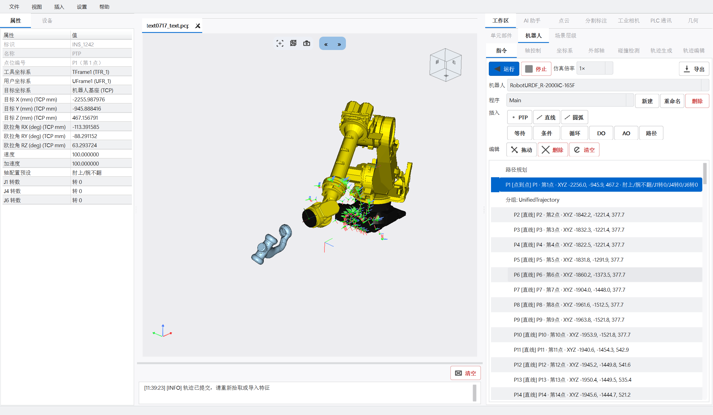
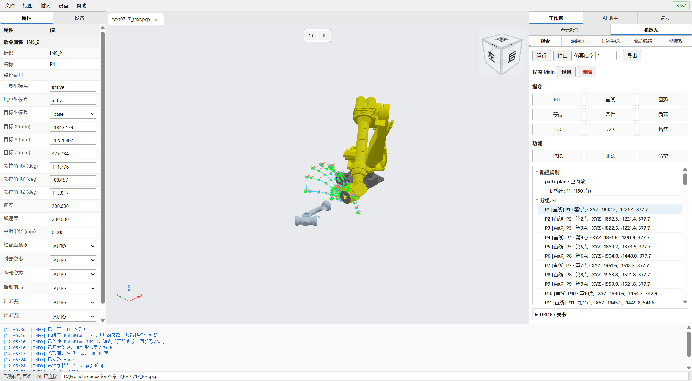

# CloudSim

工业机器人仿真双端：几何内核 OCC/CGAL（建模、点云、碰撞），桌面 Qt+OSG / 网页 React+Three.js 渲染与交互，能力由 Data 后端对象、URDF/运动规划/轨迹及可扩展插件定义。

| 桌面端 | 网页端 |
|:------:|:------:|
|  |  |

## 快速入口

| 项 | 路径 |
|----|------|
| 桌面解决方案 | [`CloudSim.sln`](CloudSim.sln) → `CloudSim.exe` |
| 网页解决方案 | [`CloudSimWeb.sln`](CloudSimWeb.sln) → `CloudSimWeb.exe` |
| 双端安装包 | [`../Setup/packaging`](../Setup/packaging)（`-Product Desktop\|Web`；Web 须 Vite `bin\x64\web\assets\`） |
| 文档索引 | [`docs/README.md`](docs/README.md)（含**按模式 / 按插件**导航） |
| 主程序 / 几何建模 / 工艺流程 / 工程图 | [`docs/主程序/`](docs/主程序/)、[`几何建模/`](docs/几何建模/)、[`工艺流程/`](docs/工艺流程/)、[`工程图/`](docs/工程图/) |
| 插件类型索引 | [`docs/插件/`](docs/插件/)、[`src/Plugins/README.md`](src/Plugins/README.md) |
| `src/` 文档总览 | [`src/README.md`](src/README.md) |
| 目录布局 | [`docs/DIRECTORY_LAYOUT.md`](docs/DIRECTORY_LAYOUT.md) |
| 模块开发指南 | [`docs/MODULE_DEVELOPER_GUIDES.md`](docs/MODULE_DEVELOPER_GUIDES.md) |
| 源码约定 | [`docs/SOURCE_CONVENTIONS.md`](docs/SOURCE_CONVENTIONS.md) |
| 世界坐标契约 | [`docs/spatial_contract_world_pose.md`](docs/spatial_contract_world_pose.md) |
| 网页 API（归档） | [`docs/_archive/网页端/API_网页端.md`](docs/_archive/网页端/API_网页端.md) |

构建产物：Debug → 仓库根 `bin\x64d\`，Release → `bin\x64\`（见 `Directory.Build.props`）。网页静态资源在同目录 `web\`。

## 桌面 vs 网页

| | 桌面 | 网页 |
|--|------|------|
| 解决方案 | `CloudSim.sln` | `CloudSimWeb.sln`（仅 Web 依赖链，不含 Widget UI） |
| 进程 | `CloudSim.exe` | `CloudSimWeb.exe`（独立，不监听桌面端口） |
| 入口 | `src/App/CloudSim/` | `src/App/CloudSimWeb/` |
| 宿主 | 完整 Qt/OSG UI | Headless Host + HTTP/WS 网关 |
| 默认访问 | 桌面窗口 | `http://127.0.0.1:8787`（可用 `--port=` 改端口） |
| TCP 拖动示教 | 末端局部轴；目标姿态用四元数真值，避免欧拉往返 | 同源：`TransformControls` 固定 `local`；`/api/robot/tcp-ik` 追赶只截断平移；落点优先罗盘矩阵 |
| 架构图 | [`docs/architecture/desktop.html`](docs/architecture/desktop.html) | [`docs/architecture/web.html`](docs/architecture/web.html) |

两套 sln **互不引入**对方的 UI/Web 工程；桌面用 `CloudSimHost`，网页用 `CloudSimHostHeadless`；共享 `CloudSimCore` / `Data` / 机器人与几何等后端 DLL。

## 网页版源码

```text
CloudSim/
├── CloudSimWeb.sln
├── web/cloudsim-web-ui/          # 前端（Vite + React + Three.js）
│   ├── src/                      # TS/TSX 源码
│   ├── scripts/postbuild-web.cmd # VS PostBuild：npm build → $(OutDir)web
│   └── _archive/public-fallback/ # 无 Node 时 CLOUDSIM_WEB_FALLBACK=1 的兜底页
├── src/App/CloudSimWeb/          # CloudSimWeb.exe：Qt 事件循环、启停 Gateway
└── src/Web/CloudSimWebGateway/   # HTTP/WS（cpp-httplib）、REST/SSE、静态托管（静态库，无独立 DLL）
```

- **Gateway**：托管 `{exe}/web`，对外 REST + SSE（`/api/events`）；业务经 Headless Host / Data / 轨迹等与桌面同源。运行时还需 `{exe}/resource/{models,trajectory,feature}`。
- **前端构建**（有 Node 时，在 `web/cloudsim-web-ui`）：

```bash
npm run build:debug    # → bin/x64d/web（含 assets/）
npm run build:release  # → bin/x64/web（含 assets/）
```

- **无 Node / 临时兜底**：设置 `CLOUDSIM_WEB_FALLBACK=1` 后编译，会 xcopy `_archive/public-fallback`；**正式安装包不要用 fallback**（打包脚本默认要求 Vite `assets/*.js`）。

## 源码结构（摘要）

```text
CloudSim/
├── CloudSim.sln / CloudSimWeb.sln
├── docs/                 # 常读文档；历史专题见 docs/_archive/
├── web/                  # 网页前端
├── scripts/              # clang-format / 编码 / vcxproj.filters
└── src/
    ├── App/              # CloudSim.exe / CloudSimWeb.exe / Bootstrap
    ├── Web/              # CloudSimWebGateway
    ├── Contracts/        # CloudSimCore 契约
    ├── Host/             # CloudSimHost 文档宿主
    ├── UI/               # Widget / RobotWidget / 插件宿主等（桌面）
    ├── Robot/            # 运动学、场景、轨迹
    ├── Geometry/         # OCC / 点云 / VCG
    ├── Data/             # 后端对象与持久化
    ├── Plugins/          # 几何建模、工艺、PLC、AI 等
    └── Infra/            # RunLogger 等
```

## 维护命令

在 `CloudSim/` 根目录：

```bash
python scripts/run_clang_format.py
python scripts/normalize_source_encoding.py
python scripts/generate_vcxproj_filters.py --sync
```
