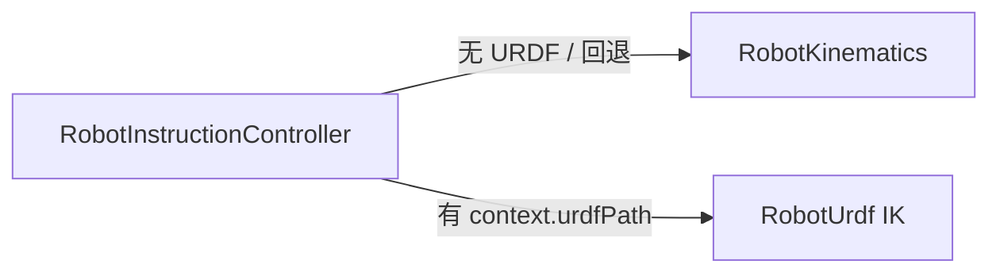

# RobotKinematics 模块开发文档

## 1. 模块定位

`RobotKinematics` 提供**串联机械臂**的修正 DH（Craig）正运动学（FK）与**仅位置**的阻尼最小二乘逆运动学（IK）。与 Qt/OSG/URDF 无关，被 `RobotScene::RobotInstructionController` 在缺少 URDF TCP 上下文时作为回退路径调用。

| 属性 | 说明 |
|------|------|
| 单位 | 长度 **mm**；角度 **rad**（关节变量） |
| 矩阵布局 | 4×4 齐次变换，**列主序** 16 double（与 OSG/`BackendMat4` 一致） |
| 导出 | `ROBOT_KINEMATICS_API`（`robot_kinematics_global.h`） |

---

## 2. 核心类型

### 2.1 `struct DhRow`

**含义**：单节修正 DH 参数，对应  
\(A_i = R_z(\theta_i) \cdot T_z(d_i) \cdot T_x(a_i) \cdot R_x(\alpha_i)\)，其中 \(\theta_i = \text{thetaOffset} + q[\text{jointIndex}]\)（旋转关节）。

| 字段 | 类型 | 说明 |
|------|------|------|
| `a` | `double` | 连杆长度 |
| `alpha` | `double` | 扭角 |
| `d` | `double` | 偏距 |
| `thetaOffset` | `double` | 固定偏置；`jointIndex < 0` 时 θ 恒为 `thetaOffset` |
| `jointIndex` | `int` | 在关节向量 `q` 中的下标 |

---

## 3. 公共函数（`SerialLinkKinematics.h`，命名空间 `robot_kinematics`）

| 函数 | 输入 | 输出 | 作用 |
|------|------|------|------|
| `fkSerialDh` | `rows`, `q` | `T_end4x4_colMajor[16]` | 末端执行器 FK |
| `endEffectorPosition` | `rows`, `q` | `posOut[3]` | 仅取 FK 平移列 |
| `ikPositionDampedLeastSquares` | `rows`, `targetPos[3]`, `qInOut`, `maxIter`, `tol`, `lambda` | `bool`；可选 `iterationsUsed` | 数值 IK：`qInOut` 作种子与结果 |
| `jointCountFromDhRows` | `rows` | `int` | `max(jointIndex)+1` |

### 3.1 IK 使用注意

- **仅位置**：不约束姿态；带欧拉角的 PTP/LINE 应优先走 `RobotUrdf` + `RobotScene` 的 URDF IK。
- **种子敏感**：`qInOut` 初值影响收敛；轴配置筛选在 `RobotScene` 层完成，不在本模块。

---

## 4. 与上层集成

| 调用方 | 何时使用 |
|--------|----------|
| `Controller::setDhRows` | UI/配置注入 DH 表 |
| `PtpPlanner` / `LinePlanner`（实现于 `.cpp`） | `context.urdfPath` 为空且 `hasDhRows()` 时 |

笛卡尔目标在 `RobotScene` 中已为 **基座系 TCP**；`context.toolFrameMat4` 换算法兰 link 目标后再 IK。导出关节角见 `RobotProgramExport`。

---

## 5. 扩展指南

- 新增 7 轴或闭链：建议新库或新命名空间，勿破坏现有 `DhRow` ABI。
- 导出宏：新公共符号加 `ROBOT_KINEMATICS_API`；静态链接定义 `ROBOT_KINEMATICS_STATIC`。

---

## 6. 相关文档

- 指令规划与 IK 链：[`../RobotScene/DEVELOPER_GUIDE.md`](../RobotScene/DEVELOPER_GUIDE.md)
- URDF 主路径：[`../RobotUrdf/DEVELOPER_GUIDE.md`](../RobotUrdf/DEVELOPER_GUIDE.md)
