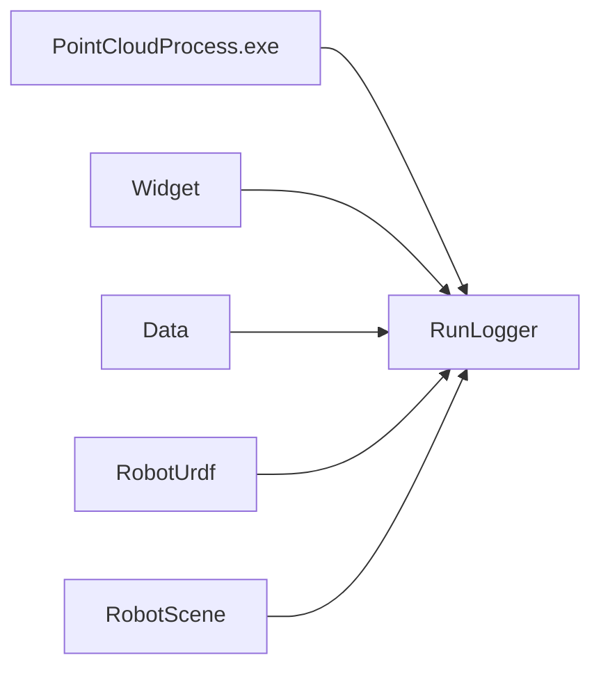

# RunLogger 模块开发文档

## 1. 模块定位

`RunLogger` 是横切基础设施：为 `PointCloudProcess` 全解决方案提供**统一日志 API**（文件 + 控制台 + 可选 UI 回调）。不依赖 Qt/OSG，可被 `Data`、`RobotUrdf`、`RobotScene`、`Widget` 等任意工程链接。

| 属性 | 说明 |
|------|------|
| 工程类型 | 静态库 / DLL（`RUN_LOGGER_API`） |
| 头文件目录 | `RunLogger/inc/` |
| 实现目录 | `RunLogger/source/` |
| 导出宏 | `run_logger_global.h` → `RUN_LOGGER_API` |

---

## 2. 依赖关系

**被依赖方**：无业务模块依赖；**依赖方**：几乎所有上层模块。

---

## 3. 命名空间 `RunLogger`

### 3.1 `enum class LogLevel`

| 枚举值 | 典型用途 |
|--------|----------|
| `Trace` | 极细粒度跟踪 |
| `Debug` | 开发调试（如 `ROBOT_KINEMATICS_DEBUG` 输出） |
| `Info` | 正常流程信息 |
| `Warn` | 可恢复异常 |
| `Error` | 操作失败 |
| `Critical` | 致命错误 |

### 3.2 类型别名

| 名称 | 定义 | 作用 |
|------|------|------|
| `UiSink` | `std::function<void(LogLevel, const std::string&)>` | 将日志行推送到 UI（如 `RunInfoPage`） |

---

## 4. 公共 API（`RunLogger.h`）

### 4.1 生命周期

| 函数 | 签名要点 | 作用 |
|------|----------|------|
| `initialize` | `(logDirectory, fileNameBase = "PointCloudProcess")` → `bool` | 创建日志目录、打开滚动日志文件；应用启动时调用一次 |
| `shutdown` | `void` | 刷盘并关闭 sink；与 `MainWindow::shutdownApplicationLogging()` 配对 |

### 4.2 UI 桥接

| 函数 | 作用 |
|------|------|
| `setUiSink(sink)` | 注册 UI 回调；`MainWindow` 初始化时通常绑定到 `RunInfoPage` |
| `clearUiSink()` | 移除回调（避免析构后悬空调用） |

### 4.3 写日志

| 函数 | 作用 |
|------|------|
| `log(level, message)` | 通用入口：写文件/控制台，并调用 `UiSink`（若已设置） |
| `trace` / `debug` / `info` / `warn` / `error` / `critical` | 按级别的便捷包装 |
| `flush()` | 强制刷盘（`debug`/`info` 默认可能缓冲） |

### 4.4 工具

| 函数 | 作用 |
|------|------|
| `levelName(level)` | 返回级别 C 字符串（用于格式化） |

---

## 5. 集成约定

1. **启动顺序**：`QApplication` 创建后、`MainWindow` 显示前调用 `RunLogger::initialize`；路径通常为用户文档或应用目录下的 `logs/`。
2. **退出顺序**：`main` 在 `app.exec()` 返回后调用 `MainWindow::shutdownApplicationLogging()` → 内部 `RunLogger::shutdown()`。
3. **线程**：API 未声明线程安全；**从 UI 线程**调用最安全。后台 `JobSystem` 任务若需打日志，应 `queueOnMainThread` 再写，或仅写文件路径（实现以 `.cpp` 为准）。
4. **环境变量诊断**：如 `POINTCLOUD_GIZMO_PIVOT_DIAG`、`ROBOT_KINEMATICS_DEBUG` 等由业务模块读取环境变量后，通过 `RunLogger::debug` 输出，而非直接 `std::cout`。

---

## 6. 与架构文档的对应

全局架构见 [`../ARCHITECTURE_SUMMARY.md`](../ARCHITECTURE_SUMMARY.md) §4.9。本模块仅提供日志通道，不参与业务状态机。
