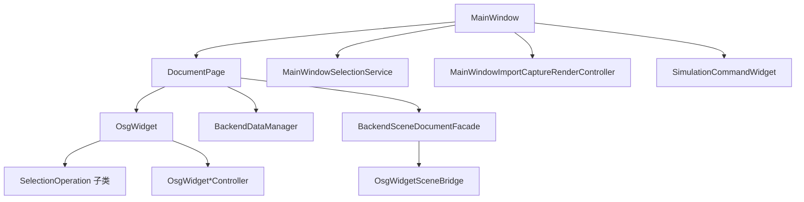

# Widget 模块开发文档

## 1. 模块定位

`Widget` 是 **Qt 桌面前端与流程协调中心**：主窗口、多文档标签、后端树/属性面板、OSG 视图桥接、项目 I/O、机器人仿真 UI、异步任务与进度。对应架构中的「前端 UI 层」；本地引擎在 `Data` / `OsgWidgetCore` / `RobotScene` 等子工程。

| 属性 | 说明 |
|------|------|
| x64 构建 | 通常为 **DLL**（`WIDGET_EXPORT`） |
| 头文件 | `Widget/inc/`（约 40 个） |
| 实现拆分 | `MainWindow*.cpp`, `OsgWidget*.cpp`, `*Controller`, `*Operation` |

---

## 2. 架构分层（本模块内）

---

## 3. 应用壳与主窗口

### 3.1 `MainWindow`

**职责**：菜单、Dock、文档标签、设备页、运行信息、仿真 Dock、主题/语言、机器人回放定时器、跟随求解调度、项目保存/加载。

| 公共 API | 说明 |
|----------|------|
| `MainWindow(parent)` | 构造；内部调用 `MainWindowUiSetup` 等拆分单元 |
| `static shutdownApplicationLogging()` | 退出时 `RunLogger::shutdown` |

| 信号 | 说明 |
|------|------|
| `backendPropertyCommitted(backendId, key, old, new, semanticFlags)` | 属性行提交 |

**友元 / 协作类**（逻辑在对应 `.cpp`，非全部 public）：

| 类 | 职责 |
|----|------|
| `MainWindowUiSetup` | 菜单、Dock、初始布局 |
| `MainWindowBackendTree` | 后端树与场景树 |
| `MainWindowPropertyPanel` | 属性浏览器；仿真指令轴配置枚举过滤 |
| `MainWindowFileImport` | 模型/点云导入 |
| `MainWindowProjectIo` | `.pcp` / `project.json`、zip 打包 |
| `MainWindowImportCaptureRenderController` | 注册 backend、URDF |
| `MainWindowSelectionService` | 选择与可见性闭环 |
| `MainWindowObjectRepository` | `findById` / `listAll` 门面 |

### 3.2 `mainwindow_detail`（`MainWindow_p.h`）

Qt 树角色：`kRoleItemType`, `kRoleBackendId`, `kRoleAnnotationId`；项类型 `kItemTypeBackend`, `kItemTypeAnnotation`。

### 3.3 `ApplicationStyle`

| API | 说明 |
|-----|------|
| `Theme::Light` / `Dark` | |
| `applyTheme`, `loadSavedTheme`, `saveTheme` | 全局 QSS/调色 |

---

## 4. 文档页与场景门面

### 4.1 `DocumentPage`

**一标签页 = 一套独立世界**：`OsgWidget` + `BackendDataManager` + 机器人上下文 + `RobotProgramStore`。

| 方法 | 说明 |
|------|------|
| `osgWidget()` / `backend()` / `hierarchyModel()` | 核心对象 |
| `sceneFacade()` | `BackendSceneDocumentFacade` |
| `robotProgramStore()` | 每机器人指令表 |
| `invalidateFollowReverseIndex()` | 跟随反向索引失效 |
| `markFollowAttachmentDirtyFromBackendMove` / `followDirtyBackendIds` | 跟随脏集 |
| `requestFollowSolveForced` / `takeFollowSolveForced` | 强制整图跟随求解 |
| `removeBackendSubtree(rootId)` | 删子树 |
| `setProjectFilePath` / `projectFilePath()` | 工程路径 |
| `appendHierarchicalRobotSimulationContext(...)` | **追加**机器人实例 |
| `clearRobotSimulationContext` / `clearRobotSimulationIfContains` | 清除仿真 |
| `robotKinematicInstanceCount` / `robotPerLinkKinematicsForInstance` | 多机 per-link 元数据 |
| `setRobotPerLinkKinematicsBinding` | 绑定 URDF 切片 |
| `notifyRobotKinematicsAppliedToScene()` | FK 后跟随脏 |

实现 **`IRobotSimulationDocument`**（供 `RobotScene` 使用）。

### 4.2 `IBackendSceneBridge`

OSG 操作抽象；矩阵为 **列主序 16 double**。

| 虚方法 | 说明 |
|--------|------|
| `set/getBackendRootWorldMatrixColumnMajor` | 世界矩阵 |
| `setBackendObjectVisible` | 显隐 |
| `removeBackendObjectVisual` | 移除分支 |
| `hasBackendObjectBranch` | 是否存在 |
| `tryGetBackendModelCenterMm` | 模型中心 mm |
| `syncOuterPatFromBackend` | 从 backend pose 写 outer |
| `setBackendParent` | 场景父链 |

### 4.3 `OsgWidgetSceneBridge`

`IBackendSceneBridge` → 委托 `OsgWidget`。

### 4.4 `BackendSceneEntity` / `BackendSceneDocumentFacade`

| 类型 | 作用 |
|------|------|
| `BackendSceneEntity` | 单 `backendId`：显隐、矩阵、子 id、follower id |
| `BackendSceneDocumentFacade` | `entity(id)`、`setBackendsVisible`、`poseSink()` → `IRobotBackendPoseSink*` |
| `BackendFollowReverseIndex` | target id → follower ids 缓存 |

**推荐调用链**：树可见性、批量 `syncOuterPatFromBackend` 经 `sceneFacade().entity(...)`，避免 UI 散落裸 `OsgWidget` 细节。

---

## 5. 选择与对象查询

### 5.1 `MainWindowSelectionState`

| 方法 | 说明 |
|------|------|
| `selectedBackendId()` / `setSelectedBackendId` / `clearBackendSelection` | 选择真源 id |

### 5.2 `MainWindowSelectionService`

| 方法 | 说明 |
|------|------|
| `SelectionSnapshot` | `backendId`, `data`, `kind`（PointCloud/Mesh/Other） |
| `handleBackendTreeSelectionChanged` | 树 → OSG/属性；mesh 调 `syncSelectionFromBackend` |
| `handleOsgBackendObjectPicked` | 拾取 → 树选中 |
| `handleBackendTreeItemChanged` | 勾选 → **子树**显隐（`subtreeIds` 语义） |
| `clearSelection` / `selectBackendById` | 程序化选择 |

### 5.3 `MainWindowObjectRepository`

| 静态方法 | 说明 |
|----------|------|
| `findById(mw, id)` | 活动文档 backend |
| `listAll(mw)` | 列表 |

---

## 6. `OsgWidget` — 3D 视图

**继承/实现**：`QWidget` + `OsgScene` 能力委托 + **`IRobotBackendPoseSink`**。

### 6.1 导入与捕获

| 方法 | 说明 |
|------|------|
| `importModelFile` / `importPointCloudFile` | 文件 → staging |
| `captureImportedPointCloudBackend` / `captureImportedMeshBackend` / `captureImportedMeshBackendHierarchy` | → `BackendDataManager` |
| `loadPointCloudFromBackendData` / `loadMeshFromBackendData(skipInner...)` | 注册后建 OSG 分支 |
| `clearImportedContent` / `clearStagingGeometry` | 清空 |

### 6.2 交互模式

| 方法 | 说明 |
|------|------|
| `setSelectionActive` / `setObjectSelectionMode` | 对象选择 + gizmo |
| `setPointPickMode` / `setMeshLinePickMode` / `setMeshFacePickMode` | 拾取模式 |
| `setTransformGizmoFrame` | World / Local 罗盘 |

### 6.3 选中对象变换（与 `ObjectGizmoFrame` 统一）

| 方法 | 说明 |
|------|------|
| `selectedPosition` / `setSelectedPosition` | 经 `readActiveObjectGizmoFrame` |
| `selectedRotationEulerDeg` / `setSelectedRotationEulerDeg` | 同上 |
| `setSelectedColor` | 颜色 |
| `syncOuterPatFromBackend` | 嵌套：**世界矩阵**写回，非 root-local 误用 |
| `syncSelectionFromBackend` / `syncSelectionForBackendId` | 选中同步 |
| `get/setBackendRootWorldMatrixFromWorld` | FK / 属性 |

### 6.4 机器人与指令预览

| 方法 | 说明 |
|------|------|
| `addHierarchicalRobotScene` / `removeHierarchicalRobotScene` | 层级 URDF |
| `setInstructionPoseAxes` / `clearInstructionPoseAxes` | PTP/LINE 世界系 XYZ 轴 |
| `setCameraFollowBackendId` | 轨道相机跟踪 backend 原点 |
| `beginTcpDragTeach` / `endTcpDragTeach` | TCP 示教罗盘（挂 robot root，独立 overlay） |
| `isTcpDragTeachActive` / `isTcpDragGizmoDragging` | 示教模式 / 拖动中 |
| `updateTcpDragTeachFromTarget` | FK 后对齐罗盘 |

### 6.5 信号（与 MainWindow 协作）

| 信号 | 说明 |
|------|------|
| `backendObjectPicked(backendId)` | OSG 拾取 |
| `transformGizmoCommitted` | 罗盘释放 → 刷新属性面板 |
| `tcpDragTeachPoseChanged` / `tcpDragTeachEnded` | TCP 示教拖动 / ESC 退出 |
| `selectedObjectPoseChanged` / `Rotation` / `Color` | 拖动中写后端 |
| `annotationCreated` / `Removed` / `visibilityChanged` | 注释 |

### 6.6 帧钩子

| 方法 | 说明 |
|------|------|
| `setPerFrameHook` | 每帧：跟随求解、注释缩放等 |
| `isTransformGizmoDragging` | 跟随求解跳过正在拖拽的 follower |

---

## 7. OsgWidget 控制器（静态，无状态）

| 类 | 主要 API |
|----|----------|
| `OsgWidgetImportController` | `importModelFile`, `importPointCloudFile` |
| `OsgWidgetBackendLoadController` | `loadPointCloudFromBackendData`, `loadMeshFromBackendData` |
| `OsgWidgetCaptureController` | `captureImported*Backend*`；`MeshCapturedPart` |
| `OsgWidgetPickAnnotationController` | 点标记、文字注释、快照恢复 |
| `OsgWidgetGizmoController` | 罗盘创建、`pickAxisAtScreenPos`、高亮、缩放 |
| `OsgWidgetTransformHierarchyController` | `setBackendParent`, `syncSelectionForBackendId`, `finalizeSelectionSync` |
| `OsgWidgetCameraFocusController` | `focusCameraOnBackend` |
| `OsgWidgetColorController` | staging/backend 上色 |

---

## 8. 交互 Operation（`eventFilter`）

| 类 | 基类 | 行为 |
|----|------|------|
| `SelectionOperation` | — | 分发鼠标/滚轮虚函数 |
| `ObjectTransformOperation` | SelectionOperation | LMB 平移 / RMB 旋转 gizmo |
| `PointPickOperation` | SelectionOperation | 点云拾取 + 注释 |
| `MeshEdgeFacePickOperation` | SelectionOperation | 网格边/面拾取高亮 |

---

## 9. Qt/OSG 窗口桥

| 类 | 说明 |
|----|------|
| `QWidgetViewer` | `QGLWidget`；转发输入到 `GraphicsWindowQt1` |
| `GraphicsWindowQt1` | `osgViewer::GraphicsWindow` 实现 |
| `QtKeyboardMap` | Qt 键 → `osgGA` 键码 |
| `LitMeshMaterial::applyPlastic` | URDF 塑料材质 |

---

## 10. 导入与 URDF

### `MainWindowImportCaptureRenderController`

| 方法 | 说明 |
|------|------|
| `registerBackendObject(mw, path, typeName, isPointCloud, quietUi)` | 通用文件导入 |
| `registerUrdfRobot(mw, urdfPath, quietUi)` | **每连杆**路径：robot root + 各 link `MeshBackendData`、拓扑 `setBackendParent`、FK bind、`appendHierarchicalRobotSimulationContext` |

要点见 [`../ARCHITECTURE_SUMMARY.md`](../ARCHITECTURE_SUMMARY.md) §6.1。

---

## 11. 项目 I/O

### `project_package_zip`

| 函数 | 说明 |
|------|------|
| `isZipArchiveFile` | 是否 zip |
| `zipDirectoryTree` | STORE 无压缩打包 `.pcp` |
| `extractZipArchive` | 解包 |

### `MainWindowProjectIo`（实现文件）

- 采集对象、属性、`edges`、`followAttachment`、`robotPrograms`、`robotKinematicsInstances`。
- 点云 sidecar PLY；加载时 `invalidateFollowReverseIndex`、重建树。

---

## 12. 异步任务

### `JobSystem` + `ProgressManager`

| 类 | 说明 |
|----|------|
| `JobSystem::enqueue(title, work, onFinished)` | `QThreadPool` 执行 `work`；`onFinished` 在 UI 线程 |
| `ProgressManager` | `jobStarted` / `jobProgress` / `jobFinished`（`QMetaObject::invokeMethod`） |

**边界**：后台仅填充 `PointCloudBackendData`（非 LAS）；注册 OSG、刷树仍在 **UI 线程**。

---

## 13. 仿真 UI

### `RobotProgramStore`

`QHash<sceneBackendId, vector<RobotInstruction::Base>>`；`activeRobotBackendId()`。

### `SimulationCommandWidget`

| 方法 / 信号 | 说明 |
|-------------|------|
| `setProgramStore` | 绑定 |
| `setRobotInstances(labels, backendIds)` | 多机 |
| `instructions(robotBackendId)` | 指令向量 |
| `appendInstructionFromCurrentPose` | 捕获当前 TCP |
| `instructionSelected` → MainWindow | 预览链式 plan |
| `runRequested` / `stopRequested` | 执行器 |
| `tcpDragTeachModeChanged(bool)` | 末端拖动示教开/关（不落盘指令） |
| `setTcpDragTeachMode` / `tcpDragTeachMode` | 与 3D ESC / 仿真 Run 同步按钮状态 |

### `InstructionProgramTreeWidget`

| 方法 | 说明 |
|------|------|
| `setProgram` / `rebuildFromProgram` / `syncToProgram` | 树 ↔ 模型 |
| `NodeKind` | Instruction / ThenBranch / ElseBranch |
| DnD | 调整顺序与嵌套 |

### `SimulationLogIoSink`

实现 `IRobotIoSink`，IO 写入打 `RunLogger`。

### `RobotAxisControlWidget`

关节滑块 ↔ `MatrixTransform`；信号 `jointAngleChanged`。

### `RobotFrameSettingsWidget`（坐标系 Dock）

| 项 | 说明 |
|----|------|
| 工具系 `T_flange_tool` | `positionMm` / `eulerDeg`；平移在 **法兰连杆轴**（UI：`X/Y/Z (mm, flange)`） |
| `flangeLink` | 空则用 `RobotCoordinateFrameSet::flangeLinkName`（如 `link_6`） |
| 捕获 / 重置 | `Capture from TCP`、`Reset to flange` → `MainWindow::onCaptureToolFrame` / `onResetToolFrame` |

### 示教与 FK 路径（`MainWindow.cpp`）

| 函数 | 说明 |
|------|------|
| `tryCaptureCurrentRobotTcpPose` | 优先 `UrdfFlangeFk+Tool`：`targetInBaseFromUrdfFlangeFk` → `engine::toolOriginFromFlange` |
| `targetRigidTransformFromUrdfFlangeFk` | 示教落盘 `context.targetTransform*` 真值 |
| `osgTcpInBaseFromFlangeLinkWorld` | 委托 `toolOriginFromFlange`（禁止裸 `linkWorld * toolMat`） |
| `osgMatrixFromRobotRigidFrame` | `osgMatrixFromRigidTransform(rigidTransformFromFrame(...))` |
| `updateRobotFrameOverlays` | per-link 时优先 URDF FK 放置工具轴；否则 `localMatrix` 挂在法兰 backend |

详见 [`../GeometryEngine/DEVELOPER_GUIDE.md`](../GeometryEngine/DEVELOPER_GUIDE.md)、[`../RobotScene/DEVELOPER_GUIDE.md`](../RobotScene/DEVELOPER_GUIDE.md) §8.3。

---

## 14. 其它页面

| 类 | 说明 |
|----|------|
| `RunInfoPage` | `appendInfo/Warning/Error`；接 `RunLogger` UiSink |
| `DevicePageWidget` | 扫描 `resource/models`；`urdfImportRequested` |

---

## 15. 关键业务流程索引

| 流程 | 入口 | 文档章节 |
|------|------|----------|
| 导入显示 | `registerBackendObject` | ARCH §6.1 |
| 属性编辑 | `applyPropertyChange` → `syncOuterPatFromBackend` | ARCH §6.2 |
| Gizmo | `ObjectTransformOperation` | ARCH §6.2.0 |
| 跟随 | `runBackendFollowSolveAndSync` | ARCH §6.2.1 |
| 选择闭环 | `MainWindowSelectionService` | ARCH §6.3 |
| 仿真预览/运行 | `onSimulationInstructionSelectionChanged` | ARCH §6.4 |
| 末端拖动示教 | `onSimulationTcpDragTeachModeChanged` → `RobotTeachIk` | §13 |
| 工具/示教 FK | `targetRigidTransformFromUrdfFlangeFk` | §13、`GeometryEngine` |

---

## 16. 扩展指南

1. **新菜单/工作流**：优先新 `MainWindowXxx.cpp` 单元，避免膨胀 `MainWindow.cpp`。
2. **新 OSG 行为**：逻辑放 `OsgWidgetCore`；Qt 事件放 `OsgWidget` 或 `*Controller`。
3. **新后端类型**：`Data` 注册 + `BackendVisual` + `load*FromBackendData` 分支。
4. **DLL 导出**：新 public 类方法标记 `WIDGET_EXPORT`。

---

## 17. 相关文档

- 总架构：[`../ARCHITECTURE_SUMMARY.md`](../ARCHITECTURE_SUMMARY.md)
- 模块索引：[`../docs/MODULE_DEVELOPER_GUIDES.md`](../docs/MODULE_DEVELOPER_GUIDES.md)
- 刚体/工具链：[`../GeometryEngine/DEVELOPER_GUIDE.md`](../GeometryEngine/DEVELOPER_GUIDE.md)
- 数据层：[`../Data/DEVELOPER_GUIDE.md`](../Data/DEVELOPER_GUIDE.md)
- OSG 核心：[`../OsgWidgetCore/DEVELOPER_GUIDE.md`](../OsgWidgetCore/DEVELOPER_GUIDE.md)
