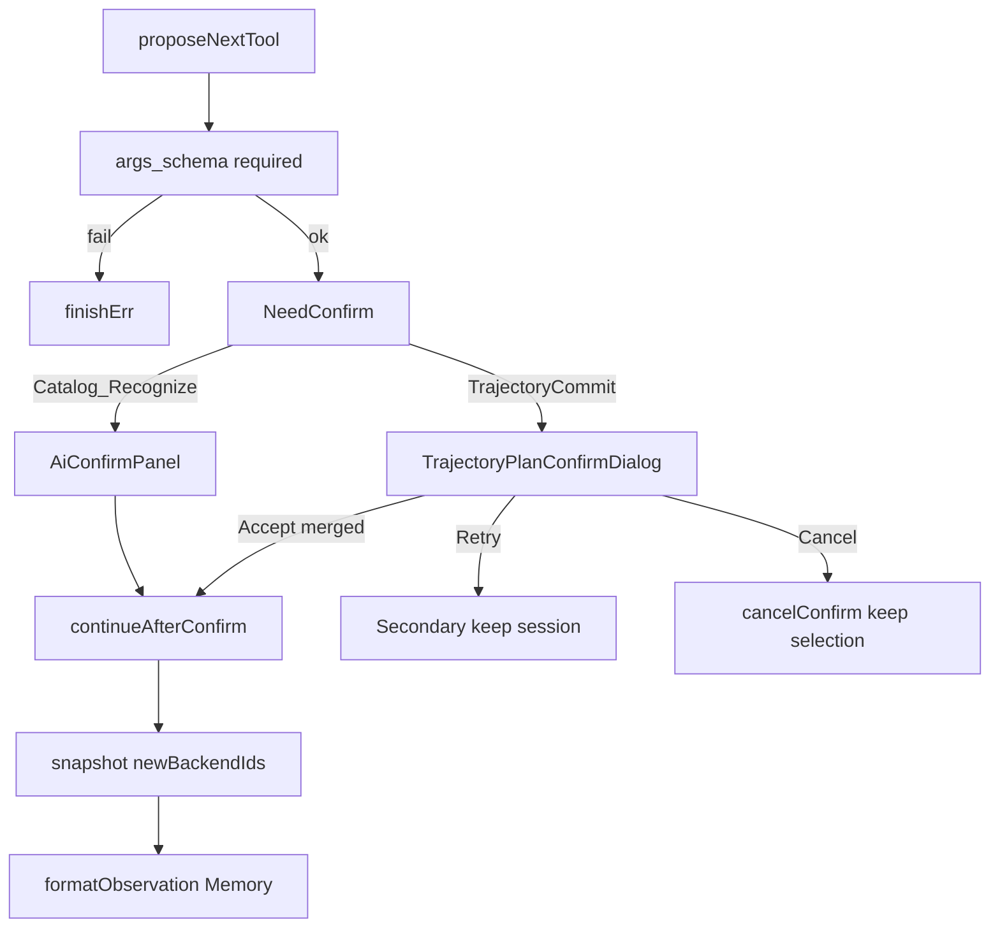

# DESIGN — AI 助手：计划可校验 + 执行可观测 + 确认 UX 单轨

## 模块

| 模块 | 变更 |
|------|------|
| `AiArgsSchema` | `missingRequiredArgs` |
| `AiAgentRuntime` | 提案后校验；快照差分填 `newBackendIds`；TrajectoryCommit 用 submit 的 merged 载荷 |
| `AiActionPlanExecutor` | mesh.compose 校验 |
| `AiAssistantCoordinator` | 轨迹确认经 Runtime；NeedConfirm 分支弹模态；Secondary=返回重选 |

## 异常

- 校验失败：不弹确认，Error/结束并提示缺参名。
- 离散对话框取消：`cancelAgentConfirm`，特征会话不 `resetFeatureSession`。
- 返回重选：`secondaryAgentConfirm`，恢复候选预览，不重置会话。
