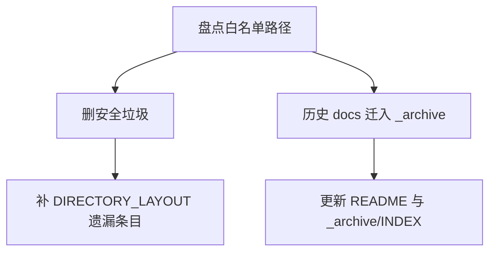

# DESIGN — CloudSim 全阶段整治

## 清理策略

- 垃圾：直接删除（日志、错误 OutDir、venv、pycache、vendor logs）
- 历史 docs：整目录 `Move-Item` → `docs/_archive/`，不散删内容
- 常读与本任务目录留在 `docs/`

## 审计矩阵

| Agent | 范围 | 输出字段 |
|-------|------|----------|
| A-Robot | Run/外轴/插帧/overlay | 文件:行、现象、P级、是否 Top3 |
| B-TrajUI | 拖放/`m_ops`/空桩 | 根因、复现、修复建议 |
| C-GeoMesh | MeshDiscretize 调用链 | 调用方、未实现 mode 暴露面 |
| D-CatchIO | 工程 I/O / restore / parametric | 必须加日志 / 延后 |

## Top3 修复原则

- T1：列表与 `m_ops` 单一真源，修拖放路径而非仅事后对齐
- T2：只修审计确认缺陷，不做功能扩展
- T3：入口拒绝未实现 mode；关键 catch 打 RunLogger，不改语义
