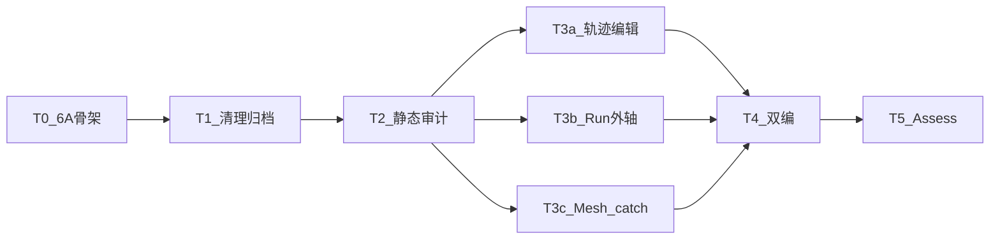

# TASK — CloudSim 全阶段整治

## 依赖图

| ID | 输入 | 输出 | 验收 |
|----|------|------|------|
| T0 | 计划共识 | ALIGNMENT/CONSENSUS/DESIGN/TASK | 文档存在 |
| T1 | 删除白名单 | 垃圾清除；`docs/_archive`；README/LAYOUT 更新 | 路径不存在；索引有效 |
| T2 | 源码只读 | `BUG_AUDIT.md` | 四路覆盖 |
| T3a | 审计 T1 | TrajectoryEdit 修复 | 列表/`m_ops` 一致逻辑 |
| T3b | 审计 T2 | Run/外轴确认缺陷修复或标明不改 | 有记录 |
| T3c | 审计 T3 | Mesh 防护 + 关键 catch 日志 | 编译通过 |
| T4 | 触及工程 | Debug+Release 成功 | ACCEPTANCE 勾选 |
| T5 | 全部 | FINAL/TODO | 交付询问 |
