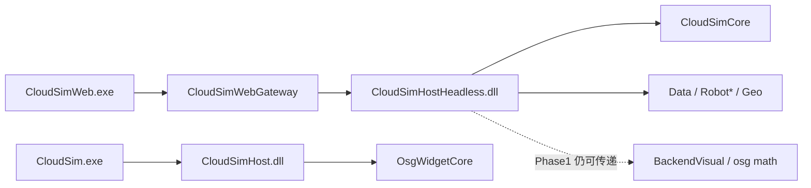

# ALIGNMENT / CONSENSUS — WebH2 链接期去 OSG

## 需求与验收（已确认）

见 `ALIGNMENT_WebH2_链接期去OSG.md`。本轮 Phase1：

| 验收项 | 标准 |
|--------|------|
| Headless DLL | `CloudSimHostHeadless.dll` 的 `dumpbin /dependents` **无** `OsgWidgetCore.dll` |
| Web 链接 | Gateway / Web.exe ProjectReference → Headless；Web.exe **尽量**不直链 `osg*.lib` |
| 桌面 | `CloudSimHost` 行为与工程不变；Debug\|x64 + Release\|x64 均过 |

## 技术方案

- 新工程 `CloudSimHostHeadless.vcxproj`，同源不同 ItemGroup / 宏 `CLOUDSIM_HOST_HEADLESS_ONLY`
- 排除 Widget `OsgWidget*` / 交互 Operation / `OsgRenderViewAdapter` / QtMoc(OsgWidget)
- 去掉对 `OsgWidgetCore` 的 ProjectReference 与 `OsgWidgetCore.lib`
- `DocumentHost` / Factory / Access / 场景同步路径在宏下走 Null / no-op
- Phase2（本轮不做）：去掉 RobotUrdf→BackendVisual / Host→osg 传递依赖

## 边界

- 不做 AiHost 物理拆 DLL
- 不从 `CloudSimWeb.sln` 删除仍被其它 ProjectReference 需要的 BackendVisual（避免 Win32 陷阱时以 ALIGNMENT 为准）
- 不改桌面 `CloudSim.sln` 主链
