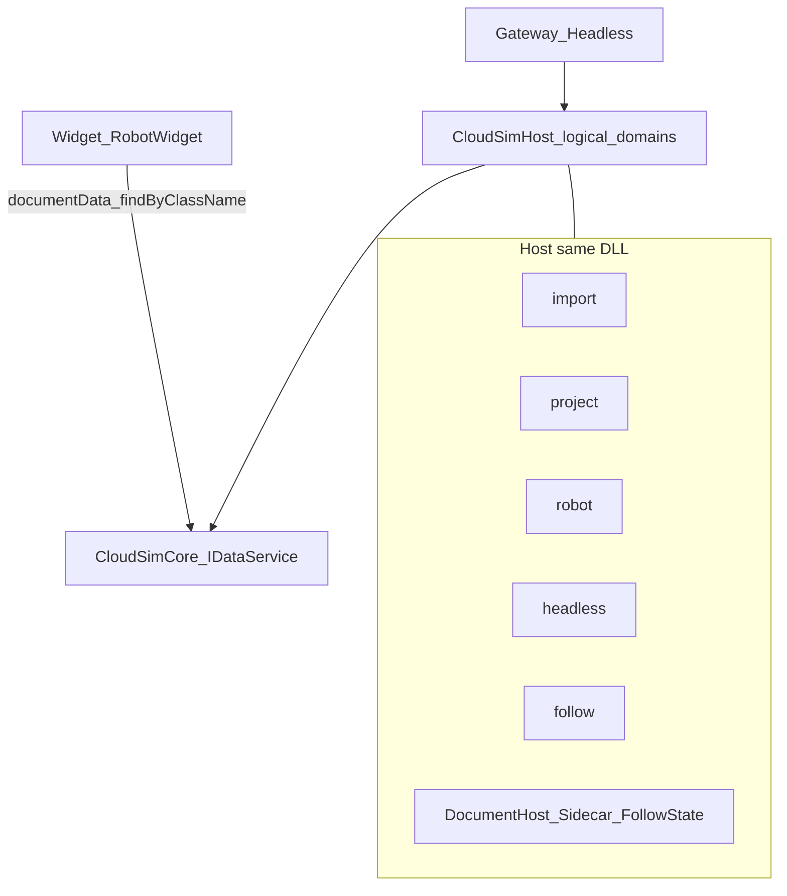

# DESIGN — HostOptimization（摘要）

详见计划路径 B 与 [CONSENSUS](CONSENSUS_HostOptimization.md)。

```mermaid
flowchart TB
  Core[CloudSimCore_IDataService]
  Host[CloudSimHost_logical_domains]
  UI[Widget_RobotWidget]
  Web[Gateway_Headless]
  UI -->|documentData_findByClassName| Core
  Host --> Core
  Web --> Host
  subgraph hostDomains [Host same DLL]
    Imp[import]
    Proj[project]
    Rob[robot]
    Hl[headless]
    Fol[follow]
    DH[DocumentHost_Sidecar_FollowState]
  end
  Host --- hostDomains
```

ABI 白名单与域表：[INTERFACE_CATALOG.md](INTERFACE_CATALOG.md)。
