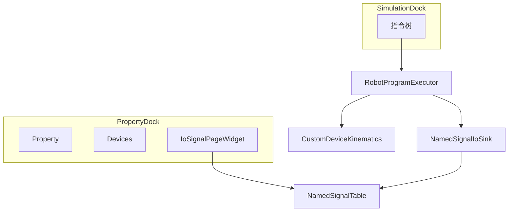

# DESIGN_IO信号与流程

## 核心组件

| 组件 | 职责 |
|------|------|
| `NamedSignalTable` | 信号定义持久化 |
| `NamedSignalIoSink` | DI/DO/AI/AO 运行时 + 强制 DI |
| `IoSignalPageWidget` | 定义/监控 UI |
| `DeviceAxisInstruction` | 设备轴运动 |
| `RobotProgramExecutor` | 解析 signalName、插值 DeviceAxis |

## 异常

- 未知信号名：回落 `ioPort`
- 未知设备 id：打日志并跳过该步
