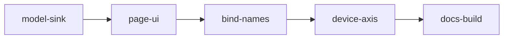

# TASK_IO信号与流程

1. 信号表 + Sink + 侧车 → 已完成
2. IoSignalPageWidget + Dock Tab → 已完成
3. signalName 绑定 + 树摘要/属性 Combo → 已完成
4. DEVICE_AXIS + executor + UI → 已完成
5. 文档 + 双配置编译 → 进行中

```mermaid
flowchart LR
  A[model-sink] --> B[page-ui]
  B --> C[bind-names]
  C --> D[device-axis]
  D --> E[docs-build]
```
