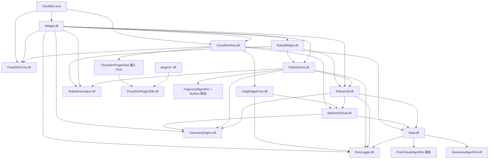

# CloudSim 各子模块开发文档索引

本文档列出各 Visual Studio 子工程（模块）的 **DEVELOPER_GUIDE.md** 入口；总架构与业务流程见 [`../ARCHITECTURE_SUMMARY.md`](../ARCHITECTURE_SUMMARY.md)；目录说明见 [`DIRECTORY_LAYOUT.md`](DIRECTORY_LAYOUT.md)；**源码格式（编码/头卫/clang-format/筛选器）见 [`SOURCE_CONVENTIONS.md`](SOURCE_CONVENTIONS.md)**；文档总索引见 [`README.md`](README.md)。

---

## 统一世界坐标契约（必读）

全工程空间语义以 **[`spatial_contract_world_pose.md`](spatial_contract_world_pose.md) v2** 为权威说明。凡涉及导入、显示、FK、配准、拾取、面重构、TCP 示教，**须先对照该文档**，再改代码。

| 要点 | 约定 |
|------|------|
| **权威存储** | `BackendMat4 worldMatrix`（16 元列主序）；JSON v2 仅持久化 `worldMatrix` |
| **几何** | `geometry` 为对象**出生时**坐标；用户移动只改 `worldMatrix`，不改顶点 |
| **变换** | `p_world = p_geometry × worldMatrix`（OSG 行向量；经 `Adapters` 与 BackendMat4 等价） |
| **属性面板** | `pose` / `rotation` 为 **worldMatrix 分解视图**，非独立存储 |
| **显示** | outer = `osgMatrixFromBackendWorldMatrix`；inner PAT 恒 `(0,0,0)` |
| **权威 API** | `BackendDataBase::worldMatrix()` / `setWorldMatrix()`；`BackendSpatial::transformPointToWorld` |
| **Gizmo** | World/Local 仅交互方式不同；分解为内禀 ZYX |
| **URDF per-link** | 连杆 `geometry` 为 link 文件系；FK 每帧刷新 `worldMatrix`；禁止双重 visual 烘焙 |
| **工具 TCP** | 无 URDF 时：右乘 FK + `toolTcpInBaseFromFk`；有坐标系时：右法兰 + `T_flange_tool` |
| **已废弃** | 独立 `pose`/`rotation` JSON 字段、`T(pose)×R` 手写拼装、轴心补偿写进 `pose`、`skipInnerModelCenterRebase` 等旧路径 |

**强耦合模块**：[`Data`](../src/Data/Data/DEVELOPER_GUIDE.md)、[`BackendVisual`](../src/UI/BackendVisual/DEVELOPER_GUIDE.md)、[`OsgWidgetCore`](../src/UI/OsgWidgetCore/DEVELOPER_GUIDE.md)、[`CloudSimHost`](../src/Host/CloudSimHost/DEVELOPER_GUIDE.md)、[`RobotUrdf`](../src/Robot/RobotUrdf/DEVELOPER_GUIDE.md)、[`RobotScene`](../src/Robot/RobotScene/DEVELOPER_GUIDE.md)、[`RobotWidget`](../src/UI/RobotWidget/DEVELOPER_GUIDE.md)

| 子工程 | 职责摘要 | 开发文档 |
|--------|----------|----------|
| **CloudSim** | 可执行入口、`main` 生命周期 | [CloudSim/DEVELOPER_GUIDE.md](../src/App/CloudSim/DEVELOPER_GUIDE.md) |
| **CloudSimCore** | 前后端契约 DLL：DTO、`EventHub`、服务接口 | [CloudSimCore/DEVELOPER_GUIDE.md](../src/Contracts/CloudSimCore/DEVELOPER_GUIDE.md) |
| **CloudSimHost** | 文档宿主、`OsgWidget` 编译、Core 适配器、组合根实现 | [CloudSimHost/DEVELOPER_GUIDE.md](../src/Host/CloudSimHost/DEVELOPER_GUIDE.md) |
| **Widget** | Qt 主窗口、文档页、属性/仿真 Dock；经 `data()`/`robot()`/`render()` 访问契约；OsgWidget 信号边界 `WidgetSceneSignalWiring`；OSG 源码由 Host 编译 | [Widget/DEVELOPER_GUIDE.md](../src/UI/Widget/DEVELOPER_GUIDE.md) |
| **RobotWidget** | 仿真/设备 Dock UI、`RobotSimulationController`、**CAD/Mesh 轨迹生成**、**轨迹编辑**、工艺化配方 JSON | [RobotWidget/DEVELOPER_GUIDE.md](../src/UI/RobotWidget/DEVELOPER_GUIDE.md) |
| **Data** | 后端对象模型、属性、层级、跟随求解；**`geometry_backend_ops` / `GeometryRef`**；工程 **v4** 持久化 | [Data/DEVELOPER_GUIDE.md](../src/Data/Data/DEVELOPER_GUIDE.md)、[backend_persistence/](backend_persistence/) |
| **BackendVisual** | 后端 → OSG 分支构建策略 | [BackendVisual/DEVELOPER_GUIDE.md](../src/UI/BackendVisual/DEVELOPER_GUIDE.md) |
| **OsgWidgetCore** | 纯 OSG 场景、拾取、gizmo、绑定索引 | [OsgWidgetCore/DEVELOPER_GUIDE.md](../src/UI/OsgWidgetCore/DEVELOPER_GUIDE.md) |
| **GeometryEngine** | `RigidTransform`、`BackendWorldPose`、坐标 FK、`OSG`/`BackendMat4` 适配 | [GeometryEngine/DEVELOPER_GUIDE.md](../src/Geometry/GeometryEngine/DEVELOPER_GUIDE.md)、[CONVENTIONS.md](../src/Geometry/GeometryEngine/CONVENTIONS.md) |
| **CollisionAlgorithm** | 多体 mesh 碰撞（内置 AABB+三角；可选 coal） | [CollisionAlgorithm/DEVELOPER_GUIDE.md](../src/Geometry/CollisionAlgorithm/DEVELOPER_GUIDE.md) |
| **GeometryAlgorithm** | OCC/CGAL 离散、求交、布尔；**FeatureSpec**；Mesh 轨迹；B-rep 更新与**网格曲面重构/管状特征** | [GeometryAlgorithm/DEVELOPER_GUIDE.md](../src/Geometry/GeometryAlgorithm/DEVELOPER_GUIDE.md) §3.1a–§3.5 |
| **RobotKinematics** | DH 串联 FK / 数值 IK | [RobotKinematics/DEVELOPER_GUIDE.md](../src/Robot/RobotKinematics/DEVELOPER_GUIDE.md) |
| **RobotUrdf** | URDF 解析、层级场景、**prismatic FK**、每连杆后端 | [RobotUrdf/DEVELOPER_GUIDE.md](../src/Robot/RobotUrdf/DEVELOPER_GUIDE.md) |
| **RobotScene** | 指令模型、规划、回放、**RawTrajectory**、特征/配方/轨迹流水线 Command | [RobotScene/DEVELOPER_GUIDE.md](../src/Robot/RobotScene/DEVELOPER_GUIDE.md) |
| **TrajectoryAlgorithm** | `ITrajectoryOp` 框架、Registry、Codec、ConfigRegistry | [TrajectoryAlgorithm/DEVELOPER_GUIDE.md](../src/Robot/TrajectoryAlgorithm/DEVELOPER_GUIDE.md) |
| **TrajectoryAlgorithmBuiltins** | 18 种原子块实现、`UnifiedTrajectoryPathMath`、注册注入 | [TrajectoryAlgorithmBuiltins/DEVELOPER_GUIDE.md](../src/Robot/TrajectoryAlgorithmBuiltins/DEVELOPER_GUIDE.md) |
| **RunLogger** | 文件/控制台/UI 日志；x64 动态 DLL | [RunLogger/DEVELOPER_GUIDE.md](../src/Infra/RunLogger/DEVELOPER_GUIDE.md) |
| **CloudSimPluginSDK** | 动态插件 ABI、宿主上下文、几何/点云 API | [CloudSimPluginSDK/DEVELOPER_GUIDE.md](../src/Plugins/CloudSimPluginSDK/DEVELOPER_GUIDE.md) |
| **CloudSimMeshTrajectorySDK** | Mesh 轨迹会话、区域选择、`generateRawPath`；由 RobotWidget 直连 | [CloudSimMeshTrajectorySDK/DEVELOPER_GUIDE.md](../src/Plugins/CloudSimMeshTrajectorySDK/DEVELOPER_GUIDE.md) |
| **CloudSimPluginHost** | 插件扫描、`QPluginLoader`、`PluginHostContext`；**编入 `CloudSimHost.dll`**；UI 经 `IPluginMainWindowHost` | [CloudSimPluginHost/DEVELOPER_GUIDE.md](../src/UI/CloudSimPluginHost/DEVELOPER_GUIDE.md)、[ARCHITECTURE_SUMMARY.md §10](../ARCHITECTURE_SUMMARY.md) |
| **插件开发示例** | 参见 CloudSimPluginSDK 开发指南中的插件模块示例工程 | [CloudSimPluginSDK/DEVELOPER_GUIDE.md](../src/Plugins/CloudSimPluginSDK/DEVELOPER_GUIDE.md) |
| **CloudSimAiSDK** | AI 插件 ABI、分域专模、`ai_config` 与训练文档入口 | [CloudSimAiSDK/DEVELOPER_GUIDE.md](../src/Plugins/CloudSimAiSDK/DEVELOPER_GUIDE.md)、[配置](../../tools/ai-training/CONFIGURATION.md)、[训练](../../tools/ai-training/README.md)、[**AI 轨迹特征**](../../docs/trajectory_feature_ai.md) |
| **AiWidget** | AI 助手 Dock、`AiAssistantCoordinator`、与 `trajectory.feature` 会话 | [CloudSimAiSDK/DEVELOPER_GUIDE.md](../src/Plugins/CloudSimAiSDK/DEVELOPER_GUIDE.md)、[trajectory_feature_ai.md](../../docs/trajectory_feature_ai.md) |
| **PointCloudAlgorithm** | 点云算法静态库（链入 Data） | [PointCloudAlgorithm/DEVELOPER_GUIDE.md](../src/Geometry/PointCloudAlgorithm/DEVELOPER_GUIDE.md) |
| **VcgAlgorithms** | vcglib 网格后处理 DLL | [VcgAlgorithms/DEVELOPER_GUIDE.md](../src/Geometry/VcgAlgorithms/DEVELOPER_GUIDE.md) |
| **CloudSimUiAssets** | UI 静态资源库 | 见工程与 DIRECTORY_LAYOUT |
| **CloudSimLabelingSDK** / **LabelingPlugin** | 标注 ABI 与插件 | [CloudSimLabelingSDK/DEVELOPER_GUIDE.md](../src/Plugins/CloudSimLabelingSDK/DEVELOPER_GUIDE.md) |
| **PlcCommSDK** / **PlcCommUI** / **PlcCommPlugin** | PLC 通讯 SDK、UI、侧栏插件 | [PlcCommSDK](../src/Plugins/PlcCommSDK/DEVELOPER_GUIDE.md)、[PlcCommUI](../src/Plugins/PlcCommUI/DEVELOPER_GUIDE.md)、[PlcCommPlugin](../src/Plugins/PlcCommPlugin/DEVELOPER_GUIDE.md) |
| **IndustrialCameraSDK** / **IndustrialCameraPlugin** | 工业相机 SDK + 单侧栏（相机/手眼 Tab）；二期梅卡/OpenCV | [IndustrialCameraSDK](../src/Plugins/IndustrialCameraSDK/DEVELOPER_GUIDE.md)、[IndustrialCameraPlugin](../src/Plugins/IndustrialCameraPlugin/DEVELOPER_GUIDE.md) |
| **PointNetPlugin** | PointNet++ 分类插件 | [PointNetPlugin/DEVELOPER_GUIDE.md](../src/Plugins/PointNetPlugin/DEVELOPER_GUIDE.md) |
| **GeometryPlugin** / **PointCloudPlugin** | 几何/点云侧栏插件 | [GeometryPlugin](../src/Plugins/GeometryPlugin/DEVELOPER_GUIDE.md)、[PointCloudPlugin](../src/Plugins/PointCloudPlugin/DEVELOPER_GUIDE.md) |

## 依赖方向（简图）

x64 下 `RunLogger`、`OsgWidgetCore` 等为**独立 DLL**；下表箭头为编译期链接方向；运行时共享 `LoadLibrary` 同一套 DLL。



## x64 动态库约定

| 工程 | x64 产物 | 构建时定义 | 消费方（默认 dllimport） |
|------|---------|-----------|-------------------------|
| RunLogger | `RunLogger.dll` | `RUN_LOGGER_LIB` | 是 |
| GeometryEngine | `GeometryEngine.dll` | `GEOMETRY_ENGINE_LIB` | 是 |
| RobotKinematics | `RobotKinematics.dll` | `ROBOT_KINEMATICS_LIB` | 是 |
| RobotUrdf | `RobotUrdf.dll` | `ROBOT_URDF_LIB` | 是 |
| RobotScene | `RobotScene.dll` | `ROBOT_SCENE_LIB` | 是 |
| BackendVisual | `BackendVisual.dll` | `BACKENDVISUAL_LIB` | 是 |
| OsgWidgetCore | `OsgWidgetCore.dll` | `OSGWIDGETCORE_LIB` | 是 |
| Data | `Data.dll` | `DATA_LIB` | 是 |
| Widget | `Widget.dll` | `WIDGET_LIB` | 是 |
| PointCloudAlgorithm | `.lib`（静态） | `POINT_CLOUD_ALGORITHM_STATIC` | 仅 `Data` 链入 |
| TrajectoryAlgorithm + Builtins | `.lib`（静态） | `TRAJECTORY_ALGORITHM_LIB` / `ROBOT_SCENE_LIB`（TU） | 仅 `RobotScene` 链接；UI 经 `TrajectoryOpBridge` |

- 导出宏见各 `inc/*_global.h`（`RUN_LOGGER_API`、`GEOMETRY_ENGINE_API`、`BACKENDVISUAL_EXPORT`、`OSGWIDGETCORE_EXPORT` 等）。
- **注意**：头文件中导出 `*_API` 类的 `constexpr` 字符串常量受 MSVC dllimport 限制，须用 `inline constexpr`（如 `RobotInstructionProgram.h` 中 `kMotionPointIndexKey`）。
- Win32 配置仍可用 `*_STATIC` / `BUILD_STATIC` 关闭导入导出。
- 新增 DLL 时：在对应 `*_global.h` 加导出宏，vcxproj 定义 `*_LIB`；消费方通过 `ProjectReference` + import `.lib` 链接。

## Visual Studio 工程过滤器

各子工程 `.vcxproj.filters` 统一为两层结构：

1. 顶层：**`inc`**（头文件）、**`src`**（源文件 / Qt Moc）
2. 子层：按功能划分（如 `inc\adapters`、`src\MainWindow`、`src\OsgWidget`、`src\Backend`、`src\ThirdParty\qtpropertybrowser` 等）

跨工程引用：如 Widget 引用 `CloudSimPluginHost`、`Host` 引用 Widget OSG 源码，使用 `inc\HostRef`、`src\WidgetBorrowed`、`inc\PluginHost` 等筛选器，与本地 `inc`/`src` 并列。

**日常推荐**（只补缺失、不覆盖已有 filters）：

```bash
python scripts/generate_vcxproj_filters.py --only-missing
```

全量重写（会覆盖已有 `.filters`，改前确认）：

```bash
python scripts/generate_vcxproj_filters.py
```

脚本扫描 `src/` 下产品 `*.vcxproj`，写出 UTF-8 BOM + CRLF；不修改 `.vcxproj` 本体。完整约定见 [`SOURCE_CONVENTIONS.md`](SOURCE_CONVENTIONS.md) §6。

## 源码注释约定（code-comment）

- 只写 **Why**：业务背景、非显然算法、边界兜底、危险操作；不写「这段代码做什么」。
- 每个文件顶部：`/// @file` + `/// @brief`（中文短句）；公开 API / 复杂类型另用 `///`，约 5–15 字；`@param` 仅在有非显然约束时写。
- 实现文件用自然中文 `//`；单行注释尽量 ≤ 80 字。
- 避免「用于」「调用方法」等空泛句；优先动词或名词短语作末 `//` 短句。
- 批量清理历史「中文。」标签等：`python scripts/apply_code_comment_style.py`（慎用，改后看 diff）。

## 头文件约定

- 公开 API：`工程/inc/*.h`
- 实现：`工程/source/*.cpp`
- Include 守卫：统一 `#ifndef <工程名>_<文件名>_H` / `#define` / `#endif // ...`（如 `DATA_MESHBOOLEAN_H`）；**不使用** `#pragma once`
- 文件头注释：`/// @file` + `/// @brief`
- 编码：UTF-8 **with BOM**，换行 **CRLF**
- 导出 DLL：使用各 `*_global.h` 中的 `*_EXPORT` 宏；跨工程引用通过 vcxproj `AdditionalIncludeDirectories`；源码根路径与 `src/` 布局见 [`DIRECTORY_LAYOUT.md`](DIRECTORY_LAYOUT.md)
- **完整细则与维护脚本**：[`SOURCE_CONVENTIONS.md`](SOURCE_CONVENTIONS.md)

## 工程持久化（v4）

设计与任务文档见 [`backend_persistence/`](backend_persistence/)（`DESIGN_*`、`TASK_*`、`REGRESSION_CHECKLIST_*`、`ACCEPTANCE_*`）；总架构见 [`../ARCHITECTURE_SUMMARY.md`](../ARCHITECTURE_SUMMARY.md) §6.5。

## 约定索引

- 源码格式（编码 / 头卫 / format / 筛选器）：[`SOURCE_CONVENTIONS.md`](SOURCE_CONVENTIONS.md)
- 文档总索引：[`README.md`](README.md)
- C++ / Qt 编码约定：`.cursor/rules/cloudsim-cpp-conventions.mdc`
- 解决方案结构：`.cursor/rules/cloudsim-architecture.mdc`
