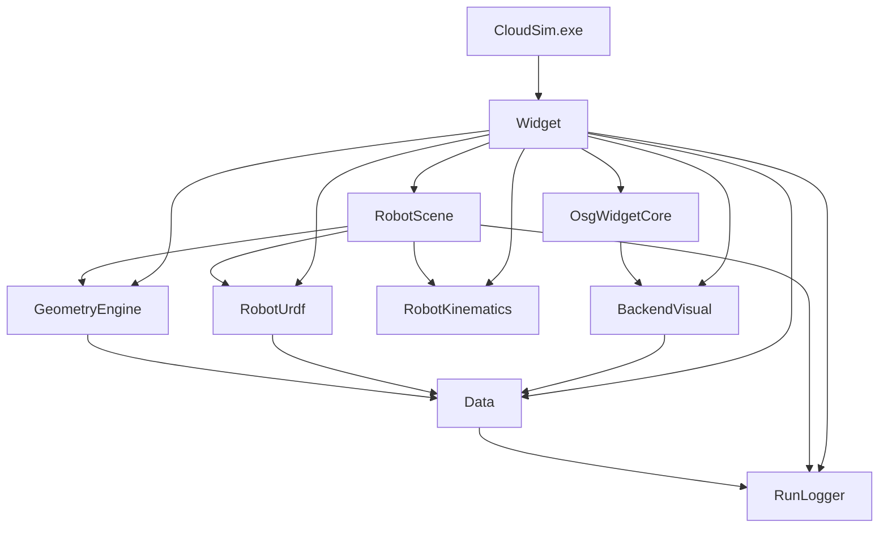

# CloudSim 子模块开发文档索引

本文档列出各 Visual Studio 子工程（子模块）的 **DEVELOPER_GUIDE.md**。总架构与业务流程见 [`../ARCHITECTURE_SUMMARY.md`](../ARCHITECTURE_SUMMARY.md)。

| 子工程 | 职责简述 | 开发文档 |
|--------|----------|----------|
| **CloudSim** | 可执行入口、`main` 生命周期 | [CloudSim/DEVELOPER_GUIDE.md](../CloudSim/DEVELOPER_GUIDE.md) |
| **Widget** | Qt 主窗口、文档页、OSG 桥接、仿真 UI | [Widget/DEVELOPER_GUIDE.md](../Widget/DEVELOPER_GUIDE.md) |
| **Data** | 后端对象模型、属性、层级、跟随求解 | [Data/DEVELOPER_GUIDE.md](../Data/DEVELOPER_GUIDE.md) |
| **BackendVisual** | 数据 → OSG 分支构建策略 | [BackendVisual/DEVELOPER_GUIDE.md](../BackendVisual/DEVELOPER_GUIDE.md) |
| **OsgWidgetCore** | 纯 OSG 场景、拾取、gizmo、绑定索引 | [OsgWidgetCore/DEVELOPER_GUIDE.md](../OsgWidgetCore/DEVELOPER_GUIDE.md) |
| **GeometryEngine** | `RigidTransform`、工具链 FK、`OSG`/`BackendMat4` 适配 | [GeometryEngine/DEVELOPER_GUIDE.md](../GeometryEngine/DEVELOPER_GUIDE.md) · [CONVENTIONS.md](../GeometryEngine/CONVENTIONS.md) |
| **RobotKinematics** | DH 串联 FK / 数值 IK | [RobotKinematics/DEVELOPER_GUIDE.md](../RobotKinematics/DEVELOPER_GUIDE.md) |
| **RobotUrdf** | URDF 解析、层级场景、每连杆后端 | [RobotUrdf/DEVELOPER_GUIDE.md](../RobotUrdf/DEVELOPER_GUIDE.md) |
| **RobotScene** | 指令模型、规划、回放、场景 FK | [RobotScene/DEVELOPER_GUIDE.md](../RobotScene/DEVELOPER_GUIDE.md) |
| **RunLogger** | 文件/控制台/UI 日志 | [RunLogger/DEVELOPER_GUIDE.md](../RunLogger/DEVELOPER_GUIDE.md) |

## 依赖方向（简图）

## 头文件约定

- 公共 API：`各工程/inc/*.h`
- 实现：`各工程/source/*.cpp`
- 跨 DLL：使用各 `*_global.h` 中的 `*_EXPORT` 宏

## 约定与规则

- C++ / Qt 编码约定：`.cursor/rules/cloudsim-cpp-conventions.mdc`
- 解决方案结构：`.cursor/rules/cloudsim-architecture.mdc`
