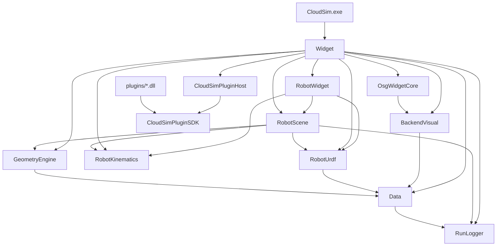

# CloudSim 子模块开发文档索引

本文档列出各 Visual Studio 子工程（子模块）的 **DEVELOPER_GUIDE.md**。总架构与业务流程见 [`../ARCHITECTURE_SUMMARY.md`](../ARCHITECTURE_SUMMARY.md)。目录说明见 [`DIRECTORY_LAYOUT.md`](DIRECTORY_LAYOUT.md)。

| 子工程 | 职责简述 | 开发文档 |
|--------|----------|----------|
| **CloudSim** | 可执行入口、`main` 生命周期 | [CloudSim/DEVELOPER_GUIDE.md](../src/App/CloudSim/DEVELOPER_GUIDE.md) |
| **Widget** | Qt 主窗口、文档页、OSG/TCP 示教桥接 | [Widget/DEVELOPER_GUIDE.md](../src/UI/Widget/DEVELOPER_GUIDE.md) |
| **RobotWidget** | 仿真/设备 Dock UI、`RobotSimulationController`、工程机器人 JSON | [RobotWidget/DEVELOPER_GUIDE.md](../src/UI/RobotWidget/DEVELOPER_GUIDE.md) |
| **Data** | 后端对象模型、属性、层级、跟随求解、**工程 v4 序列化** | [Data/DEVELOPER_GUIDE.md](../src/Data/Data/DEVELOPER_GUIDE.md) · [backend_persistence/](backend_persistence/) |
| **BackendVisual** | 数据 → OSG 分支构建策略 | [BackendVisual/DEVELOPER_GUIDE.md](../src/UI/BackendVisual/DEVELOPER_GUIDE.md) |
| **OsgWidgetCore** | 纯 OSG 场景、拾取、gizmo、绑定索引 | [OsgWidgetCore/DEVELOPER_GUIDE.md](../src/UI/OsgWidgetCore/DEVELOPER_GUIDE.md) |
| **GeometryEngine** | `RigidTransform`、工具链 FK、`OSG`/`BackendMat4` 适配 | [GeometryEngine/DEVELOPER_GUIDE.md](../src/Geometry/GeometryEngine/DEVELOPER_GUIDE.md) · [CONVENTIONS.md](../src/Geometry/GeometryEngine/CONVENTIONS.md) |
| **RobotKinematics** | DH 串联 FK / 数值 IK | [RobotKinematics/DEVELOPER_GUIDE.md](../src/Robot/RobotKinematics/DEVELOPER_GUIDE.md) |
| **RobotUrdf** | URDF 解析、层级场景、每连杆后端 | [RobotUrdf/DEVELOPER_GUIDE.md](../src/Robot/RobotUrdf/DEVELOPER_GUIDE.md) |
| **RobotScene** | 指令模型、规划、回放、场景 FK | [RobotScene/DEVELOPER_GUIDE.md](../src/Robot/RobotScene/DEVELOPER_GUIDE.md) |
| **RunLogger** | 文件/控制台/UI 日志 | [RunLogger/DEVELOPER_GUIDE.md](../src/Infra/RunLogger/DEVELOPER_GUIDE.md) |
| **CloudSimPluginSDK** | 动态插件 ABI（宿主上下文、文档/场景 API） | [CloudSimPluginSDK/DEVELOPER_GUIDE.md](../src/Plugins/CloudSimPluginSDK/DEVELOPER_GUIDE.md) |
| **CloudSimPluginHost** | 插件扫描、`QPluginLoader`、宿主实现（`src/UI/CloudSimPluginHost/`，编译进 `Widget.dll`） | 见 [ARCHITECTURE_SUMMARY.md §10](../ARCHITECTURE_SUMMARY.md) |
| **HelloPlugin** | 官方示例插件（Dock + 菜单 + 创建立方体） | [HelloPlugin/plugin.json](../src/Plugins/HelloPlugin/plugin.json) |

## 依赖方向（简图）

## 头文件约定

- 公共 API：`各工程/inc/*.h`
- 实现：`各工程/source/*.cpp`
- 跨 DLL：使用各 `*_global.h` 中的 `*_EXPORT` 宏；跨域引用优先通过 vcxproj `AdditionalIncludeDirectories`，源码内相对路径需按 `src/` 深度书写（见 `DIRECTORY_LAYOUT.md`）。

## 工程持久化（v4）

设计与验收见 [`backend_persistence/`](backend_persistence/)（`DESIGN_*`、`TASK_*`、`REGRESSION_CHECKLIST_*`、`ACCEPTANCE_*`）。架构总览：[`../ARCHITECTURE_SUMMARY.md`](../ARCHITECTURE_SUMMARY.md) §6.5。

## 约定与规则

- C++ / Qt 编码约定：`.cursor/rules/cloudsim-cpp-conventions.mdc`
- 解决方案结构：`.cursor/rules/cloudsim-architecture.mdc`
