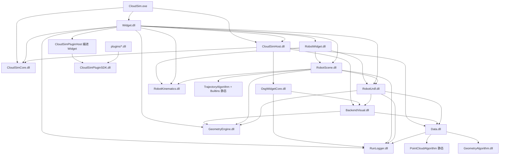

# CloudSim 子模块开发文档索引

本文档列出各 Visual Studio 子工程（子模块）的 **DEVELOPER_GUIDE.md**。总架构与业务流程见 [`../ARCHITECTURE_SUMMARY.md`](../ARCHITECTURE_SUMMARY.md)。目录说明见 [`DIRECTORY_LAYOUT.md`](DIRECTORY_LAYOUT.md)。

---

## 统一世界坐标契约（必读）

全工程空间语义以 **[`spatial_contract_world_pose.md`](spatial_contract_world_pose.md)** 为权威说明。凡涉及导入、显示、FK、配准、拾取、坐标系叠加、TCP 示教，**须先对照该文档**，再改代码。

| 要点 | 约定 |
|------|------|
| 几何 | `geometry` 存**世界绝对坐标**；`pose` + `rotation` 为**唯一**刚体偏移 |
| 显示 | outer = `T(pose)×R`；inner PAT 恒 `(0,0,0)`（**不再** `-modelCenter`） |
| URDF per-link | q0 单次 `Tbind` 烘焙顶点 → `pose=I`；FK：`M = M0·inv(T0)·Tq·P`；**禁止**双重 visual 烘焙 |
| 工具轴 | 世界烘焙顶点：挂根连杆 + `toolTcpInBaseFromFk(该工具)`；连杆系顶点：挂法兰 + `T_flange_tool` |
| 已废弃 | `skipInnerModelCenterRebase` 主路径、`meshInLinkFrame` 导入分支、质心 rebase 配准主路径 |

**强相关模块文档**：[`Data`](../src/Data/Data/DEVELOPER_GUIDE.md) · [`BackendVisual`](../src/UI/BackendVisual/DEVELOPER_GUIDE.md) · [`OsgWidgetCore`](../src/UI/OsgWidgetCore/DEVELOPER_GUIDE.md) · [`CloudSimHost`](../src/Host/CloudSimHost/DEVELOPER_GUIDE.md) · [`RobotUrdf`](../src/Robot/RobotUrdf/DEVELOPER_GUIDE.md) · [`RobotScene`](../src/Robot/RobotScene/DEVELOPER_GUIDE.md) · [`RobotWidget`](../src/UI/RobotWidget/DEVELOPER_GUIDE.md)

| 子工程 | 职责简述 | 开发文档 |
|--------|----------|----------|
| **CloudSim** | 可执行入口、`main` 生命周期 | [CloudSim/DEVELOPER_GUIDE.md](../src/App/CloudSim/DEVELOPER_GUIDE.md) |
| **CloudSimCore** | 前后端契约 DLL（DTO、`EventHub`、服务接口） | [CloudSimCore/DEVELOPER_GUIDE.md](../src/Contracts/CloudSimCore/DEVELOPER_GUIDE.md) |
| **CloudSimHost** | 文档宿主、`OsgWidget` 编译、Core 适配器、组合根实现 | [CloudSimHost/DEVELOPER_GUIDE.md](../src/Host/CloudSimHost/DEVELOPER_GUIDE.md) |
| **Widget** | Qt 主窗口、文档页、流程协调；契约经 `data()`/`robot()`/`render()`；OsgWidget 信号边界 `WidgetSceneSignalWiring`（OSG 源码由 Host 编译） | [Widget/DEVELOPER_GUIDE.md](../src/UI/Widget/DEVELOPER_GUIDE.md) |
| **RobotWidget** | 仿真/设备 Dock UI、`RobotSimulationController`、**CAD 轨迹生成**、**轨迹编辑**、工程机器人 JSON | [RobotWidget/DEVELOPER_GUIDE.md](../src/UI/RobotWidget/DEVELOPER_GUIDE.md) |
| **Data** | 后端对象模型、属性、层级、跟随求解；**`geometry_backend_ops` / `GeometryRef`**；工程 v4 序列化 | [Data/DEVELOPER_GUIDE.md](../src/Data/Data/DEVELOPER_GUIDE.md) · [backend_persistence/](backend_persistence/) |
| **BackendVisual** | 数据 → OSG 分支构建策略 | [BackendVisual/DEVELOPER_GUIDE.md](../src/UI/BackendVisual/DEVELOPER_GUIDE.md) |
| **OsgWidgetCore** | 纯 OSG 场景、拾取、gizmo、绑定索引 | [OsgWidgetCore/DEVELOPER_GUIDE.md](../src/UI/OsgWidgetCore/DEVELOPER_GUIDE.md) |
| **GeometryEngine** | `RigidTransform`、工具链 FK、`OSG`/`BackendMat4` 适配 | [GeometryEngine/DEVELOPER_GUIDE.md](../src/Geometry/GeometryEngine/DEVELOPER_GUIDE.md) · [CONVENTIONS.md](../src/Geometry/GeometryEngine/CONVENTIONS.md) |
| **GeometryAlgorithm** | OCC/CGAL 离散、求交、布尔；**FeatureSpec / discretizeFeature / FeatureCatalog** | [GeometryAlgorithm/DEVELOPER_GUIDE.md](../src/Geometry/GeometryAlgorithm/DEVELOPER_GUIDE.md) |
| **RobotKinematics** | DH 串联 FK / 数值 IK | [RobotKinematics/DEVELOPER_GUIDE.md](../src/Robot/RobotKinematics/DEVELOPER_GUIDE.md) |
| **RobotUrdf** | URDF 解析、层级场景、**prismatic FK**、每连杆后端 | [RobotUrdf/DEVELOPER_GUIDE.md](../src/Robot/RobotUrdf/DEVELOPER_GUIDE.md) |
| **RobotScene** | 指令模型、规划、回放、**RawTrajectory**、多程序/分组/轨迹流水线 Command | [RobotScene/DEVELOPER_GUIDE.md](../src/Robot/RobotScene/DEVELOPER_GUIDE.md) |
| **TrajectoryAlgorithm** | `ITrajectoryOp` 框架、Registry、Codec、ConfigRegistry | [TrajectoryAlgorithm/DEVELOPER_GUIDE.md](../src/Robot/TrajectoryAlgorithm/DEVELOPER_GUIDE.md) |
| **TrajectoryAlgorithmBuiltins** | 18 种原子块实现、`UnifiedTrajectoryPathMath`、启动注册 | [TrajectoryAlgorithmBuiltins/DEVELOPER_GUIDE.md](../src/Robot/TrajectoryAlgorithmBuiltins/DEVELOPER_GUIDE.md) |
| **RunLogger** | 文件/控制台/UI 日志（x64 共享 DLL） | [RunLogger/DEVELOPER_GUIDE.md](../src/Infra/RunLogger/DEVELOPER_GUIDE.md) |
| **CloudSimPluginSDK** | 动态插件 ABI（宿主上下文、文档/场景 API） | [CloudSimPluginSDK/DEVELOPER_GUIDE.md](../src/Plugins/CloudSimPluginSDK/DEVELOPER_GUIDE.md) |
| **CloudSimPluginHost** | 插件扫描、`QPluginLoader`、`PluginHostContext`（编进 **`CloudSimHost.dll`**；UI 经 `IPluginMainWindowHost`） | [CloudSimPluginHost/DEVELOPER_GUIDE.md](../src/UI/CloudSimPluginHost/DEVELOPER_GUIDE.md) · [ARCHITECTURE_SUMMARY.md §10](../ARCHITECTURE_SUMMARY.md) |
| **HelloPlugin** | 官方示例插件（侧栏 + 菜单 + `createPrimitiveMesh`） | [HelloPlugin/DEVELOPER_GUIDE.md](../src/Plugins/HelloPlugin/DEVELOPER_GUIDE.md) |
| **CloudSimAiSDK** | AI 助手 ABI、分域专模、`ai_config` 与训练文档索引 | [CloudSimAiSDK/DEVELOPER_GUIDE.md](../src/Plugins/CloudSimAiSDK/DEVELOPER_GUIDE.md) · [配置](../../tools/ai-training/CONFIGURATION.md) · [训练](../../tools/ai-training/README.md) · [**AI 轨迹特征**](../../docs/trajectory_feature_ai.md) |
| **AiWidget** | AI 助手 Dock、`AiAssistantCoordinator`（含 `trajectory.feature` 会话） | [CloudSimAiSDK/DEVELOPER_GUIDE.md](../src/Plugins/CloudSimAiSDK/DEVELOPER_GUIDE.md) · [trajectory_feature_ai.md](../../docs/trajectory_feature_ai.md) |

## 依赖方向（简图）

x64 下 `RunLogger`～`OsgWidgetCore` 为 **独立 DLL**（见下表）；箭头为编译期依赖，运行时各消费者 `LoadLibrary` 同一份 DLL。



## x64 动态库约定

| 工程 | x64 产物 | 构建时定义 | 消费者（默认 dllimport） |
|------|---------|-----------|-------------------------|
| RunLogger | `RunLogger.dll` | `RUN_LOGGER_LIB` | 无 |
| GeometryEngine | `GeometryEngine.dll` | `GEOMETRY_ENGINE_LIB` | 无 |
| RobotKinematics | `RobotKinematics.dll` | `ROBOT_KINEMATICS_LIB` | 无 |
| RobotUrdf | `RobotUrdf.dll` | `ROBOT_URDF_LIB` | 无 |
| RobotScene | `RobotScene.dll` | `ROBOT_SCENE_LIB` | 无 |
| BackendVisual | `BackendVisual.dll` | `BACKENDVISUAL_LIB` | 无 |
| OsgWidgetCore | `OsgWidgetCore.dll` | `OSGWIDGETCORE_LIB` | 无 |
| Data | `Data.dll` | `DATA_LIB` | 无 |
| Widget | `Widget.dll` | `WIDGET_LIB` | 无 |
| PointCloudAlgorithm | `.lib`（静态） | `POINT_CLOUD_ALGORITHM_STATIC` | 仅 `Data` 构建侧 |
| TrajectoryAlgorithm + Builtins | `.lib`（静态） | `TRAJECTORY_ALGORITHM_LIB` / `ROBOT_SCENE_LIB`（TU） | 仅 `RobotScene` 链接；UI 经 `TrajectoryOpBridge` |

- 导出宏见各 `inc/*_global.h`（`RUN_LOGGER_API`、`GEOMETRY_ENGINE_API`、`BACKENDVISUAL_EXPORT`、`OSGWIDGETCORE_EXPORT` 等）。
- **勿**在头文件中用 `*_API` 标记 `constexpr` 字符串常量（MSVC dllimport 限制）；改用 `inline constexpr`（见 `RobotInstructionProgram.h` 中 `kMotionPointIndexKey`）。
- Win32 遗留配置仍可用 `*_STATIC` / `BUILD_STATIC` 关闭导入导出。
- 新增跨 DLL 类/函数：在对应 `*_global.h` 加导出宏，vcxproj 构建侧加 `*_LIB`，消费者通过 `ProjectReference` + import `.lib` 链接。

## Visual Studio 解决方案筛选器

各子工程 `.vcxproj.filters` 统一为两层结构：

1. 顶层：**`inc`**（头文件）、**`src`**（源文件 / Qt Moc）
2. 子层：按功能划分（如 `inc\adapters`、`src\MainWindow`、`src\OsgWidget`、`src\Backend`、`src\ThirdParty\qtpropertybrowser` 等）

跨工程引用（如 Widget 编入的 `CloudSimPluginHost`、`Host` 引用的 Widget OSG 源）使用 `inc\HostRef`、`src\WidgetBorrowed`、`inc\PluginHost` 等筛选器，与本地 `inc`/`src` 区分。

新增/移动源文件后，在 `CloudSim` 目录执行：

```bash
python scripts/generate_vcxproj_filters.py
```

脚本会扫描全部 `*.vcxproj` 并重写对应的 `.vcxproj.filters`（不修改 `.vcxproj` 本身）。

## 源码注释约定（code-comment）

- 只写 **Why**：业务背景、非显然算法、边界兜底、危险操作；不写「代码在做什么」
- 头文件公开 API：精简中文 `///`（约 5–15 字）；`@param` 保留但描述用中文
- 实现文件：非显然处用短 `//`，行内注释尽量 ≤5 词
- 避免「用于…」「该方法…」等翻译腔；行末 `//` 不加句号
- 批量清理（仅删 `【中文】` 标签等）：`python scripts/apply_code_comment_style.py`（慎用，改后需 diff 复核）

## 头文件约定

- 公共 API：`各工程/inc/*.h`
- 实现：`各工程/source/*.cpp`
- 跨 DLL：使用各 `*_global.h` 中的 `*_EXPORT` 宏；跨域引用优先通过 vcxproj `AdditionalIncludeDirectories`，源码内相对路径需按 `src/` 深度书写（见 `DIRECTORY_LAYOUT.md`）。

## 工程持久化（v4）

设计与验收见 [`backend_persistence/`](backend_persistence/)（`DESIGN_*`、`TASK_*`、`REGRESSION_CHECKLIST_*`、`ACCEPTANCE_*`）。架构总览：[`../ARCHITECTURE_SUMMARY.md`](../ARCHITECTURE_SUMMARY.md) §6.5。

## 约定与规则

- C++ / Qt 编码约定：`.cursor/rules/cloudsim-cpp-conventions.mdc`
- 解决方案结构：`.cursor/rules/cloudsim-architecture.mdc`
