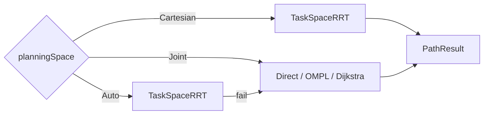
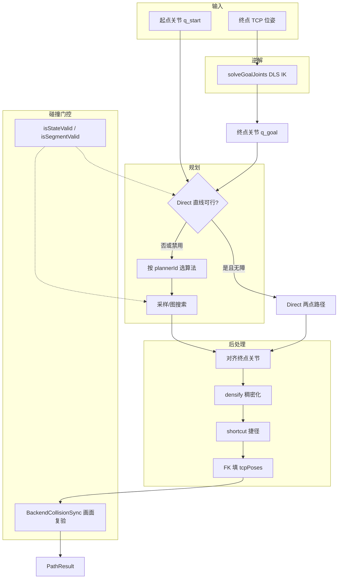
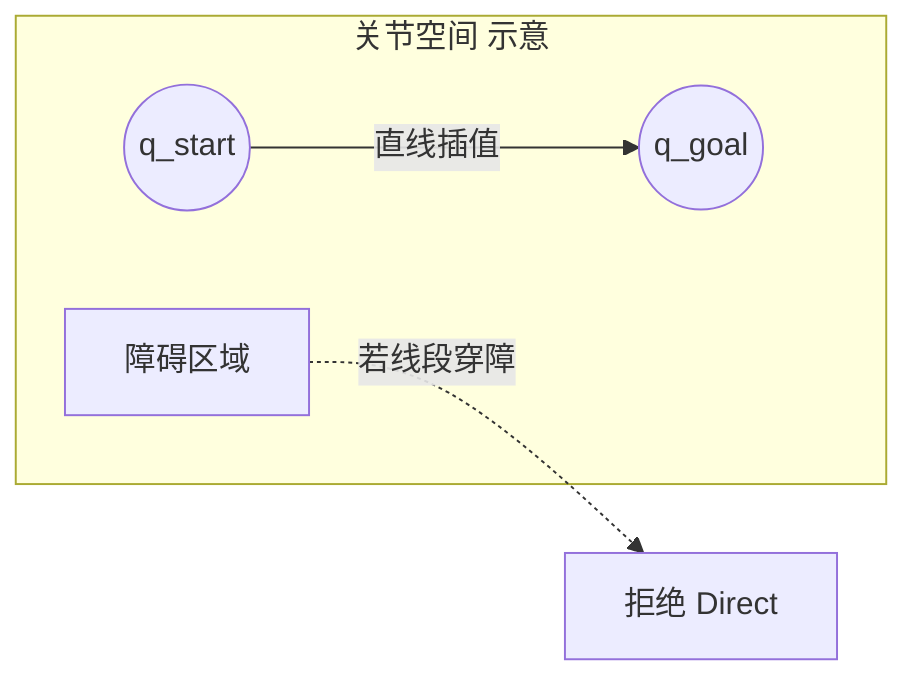
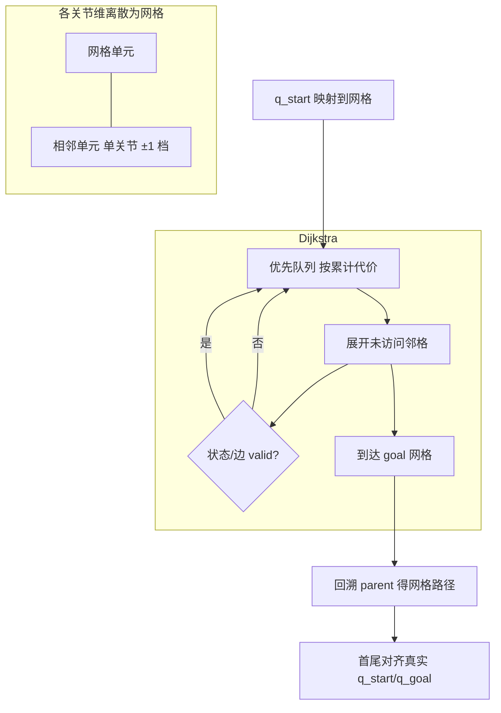
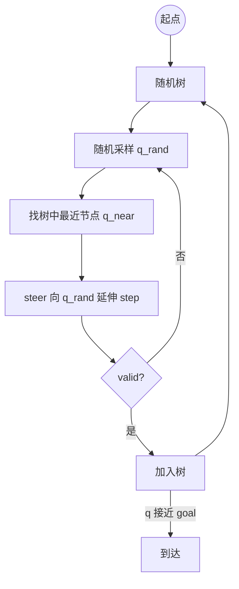
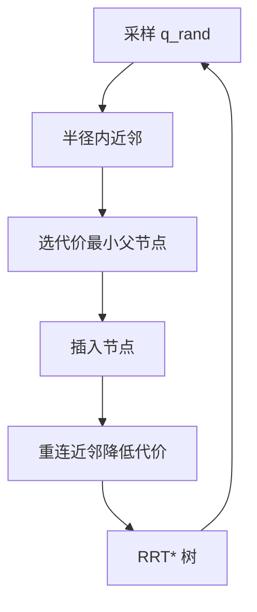
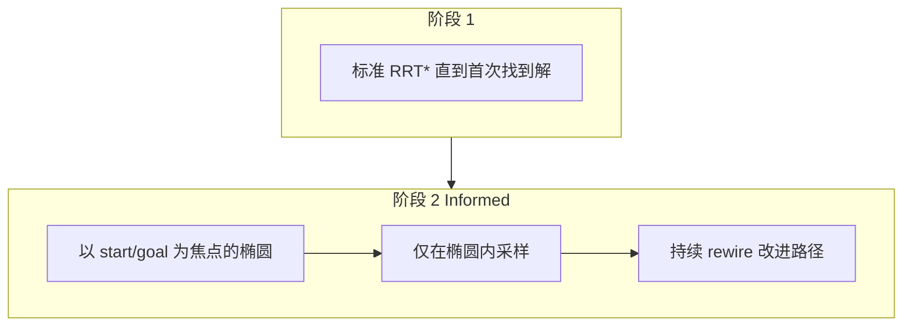
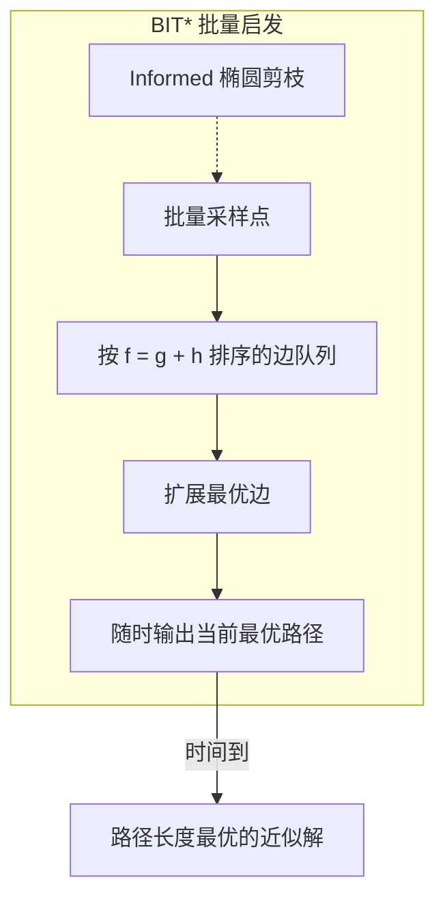
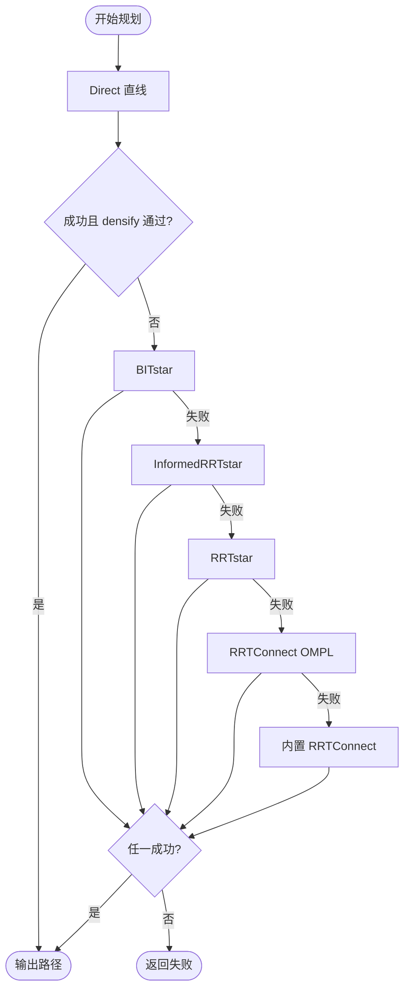
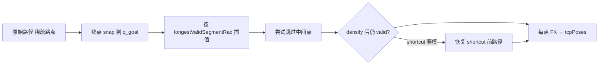

# CloudSim 碰撞路径规划：算法原理图与说明

> 实现入口：[`PlanToTcpPose.cpp`](../../src/Robot/RobotPathPlanning/source/PlanToTcpPose.cpp)  
> UI 选择：Dock「碰撞与规划」→ **规划空间** / 规划算法 / 规划时限  
> 配置空间：**Joint** = 关节角空间；**Cartesian** = TCP 位姿 SE(3) + IK（`TaskSpaceRRT`）

---

## 0. 规划空间切换

| 规划空间 | 搜索空间 | 绕障 | TCP 轨迹 |
|----------|----------|------|----------|
| Joint | 关节 C-Space | 是 | 由 FK 导出，一般非直线 |
| Cartesian | SE(3) 任务空间 RRTConnect | 是 | 折线/曲线，非 MoveL |
| Auto | 先 TaskSpaceRRT，失败再 Joint 级联 | 是 | 取决于实际算法 |



实现：[`TaskSpaceRrtPlanner.cpp`](../../src/Robot/RobotPathPlanning/source/TaskSpaceRrtPlanner.cpp) — 在起终点 TCP 包围盒内采样位姿，steer 时 lerp+slerp，逐点 IK，`isStateValid` / `isSegmentValid` 门控。

---

## 1. 总览：从 TCP 目标到关节轨迹

默认 **Joint** 模式：用户给定起点关节与终点 TCP 位姿，先 IK 得到终点关节，再在 C-Space 中搜索无碰撞路径，最后 densify / 捷径缩短并输出关节轨迹 + TCP 点列。



| 阶段 | 作用 |
|------|------|
| IK | 终点 TCP → 法兰/工具关节角；残差 > 5 mm 拒绝 |
| Direct | 无障碍时关节直线最短，最快 |
| 采样/图搜索 | 绕开 `CollisionWorld` 中的场景障碍 |
| 后处理 | 保证插值步长、缩短路径、生成 TCP 序列 |
| 画面复验 | UI 侧 apply + OSG 再检，防粗检漏检 |

**碰撞检测**：每个状态/线段更新连杆位姿 `M(q)=m0·inv(T0)·Tq·P`，与黑白名单过滤后的场景 mesh 做检碰（见 [`CollisionValidity.cpp`](../../src/Robot/RobotPathPlanning/source/CollisionValidity.cpp)）。

---

## 2. 算法一览

| ID（UI） | 类型 | 实现 | 进入 Auto 级联 | 典型特点 |
|----------|------|------|----------------|----------|
| **Auto** | 策略 | 级联多算法 | — | 默认；先最优倾向，失败换下一项 |
| **TaskSpaceRRT** | 任务空间采样 | `TaskSpaceRrtPlanner` | Auto 第 0 步 / Cartesian 唯一 | SE(3) RRTConnect + IK，可绕障 |
| **Direct** | 解析 | `PlanToTcpPose` 内建 | Joint/Auto 最先尝试 | 关节直线；仅无障碍或粗检通过 |
| **Dijkstra** | 图搜索 | `JointSpaceDijkstraPlanner` | 否 | 网格最短路；确定性、可复现 |
| **BITstar** | 采样最优 | OMPL | 是（第 1 项） | Anytime 路径长度优化 |
| **InformedRRTstar** | 采样最优 | OMPL | 是（第 2 项） | 椭圆 informed 采样 |
| **RRTstar** | 采样最优 | OMPL | 是（第 3 项） | 渐近最优 RRT |
| **RRTConnect** | 采样快速 | OMPL / 内置 | 是（第 4/5 项） | 双树连通，兜底 |

显式选择某一 ID 时**只跑该算法**（失败不偷偷换算法）。`Auto` 级联顺序：

```text
Direct → BIT* → Informed RRT* → RRT* → RRTConnect(OMPL) → RRTConnect(内置)
         └─ 仅当 Direct 不可行或 densify 穿模回退时进入 ─┘
```

---

## 3. Direct（关节直线）

### 原理图



### 说明

- **思想**：在 C-Space 中沿直线 `q(t)=(1-t)·q_start + t·q_goal` 移动；若整段 `isSegmentValid` 通过，路径即为两点。
- **优点**：极快、路径最短（关节 L2 意义下）、完全可复现。
- **限制**：`allowDirectJointLerp=false`（场景有额外障碍体）时不尝试；densify 后若发现穿模会**自动回退**到采样规划。
- **CloudSim**：`plannerName = "Direct"`。

---

## 4. Dijkstra（关节均匀网格）

### 原理图



### C-Space 示意（2 关节）

```text
  q1 ↑
     │  ░░░░░  ← 障碍（invalid 单元）
     │  ░ S→→→→→→G
     │  ░░░░░
     └────────→ q2
        网格节点；边仅连接单关节 ±1 档邻居
```

### 说明

- **思想**：把每个关节在 `[lower, upper]` 内按步长离散（步长 ≈ `longestValidSegmentRad`，单关节最多 48 档），在**稀疏图**上用 Dijkstra 求累计关节距离最小的路径。
- **边权**：相邻网格中心点的 L2 距离。
- **优点**：**确定性**（同种子/同设置结果一致）、适合低～中维、障碍结构清晰。
- **限制**：网格粗时可能无解；高维时搜索体积大，受 `planningTimeSec` 与最多 25 万展开节点约束。
- **实现**：[`JointSpaceDijkstraPlanner.cpp`](../../src/Robot/RobotPathPlanning/source/JointSpaceDijkstraPlanner.cpp)。

---

## 5. RRT / RRTConnect（快速随机树）

### 原理图 — 单树 RRT



### 原理图 — RRTConnect（双树）


### C-Space 示意

```text
  q1 ↑     ·  ·    · = 随机树节点
     │    ·╲ ·
     │   ·  ╲·  ─── 无碰撞边
     │  S    ╲·
     │        G
     └────────────→ q2
```

### 说明

- **思想**：在 C-Space 随机采样，向采样点逐步扩展树；RRTConnect 从起点、终点各建一棵树，交替扩展直至连通。
- **优点**：高维可行、实现简单、**RRTConnect 通常最快找到可行解**。
- **缺点**：路径往往曲折；**不保证最优**（内置版与 OMPL RRTConnect 均属此类）。
- **CloudSim**：
  - OMPL：`OmplJointSpacePlanner`（`CLOUDSIM_HAS_OMPL`）
  - 兜底：[`JointSpaceRrtPlanner.cpp`](../../src/Robot/RobotPathPlanning/source/JointSpaceRrtPlanner.cpp) 内置 RRTConnect / RRT*

---

## 6. RRT*（渐近最优随机树）

### 原理图



### 说明

- **思想**：在 RRT 基础上，新节点从近邻中选**代价最小**者作父节点，并尝试 **rewire** 降低近邻到起点的代价；时间足够长时趋向最优。
- **优点**：比 RRTConnect 路径更短；仍适合较高维。
- **缺点**：收敛慢于 BIT* / Informed RRT*；限时内可能不如 RRTConnect 快找到解。
- **CloudSim**：OMPL `RRTstar`；Auto 级联第 3 项（最短预算约 8 s 起）。

---

## 7. Informed RRT*（椭圆 Informed 采样）

### 原理图



### C-Space 示意（2D）

```text
  q1 ↑
     │      ╭──────╮
     │     ╱ 椭圆   ╲  ← 当前最优代价 c 内的 informed 区域
     │    │ S     G │
     │     ╲        ╱
     └──────╰──────╯──→ q2
```

### 说明

- **思想**：找到首条可行解后，只在**可能优于当前最优**的椭圆区域内采样，避免在无效区域浪费预算。
- **优点**：同预算下比 RRT* 更快缩短路径。
- **缺点**：仍需采样；首解前与 RRT* 类似。
- **CloudSim**：OMPL `InformedRRTstar`；Auto 级联第 2 项。

---

## 8. BIT*（Batch Informed Trees）

### 原理图



### 与 RRT 系列对比（概念）

```text
  RRTConnect:  先求连通 ──────────────────► 快、路径可能很长
  RRT*:        边扩展 + rewire ───────────► 渐近最优
  Informed*:   椭圆内采样 + rewire ────────► 更省采样
  BIT*:        批量边排序 + 启发式 ───────► 同预算路径通常更短（CloudSim Auto 首选）
```

### 说明

- **思想**：同时维护**顶点集**与**按 f=g+h 排序的边队列**，批量处理 informed 样本，属于 **anytime 最优**规划器。
- **优点**：CloudSim **Auto 默认首选**；在 `planningTimeSec` 内持续改进路径长度。
- **缺点**：依赖 OMPL；单限时下未必比 RRTConnect 更快得到**首条**可行解。
- **CloudSim**：OMPL `BITstar` + `PathLengthOptimizationObjective`；Auto 级联第 1 项（预算约 10 s 起）。

---

## 9. Auto 级联策略

### 原理图



### 说明

- **设计意图**：优先**路径质量**（BIT* 系），再退到**快速连通**（RRTConnect）。
- **Direct 特殊**：不占下拉列表，但任何模式都会**先尝试**（除非场景禁用直达）。
- **显式算法**：用户选 Dijkstra / RRT* 等时**不走级联**，便于对比与调试。

---

## 10. 共用后处理（所有算法）



| 步骤 | 说明 |
|------|------|
| snap | 末点精确对齐 IK 终点关节 |
| densify | 相邻路点关节差过大则插入中间点，便于播放与碰撞检 |
| shortcut | 尝试删除冗余路点；若穿模则回退 |
| FK | 输出 `jointTrajectoryRad` 与 `tcpPoses` 等长 |

---

## 11. 选型建议

| 场景 | 推荐 |
|------|------|
| 日常避障、要较短路径 | **Auto**（默认） |
| 无障碍或仅检限位 | 自动 **Direct**（无需改设置） |
| 要可复现、网格级绕障 | **Dijkstra** |
| 只要快、先动起来 | **RRTConnect** |
| 限时内尽量短、可等 10 s+ | **BITstar** 或 **InformedRRTstar** |
| 无 OMPL 构建 | **Auto** 末级 / **RRTConnect** / **Dijkstra** |

**参数**（Dock / 工程 JSON）：

- `plannerId`：`Auto` | `Dijkstra` | `BITstar` | …
- `planningTimeSec`：1–120 s，单次规划预算
- `longestValidSegmentRad`：内部默认 0.05 rad，影响 Direct 检段与 Dijkstra 网格步长
- `securityMarginMm` / 黑白名单：影响 `CollisionWorld` 有效障碍

---

## 12. 相关源码索引

| 算法 / 模块 | 文件 |
|-------------|------|
| 总入口 | [`PlanToTcpPose.cpp`](../../src/Robot/RobotPathPlanning/source/PlanToTcpPose.cpp) |
| Dijkstra | [`JointSpaceDijkstraPlanner.cpp`](../../src/Robot/RobotPathPlanning/source/JointSpaceDijkstraPlanner.cpp) |
| 内置 RRT | [`JointSpaceRrtPlanner.cpp`](../../src/Robot/RobotPathPlanning/source/JointSpaceRrtPlanner.cpp) |
| OMPL | [`OmplJointSpacePlanner.cpp`](../../src/Robot/RobotPathPlanning/source/OmplJointSpacePlanner.cpp) |
| 碰撞 valid | [`CollisionValidity.cpp`](../../src/Robot/RobotPathPlanning/source/CollisionValidity.cpp) |
| 后处理 | [`PathPostProcess.cpp`](../../src/Robot/RobotPathPlanning/source/PathPostProcess.cpp) |
| UI | [`RobotCollisionSettingsWidget.cpp`](../../src/UI/RobotWidget/source/RobotCollisionSettingsWidget.cpp) |
