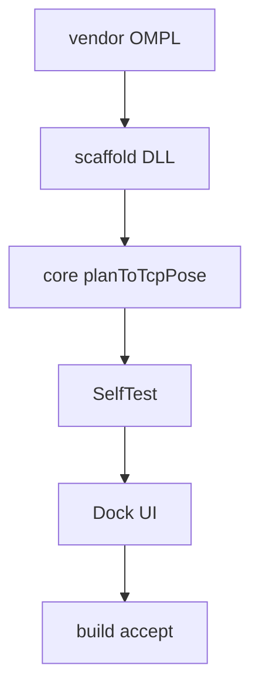

# TASK — RobotPathPlanning

| ID | 任务 | 验收 |
|----|------|------|
| T1 | OMPL → bin/SDK/ompl | lib 可链 x64 MD |
| T2 | vcxproj + sln | DLL 生成 |
| T3 | OMPL + 碰撞 + IK | SelfTest ok |
| T5 | 轴控页按钮 | OSG 预览 |
