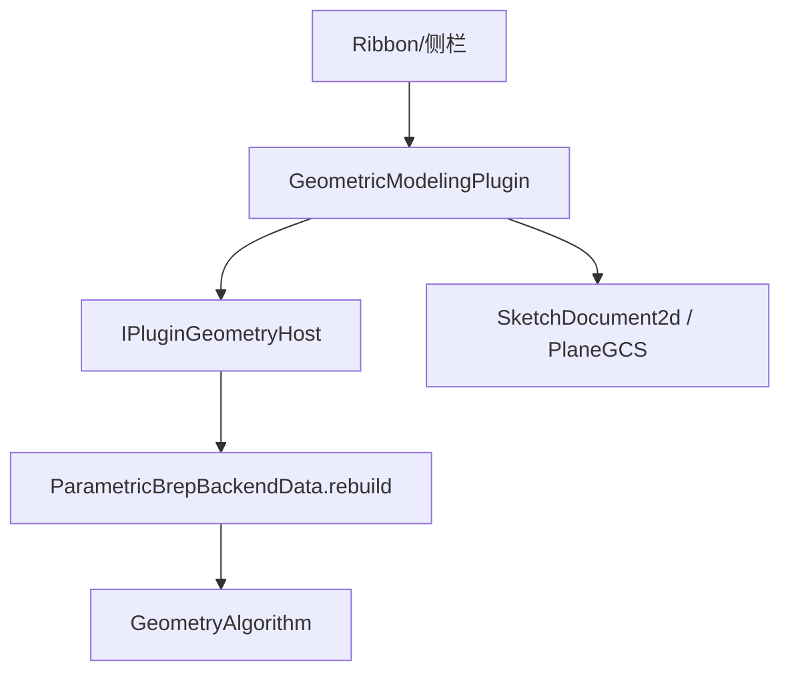

# DESIGN — SW差距续期「草图标配 + 扫描硬化」

## 架构（沿用现栈）

## 模块

| 模块 | 职责 |
|------|------|
| SketchGeom/Tools | 椭圆/多边形/槽口实体与工具；Offset；Convert 写入草图 |
| SketchSweep | `twistDeg`；路径可来自模型边折线 |
| SketchExtrude | `UpToVertex` / `OffsetFromFace` 求长 |
| SketchDraft | `draftFacesToHandle`（OCC DraftAngle） |
| Host/SDK | 新参数字段 + Draft preview/commit；版本 → `0x00012700` |
| FeatureDocument | Draft kind；拉伸终止枚举扩展 |

## 数据流要点

- 椭圆：文档存 `SkEllipse`，导出时离散成环（同圆）
- 多边形/槽口：落成线+弧，走现有环提取
- Offset：对选中闭合 UV 环做 2D 平行偏置，写回草图线
- Convert Face：面边界边离散 → UV → 线（可构造）
- Draft：选面 + 中性平面（默认草图/XY）+ 角度 → tip 上 DraftAngle

## 异常

- Offset 自交/零长度：失败提示，不写文档
- Draft/扫描失败：预览清 staging，commit 返回错误串
