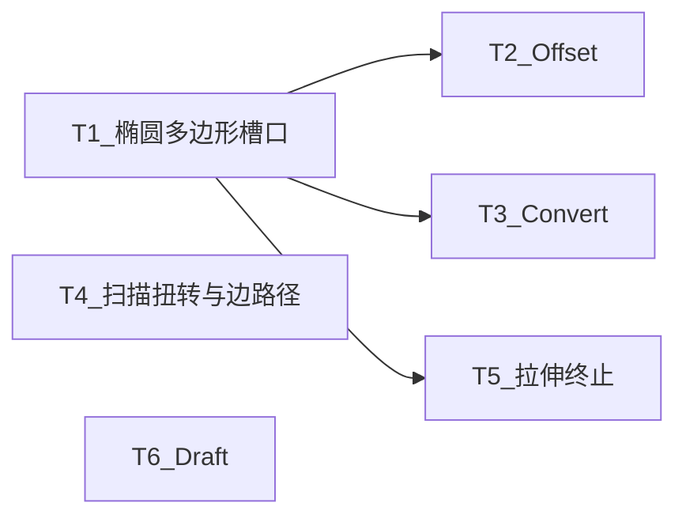

# TASK — SW差距续期

## 依赖图

## T1 椭圆/正多边形/直槽口

- 输入：现有 SketchTools/Ribbon/setTool
- 输出：可画、可导出、可 Pad
- 约束：椭圆可存实体再离散；多边形/槽口用线+弧

## T2 Offset

- 输入：闭合环（选线链或当前最大环）
- 输出：偏置后新环（线）
- 验收：内外偏置各一测例逻辑正确

## T3 Convert

- 输入：Face 点选 + 现 Edge 投影
- 输出：草图线；Ribbon「转换实体」或扩展投影边
- 验收：平面边界可投影到当前草图

## T4 扫描增强

- 输入：Sweep 侧栏
- 输出：`twistDeg`；点选模型边作路径
- 验收：扭转预览变化；无路径草图可提交

## T5 拉伸终止

- 枚举 + UI + resolve + JSON
- 验收：到顶点/到面偏移 rebuild 可复现

## T6 Draft

- Fillet 同栈：geoalgo → Data → Host → UI
- 验收：选面拔模成功写入特征树

## 并行

T4/T5/T6 可与 T1–T3 并行；全部完成后编 CloudSimHost + Plugin。
