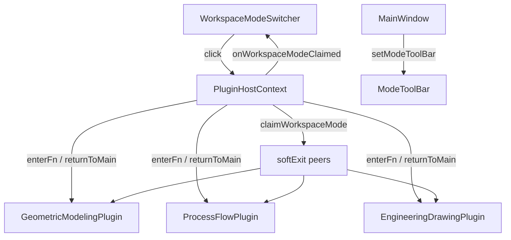

# DESIGN — WorkspaceModeSwitcher

## 整体架构



## 布局

```
MenuBar
WorkspaceModeBar   [主程序|几何建模|工艺流程|工程图]
ModeToolBar         Ribbon（按模式显隐）
Central + Docks
```

## 模式表

| modeId | 标题 | enter |
|--------|------|-------|
| `""` | 主程序 / Main | `returnToMainWorkspace` |
| `com.cloudsim.geomodeling` | 几何建模 | `enterGeometricModeling` |
| `com.cloudsim.processflow` | 工艺流程 | `enterProcessFlow` |
| `com.cloudsim.drawing` | 工程图 | `enterDrawing` |

## 接口契约

```cpp
struct WorkspaceModeEntry {
  QString modeId;
  QString titleZh;
  QString titleEn;
  std::function<void()> enterFn;
};

virtual void registerWorkspaceMode(const QString& modeId, const QString& titleZh,
                                   const QString& titleEn, std::function<void()> enterFn) = 0;
virtual void returnToMainWorkspace() = 0;
// Host 内部 / MainWindow：遍历已注册项重建分段
```

`IPluginMainWindowHost::notifyWorkspaceModesChanged()` — 注册后刷新 UI。

## 切换时序

点击工程图：`enterDrawing` → `claim` → 他插件 softExit → 画布/侧栏/`setModeToolBar` → Switcher 同步。

点击主程序：`returnToMainWorkspace` → `claim("")` → `showCentralScene3D` + `exitAlternateSideUi` + `setModeToolBar(nullptr)`。

## softExit 约定

只清本插件本地标志与本模式 UI 引用；**不**抢中央 3D。完整退回仅 `returnToMainWorkspace` / 完整 `exit*`。

## 异常

- 无活动文档：enter 内提示并 return；Switcher 选中保持原 mode（claim 未发生）。
- 同 mode 点击：enter 可早退；Switcher 防重入。

## 样式

`QToolBar#WorkspaceModeBar QToolButton:checked` → `#0f766e`；Dark/Light 各一套。
