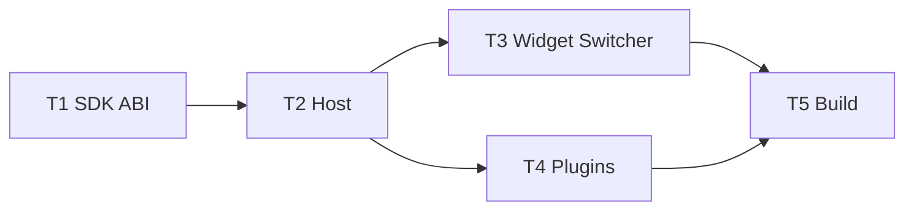

# TASK — WorkspaceModeSwitcher

## 依赖图

### T1 SDK

- **输入**：`IPluginHostContext.h`、`cloudsim_plugin_sdk_global.h`
- **输出**：`registerWorkspaceMode` / `returnToMainWorkspace`；version `0x00012300`
- **验收**：头文件编译；DEVELOPER_GUIDE 版本注记更新

### T2 Host

- **输入**：T1
- **输出**：`PluginHostContext` 注册表、`returnToMainWorkspace`、claim 不再硬清 Ribbon；`IPluginMainWindowHost::notifyWorkspaceModesChanged`
- **验收**：单元逻辑：注册后可枚举；return 清空 mode

### T3 Widget

- **输入**：T2
- **输出**：`WorkspaceModeSwitcher`、UiSetup 顶栏、`setModeToolBar` 互斥显隐、ApplicationStyle
- **验收**：启动可见分段；claim 同步选中

### T4 Plugins

- **输入**：T1/T2
- **输出**：三插件 register；drawing softExit 对齐；exit 菜单走 `returnToMainWorkspace` 或完整 exit
- **验收**：菜单与分段等价进入

### T5 Build

- Debug|x64 + Release|x64：CloudSimPluginSDK → CloudSimHost → Widget → 三插件
