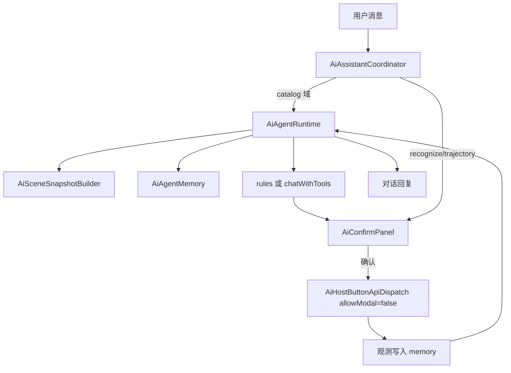

# DESIGN — Full AI Agent Runtime

## 分层

| 层 | 组件 |
|----|------|
| SDK | `AiAgentTypes`、`IAiAssistantHost` Agent API |
| Host | Runtime、Memory、Snapshot、LlmClient tools、Dispatch |
| Widget | ConfirmPanel、Dock、Coordinator pending |

## 事件

`NeedConfirm` | `StepDone` | `Finished` | `Error` — Host `invokeOnUiThread` 投递

## 闸门

- `args_schema` 非空 → 必须面板
- `risk=low` 且空 schema → 可直跑
- `medium`/`high` → 面板 + 风险文案；Agent 路径禁止模态补参
