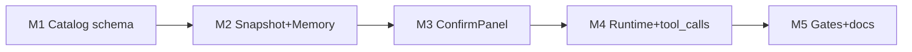

# TASK — Full AI Agent Runtime

| ID | 任务 | 验收 |
|----|------|------|
| M1 | Catalog `risk`/`args_schema` + embed | 带 keywords 项 100% 有 schema 或显式空 |
| M2 | Snapshot + Memory | JSON 对象列表；prefs 落盘 |
| M3 | AiConfirmPanel + Coordinator | 确认后才 execute |
| M4 | chatWithTools + Runtime 循环 | 异步提案；最多 8 步 |
| M5 | 闸门、识别/轨迹面板、文档 | 本目录 + DEVELOPER_GUIDE |
