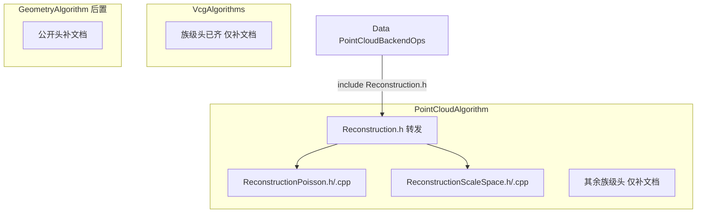

# DESIGN — 算法工程整理

## 1. 整体架构



## 2. Reconstruction 拆分

| 文件 | 职责 |
|------|------|
| `inc/ReconstructionPoisson.h` | `reconstructPoisson` / `reconstructPoissonAuto` |
| `source/ReconstructionPoisson.cpp` | CGAL Poisson + Auto 预处理调用 |
| `inc/ReconstructionScaleSpace.h` | `reconstructScaleSpace` |
| `source/ReconstructionScaleSpace.cpp` | Scale-space + soup 绕序校正（原匿名命名空间辅助） |
| `inc/Reconstruction.h` | `#include` 上述两头；无新声明 |
| 删除 | `source/Reconstruction.cpp`（逻辑迁出） |

`ReconstructionConfig.*` 不变：仍调用底层 Poisson/ScaleSpace API；文档补齐。

## 3. 头文件文档契约

每个算法入口：

```cpp
/// @file Xxx.h
/// @brief <一句算法意图>

/**
 * <算法意图补一句；关键限制>
 * @param name 含义；单位；默认 …
 * @return false 时：失败条件（errMsg 典型文案）
 */
```

参数结构体成员用 `///` 行注释（默认值已在 `=` 处时注释写单位/语义即可）。

## 4. 模块依赖

无新增跨模块依赖。拆分后 vcxproj 用两份 `.cpp` 替换 `Reconstruction.cpp`。

## 5. 异常 / 失败

保持现有 `bool` + `errMsg` 约定；文档写清典型失败，不新增异常类型。

## 6. 风险

| 风险 | 缓解 |
|------|------|
| Data 仍 include 旧头 | 转发头保证 |
| 辅助函数重复 | 迁到各自 cpp 匿名命名空间（Poisson / ScaleSpace 不共享） |
| Geometry 头多 | 后置分批；不做内部子目录拆分 |
