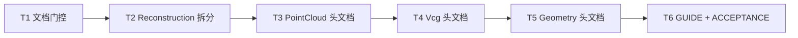

# TASK — 算法工程整理

## 依赖图

## T1 — 门控文档

- **输入**：ALIGNMENT / CONSENSUS / DESIGN 已确认
- **输出**：本 TASK
- **验收**：三份决策文档存在且与用户确认一致

## T2 — Reconstruction 拆分

- **输入**：`Reconstruction.h/.cpp`
- **输出**：`ReconstructionPoisson.*`、`ReconstructionScaleSpace.*`；`Reconstruction.h` 转发；vcxproj/filters 更新；删除旧 cpp
- **约束**：符号签名不变；逻辑字节级等价迁移
- **验收**：工程列出新 cpp；`#include "Reconstruction.h"` 仍可见全部三函数声明

## T3 — PointCloud 公开头文档

- **范围**：`Downsample` `Preprocess` `Measure` `Transform` `Crop` `Registration*` `Reconstruction*` `ReconstructionConfig` `PointFeatures` 等算法头
- **验收**：每入口含意图/参数/失败；工具头（Buffer/Parallel/SelfTest）可短 brief

## T4 — Vcg 公开头文档

- **范围**：`MeshSimplify` `MeshSmooth` `MeshRepair` `MeshRemesh` `MeshReconstruct` `MeshDefectDetect`；`MeshNormalSmooth` 已较完整则核对补齐
- **验收**：同 T3

## T5 — Geometry 公开头文档（后置）

- **范围**：`DEVELOPER_GUIDE` API 总览表中的公开算法头（Discretize/Intersection/Boolean/Tubular/MeshTrajectory/TemplateBrep/MeshSurface…）
- **不做**：内部 `source/**` 实现头拆分
- **验收**：同 T3

## T6 — 同步与验收

- 更新三份 DEVELOPER_GUIDE API 表
- 写 `ACCEPTANCE_算法工程整理.md`
- 编码规范化（BOM/CRLF）

## 并行

T3 与 T4 可在 T2 后并行；T5 依赖 T3/T4 完成风格样板。
