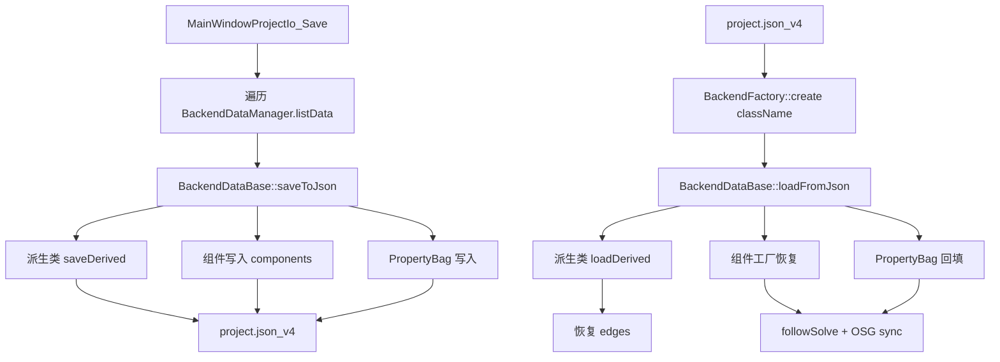

# DESIGN_后端持久化重构

## 1. 目标

基于现有 `CloudSim` 后端架构，设计一套可扩展的工程保存/恢复机制，满足以下要求：

- 以 `BackendDataBase` 为统一入口，定义对象级保存与恢复骨架
- 利用多态覆盖各后端类型差异（点云、网格、后续插件后端）
- 通过工厂注册机制恢复具体对象类型，避免 `MainWindowProjectIo` 中硬编码分支膨胀
- 统一覆盖对象核心字段、属性(`PropertyBag`)、组件(`FollowAttachmentComponent` 及后续组件)、层级关系(`BackendDataManager` edges)

## 2. 现状与问题

当前工程保存恢复主流程集中在 `src/UI/Widget/source/MainWindowProjectIo.cpp`，主要问题：

- `MainWindowProjectIo` 同时承担 UI 入口、对象编排、类型分支、字段拼装，职责过重
- 对象恢复依赖 `embeddedGeometry + sourceType` 分支判断，扩展新后端类型时侵入主流程
- 属性保存偏展示驱动，缺少“对象状态完整快照”的统一协议
- 组件保存目前仅 `followAttachment` 特判，缺少通用组件序列化框架

## 3. 设计总览



## 4. 分层与职责

### 4.1 `BackendDataBase`（对象序列化骨架）

新增统一协议（模板方法）：

- `nlohmann::json saveToJson() const`：非虚，负责公共字段与统一结构
- `bool loadFromJson(const nlohmann::json& j, std::string* err)`：非虚，负责公共字段恢复
- `virtual void saveDerived(nlohmann::json& out) const = 0`：子类扩展字段
- `virtual bool loadDerived(const nlohmann::json& in, std::string* err) = 0`：子类恢复字段

公共字段范围：

- `id/name/className`
- `pose/rotation/color`
- `worldMatrix`（用于恢复校验与兜底）
- `propertyBag`（全量）
- `components`（统一数组）

### 4.2 `BackendComponent`（组件序列化）

为组件增加统一协议：

- `virtual void writeJson(nlohmann::json& out) const`
- `virtual bool readJson(const nlohmann::json& in, std::string* err)`

实现方式：

- `FollowAttachmentComponent` 继续沿用现有读写字段
- 基类保存 `components: [{type,data}]`
- 恢复阶段由组件工厂按 `type` 创建并 `readJson`

### 4.3 `BackendFactory`（对象创建注册）

新增类型工厂注册表：

- key: `className`
- value: `std::function<std::shared_ptr<BackendDataBase>()>`

用于恢复流程：

1. 读取对象 `className`
2. 工厂创建实例
3. 调用 `loadFromJson`
4. 交由 `BackendProjectObjectIo::loadProjectObjectsFromJson`（内嵌 `registerEmbeddedProjectObject`、文件 `importProjectObjectFromFile`）注册并发布 `BackendObjectRegisteredEvent`

### 4.4 `MainWindowProjectIo`（流程编排）

保留 UI 入口职责，剥离对象字段拼装细节：

- 保存：只做循环与文件写出，单对象交给 `saveToJson`
- 加载：只做读取、对象恢复编排、边恢复、后处理同步
- 继续负责项目级数据：`robotKinematicsInstances`、`robotPrograms`、`annotations`、打包解包

## 5. 数据契约（project.json v4）

```json
{
  "version": 4,
  "objects": [
    {
      "id": "backend_id",
      "className": "Mesh",
      "name": "obj",
      "sourceType": "Model",
      "sourcePath": "D:/...",
      "transform": {
        "pose": {"x":0,"y":0,"z":0},
        "rotation": {"x":0,"y":0,"z":0},
        "color": {"r":1,"g":1,"b":1,"a":1},
        "worldMatrix": [16 doubles]
      },
      "geometry": { "kind": "triangles|points", "...": "..." },
      "propertyBag": { "...": "..." },
      "components": [
        { "type": "follow_attachment", "data": { "...": "..." } }
      ]
    }
  ],
  "edges": [{"parentId":"p","childId":"c"}]
}
```

说明：

- 几何字段由各派生类自定义；`MainWindowProjectIo` 不再感知类型细节
- `propertyBag` 为对象状态真源，属性面板仅作为编辑视图

## 6. 恢复顺序约束

固定顺序避免状态冲突：

1. 清空当前文档状态（后端、机器人上下文、标注）
2. 按 `objects` 创建并恢复对象（不连边）
3. 恢复 `edges` 到 `BackendDataManager`
4. 执行组件后处理（例如 follow 目标映射修正）
5. 执行 `runBackendFollowSolveAndSync`
6. 恢复注释、机器人程序、UI 刷新

## 7. 异常与边界策略

- `version != 4`：直接拒绝并给出升级提示
- 未注册 `className`：跳过对象并记录 warning
- 组件 `type` 未注册：保留对象，忽略该组件并记录 warning
- `edges` 悬空/成环：沿用 `BackendDataManager::attachChild` 校验并告警

## 8. 渐进落地计划

1. **第一步**：在 `BackendDataBase` 引入模板方法，`Mesh/PointCloud` 接口打通  
2. **第二步**：引入 `BackendFactory`，替换 `MainWindowProjectIo` 类型分支  
3. **第三步**：引入组件工厂，`FollowAttachmentComponent` 改为通用路径  
4. **第四步**：启用 `project.json v4`，移除旧 schema 兼容逻辑  
5. **第五步**：补齐回归测试（对象一致性、组件一致性、层级一致性）

## 9. 验收标准

- 对管理器下所有后端对象，保存后恢复对象数与 `id` 一致
- 对象核心字段（位姿、颜色、世界矩阵）恢复误差在阈值内
- `PropertyBag` 关键键值一致
- `FollowAttachmentComponent` 状态一致，follow 求解后场景一致
- 新增后端类型时无需修改 `MainWindowProjectIo` 主流程
