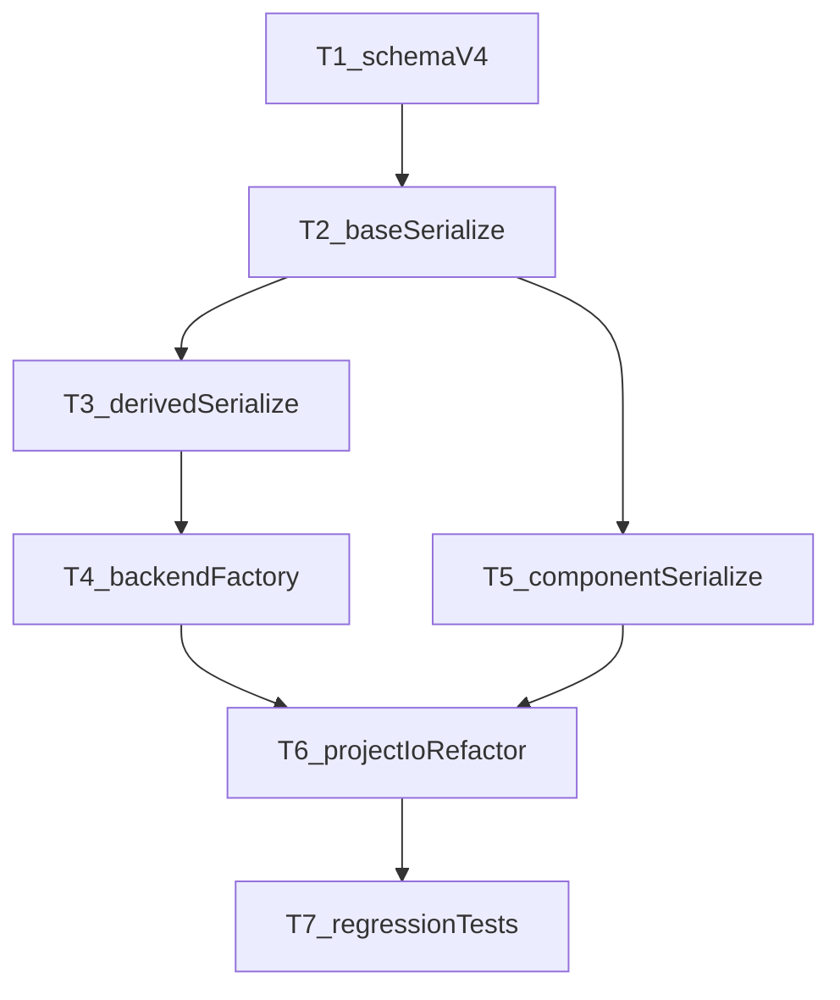

# TASK_backend_persistence

## 1. 目标

将 `DESIGN_backend_persistence.md` 落地为可执行的原子任务，覆盖后端对象、属性、组件、管理器关系的保存与恢复重构。

## 2. 原子任务清单

## T1: 定义 v4 数据契约与迁移规则

- 输入契约
  - `docs/backend_persistence/DESIGN_backend_persistence.md`
  - 现有 `project.json` 字段（`MainWindowProjectIo`）
- 输出契约
  - 明确 `version=4` 的对象结构（core/geometry/propertyBag/components/edges）
  - 明确旧版本处理策略（拒绝/迁移）
- 实现约束
  - 不引入运行时行为变化，仅定义契约和校验
- 验收标准
  - 能列出完整字段表和必填/可选约束
  - 对 `version!=4` 行为有明确约定与提示文本

## T2: 在 `BackendDataBase` 增加模板方法序列化骨架

- 输入契约
  - `src/Data/Data/inc/BackendDataBase.h`
  - `src/Data/Data/source/BackendDataBase.cpp`
- 输出契约
  - 基类统一保存/恢复公共字段
  - 暴露派生类扩展钩子 `saveDerived/loadDerived`
- 实现约束
  - 不破坏现有 `snapshotPropertyRows/applyPropertyChange` 行为
- 验收标准
  - 公共字段由基类统一读写
  - 新增后端类型无需改主流程即可接入基础序列化

## T3: `MeshBackendData` 与 `PointCloudBackendData` 接入派生序列化

- 输入契约
  - `src/Data/Data/source/MeshBackendData.cpp`
  - `src/Data/Data/source/PointCloudBackendData.cpp`
- 输出契约
  - 几何相关字段走派生类读写
  - 与现有 embedded geometry 行为一致
- 实现约束
  - 不改变几何精度与单位语义
- 验收标准
  - 保存后恢复网格/点云数量一致
  - 恢复后可正常渲染且无明显偏移

## T4: 实现对象类型工厂 `BackendFactory`

- 输入契约
  - 后端 `className` 列表
  - 当前对象创建路径（`MainWindowProjectIo` / `BackendProjectObjectIo`）
- 输出契约
  - `className -> creator` 注册表
  - 加载时通过工厂创建对象
- 实现约束
  - 未注册类型只告警，不导致整体加载失败
- 验收标准
  - 主流程中去除硬编码类型分支
  - 新类型仅需注册即可恢复

## T5: 组件序列化注册机制（先接入 Follow）

- 输入契约
  - `FollowAttachmentComponent` 现有 `writeJson/readJson`
  - `BackendDataBase` 组件容器接口
- 输出契约
  - 统一 `components: [{type,data}]` 读写
  - Follow 迁移到通用组件路径
- 实现约束
  - 组件恢复在对象创建后、follow solve 前完成
- 验收标准
  - Follow 属性恢复后行为与当前一致
  - 未注册组件被忽略并记录 warning

## T6: `MainWindowProjectIo` 主流程收敛改造

- 输入契约
  - `src/UI/Widget/source/MainWindowProjectIo.cpp`
  - T2~T5 产物
- 输出契约
  - 保存：遍历对象调用统一序列化
  - 加载：工厂创建 + 统一反序列化 + edges + 后处理
- 实现约束
  - 保持机器人程序、标注、打包/解包流程不回退
- 验收标准
  - 主流程代码复杂度下降，类型分支显著减少
  - 保存/恢复全链路可用

## T7: 属性一致性回归测试

- 输入契约
  - 典型工程样本（点云、网格、follow、层级）
- 输出契约
  - 保存->恢复一致性测试集
- 实现约束
  - 覆盖正常、缺字段、未知组件、悬空边
- 验收标准
  - 对象数、边数、关键属性、组件状态一致
  - 失败场景给出可读告警

## 3. 依赖关系

## 4. 执行顺序建议

1. T1 -> T2（先立协议再立骨架）
2. T3 + T5（并行：派生对象与组件）
3. T4（对象创建统一入口）
4. T6（主流程收敛）
5. T7（回归收口）

## 5. DoD（完成定义）

- 能使用 `version=4` 工程文件完整恢复对象、属性、组件、边关系
- `MainWindowProjectIo` 不再维护对象级类型细节
- 扩展一个新后端类型时仅需：实现派生序列化 + 工厂注册
- 关键回归测试通过
