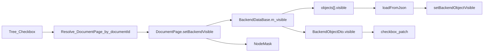

# DESIGN：后端对象显示/隐藏

## 真源与派生视图

| 层 | 角色 |
|----|------|
| `BackendDataBase::m_visible` | 真源；`saveToJson`/`loadFromJson` 字段 `visible` |
| `OsgWidget::m_backendVisibility` + NodeMask | 派生渲染态（**文档内**活动场景） |
| Units 树 `Qt::CheckState` | 派生 UI 态（读 `BackendObjectDto.visible`） |

## 关键路径

### 隐藏

`itemChanged` → 从 item 读取 `kRoleDocumentId` + `kRoleBackendId` → 解析对应 `DocumentPage`（必要时先激活该文档）→ `setBackendVisible` → `IDataService::setVisible` + facade/OSG。

**多文档 Units**：勾选非活动文档节点时，不得使用「仅 currentPage」写可见性。树刷新对可见性变更应走 **属性 patch**（`patchObjectItem`），避免整文档结构 rebuild。框架见 [`../后端对象显示树/DESIGN_后端对象显示树.md`](../后端对象显示树/DESIGN_后端对象显示树.md)。

插件旁路：`BackendSceneDocumentFacade::setBackendsVisible` / `BackendSceneEntity::setVisible` 同步写 Data（作用域为该 facade 所属文档）。

### 加载

- 内嵌：`decode`→`loadFromJson`→建视觉→`setBackendObjectVisible(id, isVisible())`
- 文件回退：导入几何后从 JSON 写回 `visible` 并应用到 OSG
- 树勾选：该文档 `rebuildDocument` / 快照同步后反映 `BackendObjectDto.visible`

## 关键文件

| 模块 | 文件 |
|------|------|
| Data | `BackendDataBase.h/.cpp` |
| Core | `CoreTypes.h`、`IDataService.h`、`NullCoreServices.cpp` |
| Host | `DataServiceAdapter`、`BackendProjectObjectIo`、`BackendVisualSync` |
| Widget | `DocumentPage`、`BackendSceneDocumentFacade`、`MainWindowBackendTree`、（规划）`BackendUnitsTreeBinder` |

## 相关

- Units 多文档显示树：[`../后端对象显示树/`](../后端对象显示树/)
