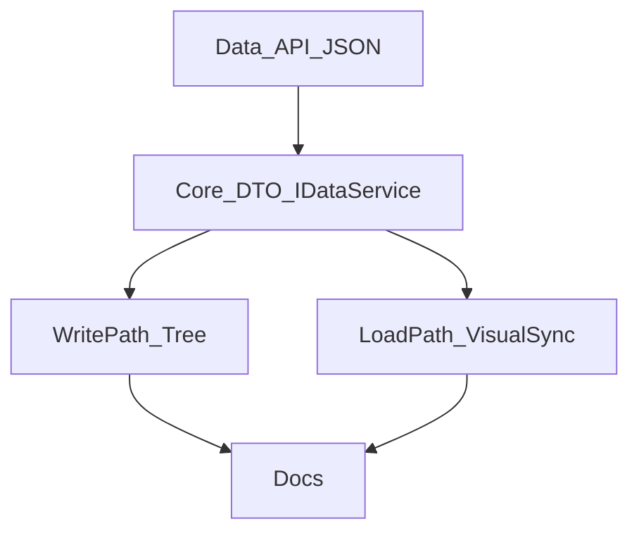

# TASK：后端对象显示/隐藏

## T1 Data API + JSON

- 输入：`BackendDataBase`
- 输出：`isVisible`/`setVisible`；`visible` 字段读写
- 验收：缺字段默认 true；写出含 `visible`

## T2 Core 契约

- 输入：T1
- 输出：`BackendObjectDto.visible`；`IDataService` + Adapter + Null
- 验收：快照与 set/get 一致

## T3 写路径 + 树

- 输入：T2
- 输出：DocumentPage/Facade 双写；树读 DTO
- 验收：勾选切换后 Data 与 OSG 一致

## T4 加载路径

- 输入：T1
- 输出：内嵌/文件加载后 apply NodeMask；VisualSync visible key
- 验收：重开工程隐藏态恢复

## T5 文档

- 输出：本目录 CONSENSUS/DESIGN/TASK/ACCEPTANCE/FINAL/TODO；Data/Widget DEVELOPER_GUIDE
