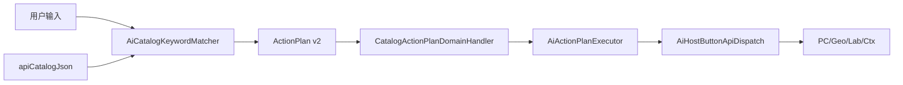

# DESIGN — Host 公共接口接入 AI

## 架构

## 按钮 → API 全表

### pointcloud.ops / document.import

| keywords (ZH / EN) | api id |
|---|---|
| 导入 PLY/XYZ… / Import PLY/XYZ... | importFileIntoActiveDocument (pc) |
| 导入点云… / Import Point Cloud... | importFileIntoActiveDocument (pc) |
| 打开模型... / Open Model... | importFileIntoActiveDocument (mesh) |
| 体素下采样 / Voxel downsample | downsamplePointCloudVoxel |
| 随机下采样 / Random downsample | downsamplePointCloudRandom |
| 按包围盒裁剪 / Crop to bbox | cropPointCloudByBox |
| 球裁剪 (r=50) / Crop sphere (r=50) | cropPointCloudBySphere |
| 多边形裁剪… / Draw polygon crop... | cropPointCloudByPolyline (+ pick) |
| 离群移除 / Remove outliers | removePointCloudOutliers |
| 双边平滑 / Bilateral smooth | smoothPointCloudBilateral |
| 法线 PCA / Normals PCA | estimatePointCloudNormalsPca |
| MST 定向 / Orient MST | orientPointCloudNormalsMst |
| ICP 配准 / ICP register | rigidRegisterPointCloudsIcp |
| SPARE 配准 / SPARE register | nonRigidRegisterSpare |
| Poisson Auto | reconstructMeshPoissonAuto |
| Scale-space | reconstructMeshScaleSpace |
| 导出 PLY… / Export PLY... | exportMeshToPly |
| 粗匹配 / Coarse match | registerScanToCadTemplate (coarse) |
| 精匹配 / Fine match | registerScanToCadTemplate (fine) |
| 面重构 / Refactor faces | updateTemplateBrepFromAlignedScan |
| 网格简化 / Simplify | simplifyMesh |
| Laplacian 平滑 / Laplacian smooth | smoothMesh (laplacian) |
| Taubin 平滑 / Taubin smooth | smoothMesh (taubin) |
| 网格修复 / Repair mesh | repairMesh |
| 各向同性重网格 / Isotropic remesh | remeshMeshIsotropic |
| 预处理 / Preprocess | runMeshSurfaceReconstructStage(Preprocess) |
| 分块 / Partition | …(Partition) |
| 栅格采样 / Sample | …(Sample) |
| NURBS拟合 / NURBS fit | …(Fit) |
| 边界混合 / Boundary blend | …(BoundaryBlend) |
| 交汇混合 / Junction blend | …(JunctionBlend) |
| 光顺 / Fair | …(Fair) |
| 装配输出 / Assemble | …(Assemble) |
| 全流程 / Full pipeline | reconstructSurfaceFromMesh |
| 重置会话 / Reset session | clearMeshSurfaceReconstructSession |

### geometry.ops

| keywords | api |
|---|---|
| 离散生成网格 / Discretize to Mesh | discretizeBackendToMesh |
| 点选边 / Pick Edge | pickStepElementFromViewport (edge) |
| 点选面 / Pick Face | pickStepElementFromViewport (face) |
| 执行线面求交 / Run Edge-Face | intersectEdgeFace |
| 执行面面求交 / Run Face-Face | intersectFaces |
| 生成管状网格 / Create Tube Mesh | discretizeWireToTubeMesh |
| 生成带状网格 / Create Ribbon Mesh | discretizeWireToRibbonMesh |

### feature.build

| keywords | api |
|---|---|
| 运行中心线 / Run centerline | runTubularGrindingStage(Centerline) |
| 模板点位 / Templates | …(TemplatePoints) |
| 表面投影 / Project | …(Project) |
| 运行区域划分 / Run region partition | …(FpfhRegionPartition) |
| 重置会话 / Reset session | clearTubularGrindingSession |

### labeling.annot

| keywords | api |
|---|---|
| 点选 / Click | pickPointsOnce / pickMeshFaceOnce |
| 刷选 / Brush | brushStroke / brushMeshFaces |
| 套索 / Lasso | pickPolylineRegion |
| 擦除 / Erase | pick + applyLabels(erase) |
| 取消选择 / Cancel Pick | cancelActiveLabelingPick |
| 撤销 / Undo | undo |
| 重做 / Redo | redo |
| PointNet 预标注 / PointNet Pre-label | （引导错误，无 Host 单方法） |
| 导出数据集 / Export Dataset | exportPointNetDataset |

## 异常

- 无文档 / 无选中 / 无 path → fail-fast 中文错误
- pick 取消 → 失败摘要
- PointNet 预标注 → 提示使用标注面板
