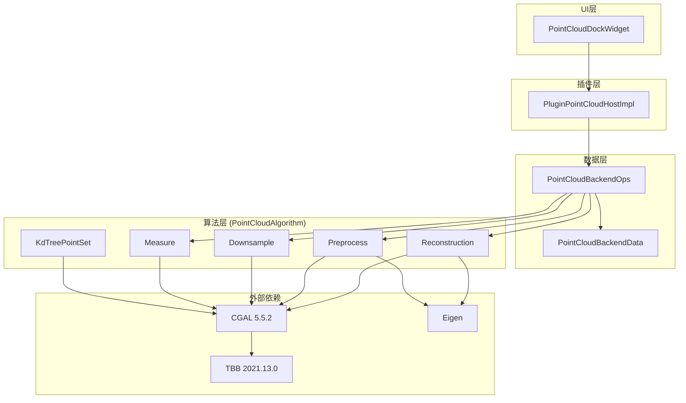
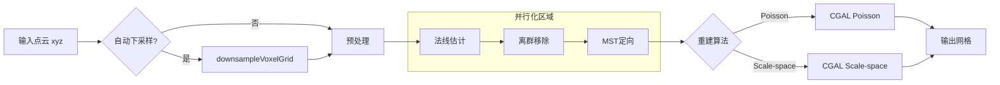
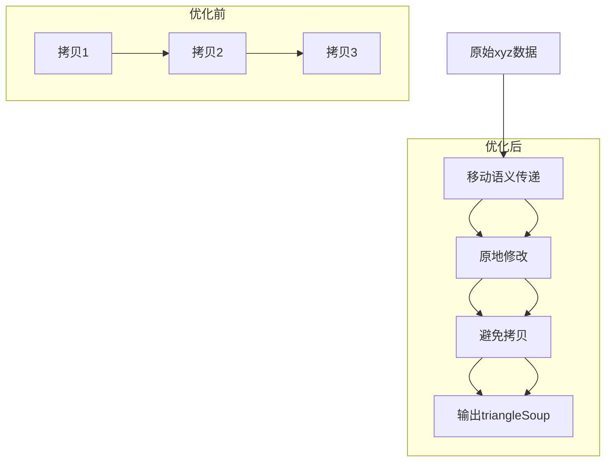
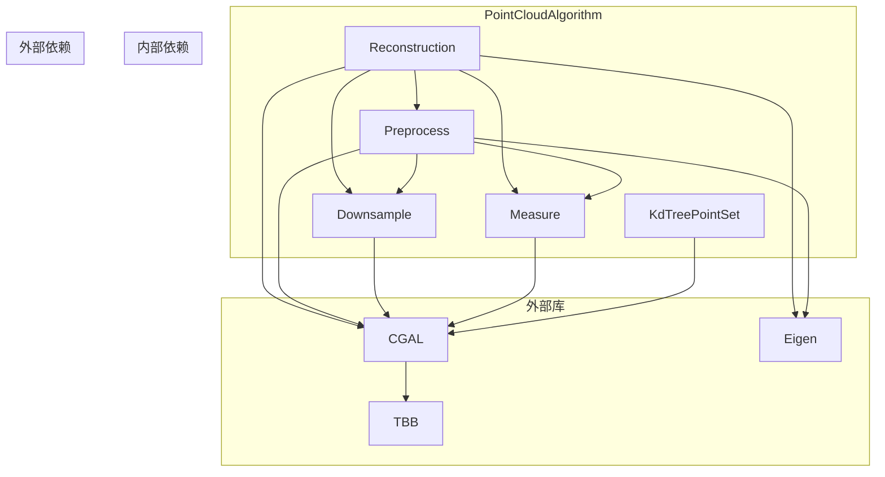

# Mesh重构效率优化 - 架构设计文档

## 1. 整体架构

### 1.1 架构图



### 1.2 分层设计

| 层级 | 职责 | 关键类 |
|------|------|--------|
| UI层 | 用户交互、参数收集 | `PointCloudDockWidget` |
| 插件层 | 异步任务调度 | `PluginPointCloudHostImpl` |
| 数据层 | 数据管理、API薄包装 | `PointCloudBackendOps`, `PointCloudBackendData` |
| 算法层 | 核心几何算法 | `pclalgo`命名空间下的各类 |

---

## 2. 核心组件设计

### 2.1 配置管理组件

#### 2.1.1 配置结构体
```cpp
// Reconstruction.h
namespace pclalgo {

enum class ReconstructionQuality {
    Fast,      // 快速模式: 更大体素、更少迭代
    Balanced,  // 平衡模式: 默认参数
    Quality    // 质量模式: 更小体素、更多迭代
};

struct ReconstructionConfig {
    ReconstructionQuality quality = ReconstructionQuality::Balanced;
    double maxPointsForReconstruction = 500000; // 最大点数限制
    bool enableParallel = true;                  // 是否启用并行
    
    // 根据质量级别获取参数
    double getVoxelPrefilterMm() const;
    double getSpacingMm() const;
    int getSmoothIterations() const;
};

} // namespace pclalgo
```

#### 2.1.2 参数映射表

| 参数 | Fast | Balanced | Quality |
|------|------|----------|---------|
| `voxelPrefilterMm` | 2.0 | 1.0 | 0.5 |
| `spacingMm` | 自动×1.5 | 自动 | 自动×0.7 |
| `smoothIterations` | 2 | 4 | 6 |
| `outlierRemovalPercent` | 3.0 | 5.0 | 7.0 |

### 2.2 并行化管理组件

#### 2.2.1 并行化开关
```cpp
// ParallelUtils.h
namespace pclalgo {

class ParallelUtils {
public:
    static bool isParallelEnabled();
    static void setParallelEnabled(bool enabled);
    
    // 获取可用线程数
    static int getThreadCount();
    
private:
    static bool s_enabled;
    static int s_threadCount;
};

} // namespace pclalgo
```

#### 2.2.2 CGAL并行化集成
```cpp
// 在Preprocess.cpp中
#include <CGAL/Exact_predicates_inexact_constructions_kernel.h>

// 条件编译选择tag
#ifdef CGAL_LINKED_WITH_TBB
    using ParallelTag = CGAL::Parallel_tag;
#else
    using ParallelTag = CGAL::Sequential_tag;
#endif

// 使用示例
CGAL::pca_estimate_normals<ParallelTag>(points, k, ...);
```

### 2.3 大点云处理组件

#### 2.3.1 自动下采样策略
```cpp
// Reconstruction.cpp
bool autoDownsampleIfNeeded(
    std::vector<float>& xyz,
    std::vector<float>* normals,
    const ReconstructionConfig& config)
{
    const std::size_t pointCount = pointCountFromXyz(xyz);
    if (pointCount <= config.maxPointsForReconstruction) {
        return true; // 无需下采样
    }
    
    // 计算下采样比例
    const double ratio = static_cast<double>(config.maxPointsForReconstruction) / pointCount;
    const double voxelSize = estimateVoxelSize(xyz) / std::cbrt(ratio);
    
    // 执行下采样
    return downsampleVoxelGrid(xyz, voxelSize);
}
```

### 2.4 数据拷贝优化组件

#### 2.4.1 移动语义优化
```cpp
// 优化前
bool reconstructPoisson(
    const std::vector<float>& xyz,
    const std::vector<float>& normals,
    std::vector<float>& triangleSoupOut,
    ...);

// 优化后
bool reconstructPoisson(
    std::vector<float> xyz,  // 按值传递，支持移动
    std::vector<float> normals,
    std::vector<float>& triangleSoupOut,
    ...);
```

#### 2.4.2 RGBA同步优化
```cpp
// Preprocess.cpp
void syncRgbaAfterErase(
    const std::vector<Point_with_normal>& before,
    const std::vector<Point_with_normal>& after,
    std::vector<float>& rgba)
{
    if (rgba.empty()) return;
    
    // 构建索引映射 O(n)
    std::unordered_map<Point_3, std::size_t, PointHash> indexMap;
    for (std::size_t i = 0; i < before.size(); ++i) {
        indexMap[before[i].first] = i;
    }
    
    // 使用映射查找 O(1)
    std::vector<float> newRgba;
    newRgba.reserve(after.size() * 4U);
    for (const auto& pn : after) {
        auto it = indexMap.find(pn.first);
        if (it != indexMap.end()) {
            const std::size_t idx = it->second;
            const std::size_t b = idx * 4U;
            if (b + 3U < rgba.size()) {
                newRgba.insert(newRgba.end(), rgba.begin() + b, rgba.begin() + b + 4);
            }
        }
    }
    rgba = std::move(newRgba);
}
```

---

## 3. 接口契约定义

### 3.1 新增API接口

#### 3.1.1 Reconstruction.h
```cpp
namespace pclalgo {

// 新增配置版本API
bool reconstructPoissonWithConfig(
    std::vector<float> xyz,
    std::vector<float> normals,
    std::vector<float>& triangleSoupOut,
    const ReconstructionConfig& config,
    std::string* errMsg = nullptr);

bool reconstructPoissonAutoWithConfig(
    std::vector<float> xyz,
    std::vector<float>& triangleSoupOut,
    const ReconstructionConfig& config,
    std::string* errMsg = nullptr);

bool reconstructScaleSpaceWithConfig(
    std::vector<float> xyz,
    std::vector<float>& triangleSoupOut,
    const ReconstructionConfig& config,
    std::string* errMsg = nullptr);

// 保持旧接口，内部调用新实现
bool reconstructPoisson(
    const std::vector<float>& xyz,
    const std::vector<float>& normals,
    std::vector<float>& triangleSoupOut,
    double spacingMm = 0.0,
    double smAngleDeg = 20.0,
    double smRadiusRel = 30.0,
    double smDistanceRel = 0.375,
    std::string* errMsg = nullptr);

bool reconstructPoissonAuto(
    std::vector<float> xyz,
    std::vector<float>& triangleSoupOut,
    double voxelPrefilterMm = 1.0,
    double outlierRemovalPercent = 5.0,
    std::string* errMsg = nullptr);

} // namespace pclalgo
```

#### 3.1.2 PointCloudBackendOps.h
```cpp
namespace point_cloud_backend_ops {

// 新增配置版本API
bool reconstructMeshFromPointCloudPoissonWithConfig(
    PointCloudBackendData& pointCloudData,
    MeshBackendData& meshOut,
    const pclalgo::ReconstructionConfig& config,
    std::string* errMsg = nullptr);

// 保持旧接口
bool reconstructMeshFromPointCloudPoisson(
    PointCloudBackendData& pointCloudData,
    MeshBackendData& meshOut,
    double voxelPrefilterMm = 1.0,
    std::string* errMsg = nullptr);

} // namespace point_cloud_backend_ops
```

### 3.2 接口约束

1. **线程安全**: 所有新增API必须是线程安全的
2. **异常安全**: 提供基本异常安全保证
3. **内存管理**: 使用智能指针管理动态内存
4. **参数验证**: 所有输入参数必须验证

---

## 4. 数据流向图

### 4.1 重构流程数据流



### 4.2 内存优化数据流



---

## 5. 异常处理策略

### 5.1 异常类型

| 异常类型 | 处理策略 |
|----------|----------|
| 内存不足 | 捕获`std::bad_alloc`，返回错误码 |
| CGAL异常 | 捕获`CGAL::Failure_exception`，记录日志 |
| 参数无效 | 参数验证，返回`false`和错误信息 |
| 文件IO异常 | 捕获`std::ios_base::failure` |

### 5.2 错误传播

```cpp
bool reconstructPoissonWithConfig(
    std::vector<float> xyz,
    std::vector<float> normals,
    std::vector<float>& triangleSoupOut,
    const ReconstructionConfig& config,
    std::string* errMsg)
{
    try {
        // 参数验证
        if (!validXyzLength(xyz) || normals.size() != xyz.size()) {
            if (errMsg) *errMsg = "Invalid input data";
            return false;
        }
        
        // 自动下采样
        if (!autoDownsampleIfNeeded(xyz, &normals, config)) {
            if (errMsg) *errMsg = "Downsampling failed";
            return false;
        }
        
        // 重建
        // ...
        
    } catch (const std::bad_alloc&) {
        if (errMsg) *errMsg = "Out of memory";
        return false;
    } catch (const CGAL::Failure_exception& e) {
        if (errMsg) *errMsg = std::string("CGAL error: ") + e.what();
        return false;
    } catch (const std::exception& e) {
        if (errMsg) *errMsg = std::string("Error: ") + e.what();
        return false;
    }
    
    return true;
}
```

---

## 6. 模块依赖关系图



---

## 7. 性能优化策略

### 7.1 并行化策略

| 算法 | 并行化方式 | 预期加速 |
|------|-----------|----------|
| `pca_estimate_normals` | `CGAL::Parallel_tag` | 2-8x |
| `jet_estimate_normals` | `CGAL::Parallel_tag` | 2-6x |
| `remove_outliers` | `CGAL::Parallel_tag` | 2-4x |
| `bilateral_smooth_point_set` | `CGAL::Parallel_tag` | 2-6x |
| `mst_orient_normals` | `CGAL::Parallel_tag` | 1.5-3x |

### 7.2 内存优化策略

1. **移动语义**: 减少vector拷贝
2. **预分配内存**: `reserve()`避免重新分配
3. **原地修改**: 直接修改输入数据
4. **索引映射**: `unordered_map`替代线性搜索

### 7.3 算法优化策略

1. **自动下采样**: 大点云自动降采样
2. **参数调优**: 根据质量级别调整参数
3. **早退出**: 检测无效输入提前返回

---

## 8. 测试策略

### 8.1 单元测试

1. **功能测试**: 验证优化后结果正确性
2. **性能测试**: 测量执行时间
3. **边界测试**: 测试边界条件
4. **异常测试**: 测试异常处理

### 8.2 集成测试

1. **插件集成**: 测试插件调用
2. **UI集成**: 测试界面交互
3. **端到端测试**: 完整流程测试

### 8.3 性能基准

1. **小点云**: 1万点，基准时间
2. **中点云**: 10万点，测试加速比
3. **大点云**: 100万点，测试内存和稳定性

---

## 9. 部署和配置

### 9.1 构建配置

1. **TBB依赖**: 修改`PointCloudAlgorithm.vcxproj`
2. **预处理器**: 添加`CGAL_LINKED_WITH_TBB`
3. **链接库**: 添加TBB库

### 9.2 运行时配置

1. **环境变量**: TBB线程数控制
2. **配置文件**: 质量级别配置
3. **API参数**: 运行时参数传递

---

## 10. 风险评估

### 10.1 技术风险

| 风险 | 概率 | 影响 | 缓解措施 |
|------|------|------|----------|
| TBB集成失败 | 低 | 高 | 提供单线程回退 |
| 并行化竞态 | 中 | 高 | 充分测试，CGAL已处理 |
| 内存增加 | 中 | 中 | 监控峰值，配置TBB内存池 |
| 质量下降 | 低 | 中 | 保留默认参数 |

### 10.2 进度风险

| 风险 | 概率 | 影响 | 缓解措施 |
|------|------|------|----------|
| CGAL兼容性问题 | 低 | 高 | 先验证TBB集成 |
| 测试覆盖不足 | 中 | 中 | 创建性能测试套件 |
| 集成复杂度 | 中 | 中 | 分阶段实施 |

---

## 11. 实施计划

### 11.1 阶段1: TBB集成验证 (1天)
1. 修改`PointCloudAlgorithm.vcxproj`
2. 验证CGAL并行化编译
3. 运行简单测试

### 11.2 阶段2: 核心优化 (2天)
1. 实现配置管理组件
2. 优化预处理管线
3. 实现大点云自动下采样

### 11.3 阶段3: API扩展 (1天)
1. 新增配置版本API
2. 保持旧接口兼容
3. 更新文档

### 11.4 阶段4: 测试验证 (1天)
1. 功能测试
2. 性能测试
3. 集成测试