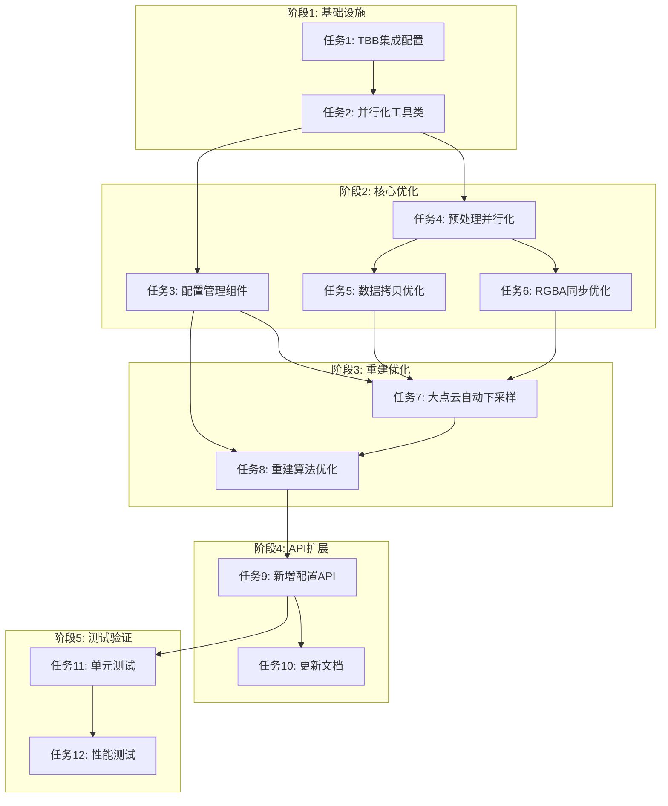

# Mesh重构效率优化 - 任务拆分文档

## 1. 任务依赖图

---

## 2. 原子任务清单

### 任务1: TBB集成配置
**输入契约**:
- 前置依赖: 无
- 输入数据: `PointCloudAlgorithm.vcxproj`文件
- 环境依赖: TBB SDK已存在(`bin/SDK/opencascade-7.9.3-vc14-64/3rdparty-vc14-64/tbb-2021.13.0-x64/`)

**输出契约**:
- 输出数据: 修改后的`PointCloudAlgorithm.vcxproj`
- 交付物: 可编译的PointCloudAlgorithm项目
- 验收标准: 
  1. 项目编译成功
  2. `CGAL_LINKED_WITH_TBB`宏已定义
  3. TBB头文件和库正确链接

**实现约束**:
- 技术栈: Visual Studio 2019, MSVC v142
- 接口规范: 保持现有项目配置不变
- 质量要求: 配置清晰，注释完整

**依赖关系**:
- 后置任务: 任务2、任务4
- 并行任务: 无

---

### 任务2: 并行化工具类
**输入契约**:
- 前置依赖: 任务1
- 输入数据: 无
- 环境依赖: TBB库可用

**输出契约**:
- 输出数据: `ParallelUtils.h`, `ParallelUtils.cpp`
- 交付物: 并行化管理工具类
- 验收标准:
  1. 能够检测TBB可用性
  2. 能够获取线程数
  3. 提供并行化开关

**实现约束**:
- 技术栈: C++17, TBB
- 接口规范: 符合`pclalgo`命名空间规范
- 质量要求: 线程安全，异常安全

**依赖关系**:
- 后置任务: 任务3、任务4
- 并行任务: 无

---

### 任务3: 配置管理组件
**输入契约**:
- 前置依赖: 任务2
- 输入数据: 无
- 环境依赖: 无

**输出契约**:
- 输出数据: `ReconstructionConfig.h`, `ReconstructionConfig.cpp`
- 交付物: 配置管理组件
- 验收标准:
  1. 支持三种质量级别(Fast/Balanced/Quality)
  2. 参数映射正确
  3. 接口清晰易用

**实现约束**:
- 技术栈: C++17
- 接口规范: 符合`pclalgo`命名空间规范
- 质量要求: 配置验证，默认值合理

**依赖关系**:
- 后置任务: 任务7、任务8
- 并行任务: 任务4、任务5、任务6

---

### 任务4: 预处理并行化
**输入契约**:
- 前置依赖: 任务1、任务2
- 输入数据: `Preprocess.cpp`
- 环境依赖: TBB库可用

**输出契约**:
- 输出数据: 修改后的`Preprocess.cpp`
- 交付物: 并行化的预处理算法
- 验收标准:
  1. 4处`Sequential_tag`替换为`Parallel_tag`
  2. 功能测试通过
  3. 性能提升可测量

**实现约束**:
- 技术栈: C++17, CGAL, TBB
- 接口规范: 保持现有API不变
- 质量要求: 线程安全，无竞态条件

**依赖关系**:
- 后置任务: 任务5、任务6
- 并行任务: 任务3

---

### 任务5: 数据拷贝优化
**输入契约**:
- 前置依赖: 任务4
- 输入数据: `Reconstruction.cpp`, `Preprocess.cpp`
- 环境依赖: 无

**输出契约**:
- 输出数据: 优化后的源文件
- 交付物: 减少拷贝的实现
- 验收标准:
  1. 使用移动语义
  2. 减少内存拷贝
  3. 功能测试通过

**实现约束**:
- 技术栈: C++17
- 接口规范: 保持现有API不变
- 质量要求: 无内存泄漏，异常安全

**依赖关系**:
- 后置任务: 任务7
- 并行任务: 任务6

---

### 任务6: RGBA同步优化
**输入契约**:
- 前置依赖: 任务4
- 输入数据: `Preprocess.cpp`, `Downsample.cpp`
- 环境依赖: 无

**输出契约**:
- 输出数据: 优化后的源文件
- 交付物: O(n)复杂度的RGBA同步
- 验收标准:
  1. 使用`unordered_map`索引
  2. 复杂度从O(n^2)降为O(n)
  3. 功能测试通过

**实现约束**:
- 技术栈: C++17, STL
- 接口规范: 保持现有API不变
- 质量要求: 正确性，内存效率

**依赖关系**:
- 后置任务: 任务7
- 并行任务: 任务5

---

### 任务7: 大点云自动下采样
**输入契约**:
- 前置依赖: 任务3、任务5、任务6
- 输入数据: `Reconstruction.cpp`
- 环境依赖: 无

**输出契约**:
- 输出数据: 修改后的`Reconstruction.cpp`
- 交付物: 自动下采样功能
- 验收标准:
  1. 超过阈值自动下采样
  2. 阈值可配置
  3. 功能测试通过

**实现约束**:
- 技术栈: C++17, CGAL
- 接口规范: 保持现有API不变
- 质量要求: 下采样质量可接受

**依赖关系**:
- 后置任务: 任务8
- 并行任务: 无

---

### 任务8: 重建算法优化
**输入契约**:
- 前置依赖: 任务7
- 输入数据: `Reconstruction.cpp`
- 环境依赖: 无

**输出契约**:
- 输出数据: 优化后的`Reconstruction.cpp`
- 交付物: 优化的重建算法
- 验收标准:
  1. 使用配置参数
  2. 性能提升可测量
  3. 功能测试通过

**实现约束**:
- 技术栈: C++17, CGAL
- 接口规范: 保持现有API不变
- 质量要求: 输出质量可接受

**依赖关系**:
- 后置任务: 任务9
- 并行任务: 无

---

### 任务9: 新增配置API
**输入契约**:
- 前置依赖: 任务8
- 输入数据: `Reconstruction.h`, `Reconstruction.cpp`, `PointCloudBackendOps.h`, `PointCloudBackendOps.cpp`
- 环境依赖: 无

**输出契约**:
- 输出数据: 新增API头文件和实现
- 交付物: 配置版本API
- 验收标准:
  1. 新增API可用
  2. 旧API保持兼容
  3. 文档更新

**实现约束**:
- 技术栈: C++17
- 接口规范: 符合项目规范
- 质量要求: 接口清晰，文档完整

**依赖关系**:
- 后置任务: 任务10、任务11
- 并行任务: 无

---

### 任务10: 更新文档
**输入契约**:
- 前置依赖: 任务9
- 输入数据: 现有文档
- 环境依赖: 无

**输出契约**:
- 输出数据: 更新后的文档
- 交付物: 完整的文档
- 验收标准:
  1. API文档更新
  2. 使用示例更新
  3. 性能对比数据

**实现约束**:
- 技术栈: Markdown
- 接口规范: 符合项目文档规范
- 质量要求: 准确、完整、易读

**依赖关系**:
- 后置任务: 无
- 并行任务: 任务11

---

### 任务11: 单元测试
**输入契约**:
- 前置依赖: 任务9
- 输入数据: 现有测试用例
- 环境依赖: 测试框架

**输出契约**:
- 输出数据: 新增测试用例
- 交付物: 完整的测试套件
- 验收标准:
  1. 功能测试覆盖
  2. 边界测试覆盖
  3. 异常测试覆盖

**实现约束**:
- 技术栈: C++17, 测试框架
- 接口规范: 符合项目测试规范
- 质量要求: 测试覆盖率>80%

**依赖关系**:
- 后置任务: 任务12
- 并行任务: 任务10

---

### 任务12: 性能测试
**输入契约**:
- 前置依赖: 任务11
- 输入数据: 测试数据集
- 环境依赖: 性能测试环境

**输出契约**:
- 输出数据: 性能测试报告
- 交付物: 性能基准数据
- 验收标准:
  1. 性能提升可测量
  2. 内存使用可接受
  3. 输出质量可接受

**实现约束**:
- 技术栈: C++17, 性能测试工具
- 接口规范: 符合项目测试规范
- 质量要求: 测试结果可复现

**依赖关系**:
- 后置任务: 无
- 并行任务: 无

---

## 3. 任务优先级

| 优先级 | 任务 | 原因 |
|--------|------|------|
| P0 | 任务1: TBB集成配置 | 基础设施，阻塞其他任务 |
| P0 | 任务2: 并行化工具类 | 基础设施，阻塞其他任务 |
| P1 | 任务4: 预处理并行化 | 主要性能瓶颈 |
| P1 | 任务6: RGBA同步优化 | 严重性能瓶颈 |
| P1 | 任务7: 大点云自动下采样 | 内存和性能关键 |
| P2 | 任务3: 配置管理组件 | 功能增强 |
| P2 | 任务5: 数据拷贝优化 | 性能优化 |
| P2 | 任务8: 重建算法优化 | 性能优化 |
| P3 | 任务9: 新增配置API | 功能扩展 |
| P3 | 任务10: 更新文档 | 文档完善 |
| P3 | 任务11: 单元测试 | 质量保证 |
| P3 | 任务12: 性能测试 | 验收标准 |

---

## 4. 风险评估

### 4.1 高风险任务

| 任务 | 风险 | 缓解措施 |
|------|------|----------|
| 任务1: TBB集成配置 | 构建系统配置复杂 | 先验证TBB集成可行性 |
| 任务4: 预处理并行化 | 并行化竞态条件 | CGAL已处理，充分测试 |
| 任务7: 大点云自动下采样 | 下采样质量下降 | 提供质量配置选项 |

### 4.2 中风险任务

| 任务 | 风险 | 缓解措施 |
|------|------|----------|
| 任务5: 数据拷贝优化 | 移动语义使用不当 | 代码审查，充分测试 |
| 任务6: RGBA同步优化 | 索引映射正确性 | 单元测试覆盖 |
| 任务8: 重建算法优化 | 参数调优困难 | 提供默认配置 |

---

## 5. 验收标准

### 5.1 整体验收

1. **性能**: 相同输入，重构时间减少50%以上
2. **内存**: 内存使用峰值不超过当前1.5倍
3. **质量**: 输出网格质量指标变化<10%
4. **功能**: 现有功能测试全部通过
5. **兼容**: 旧API保持兼容

### 5.2 分阶段验收

| 阶段 | 验收标准 |
|------|----------|
| 阶段1 | TBB集成成功，编译通过 |
| 阶段2 | 预处理并行化，性能提升可测量 |
| 阶段3 | 重建优化，大点云处理正常 |
| 阶段4 | 新增API可用，文档完整 |
| 阶段5 | 测试通过，性能达标 |

---

## 6. 资源估算

### 6.1 时间估算

| 阶段 | 任务数 | 估算时间 |
|------|--------|----------|
| 阶段1: 基础设施 | 2 | 1天 |
| 阶段2: 核心优化 | 4 | 2天 |
| 阶段3: 重建优化 | 2 | 1天 |
| 阶段4: API扩展 | 2 | 1天 |
| 阶段5: 测试验证 | 2 | 1天 |
| **总计** | **12** | **6天** |

### 6.2 人力估算

- 主要开发: 1人
- 代码审查: 0.5人
- 测试验证: 0.5人

---

## 7. 沟通计划

### 7.1 进度汇报

- 每日站会: 汇报当日进展
- 周报: 汇报本周完成情况
- 里程碑: 阶段完成时汇报

### 7.2 问题升级

- 技术问题: 及时汇报，寻求支持
- 进度延迟: 提前预警，调整计划
- 需求变更: 评估影响，重新规划