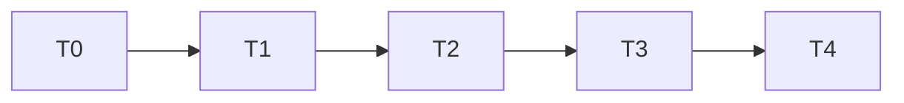

# TASK — Robot 运动学演进

## T0 文档与图

- 输入：本目录 ALIGNMENT/CONSENSUS/DESIGN
- 输出：DEVELOPER_GUIDE 四处更新；`diagrams/*.html`
- 验收：链接可开

## T1 Workspace

- 输入：UrdfRobotLoader Jacobian 路径
- 输出：`UrdfKinematicsWorkspace` + 索引 BFS；TeachIkScratch
- 验收：Debug+Release 编译；拖动可跑

## T2 Options + DH

- 输出：Options 结构；DH deprecated；有 URDF 切断 DH IK
- 验收：默认数值与旧硬编码一致

## T3 Oracle

- 输出：SelfTest + golden + pinocchio 脚本
- 验收：runSelfTest 通过

## T4 核拆分

- 输出：`UrdfNumericalIk` 在 RobotUrdf；TeachIk 调核；filters 齐全
- 验收：Scene 无独立 DLS 正规方程主实现

## 依赖

