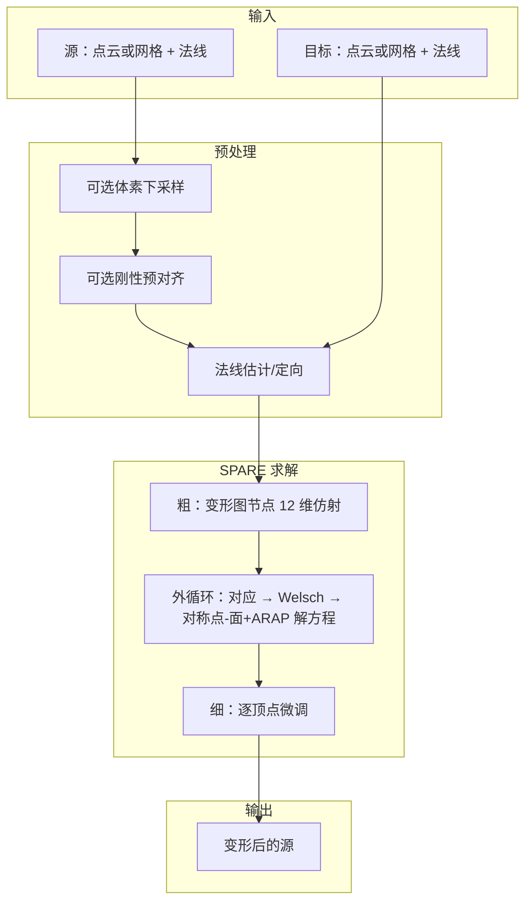

# SPARE 非刚性配准：原理说明（通俗版）

本文说明 CloudSim 中 SPARE 非刚性匹配「在算什么、怎么算」，尽量少公式、多比喻。  
面向：点云/网格配准使用者、需要调参或排查 OOM/不收敛问题的开发者。

| 项 | 内容 |
|----|------|
| 论文 | [SPARE: Symmetrized Point-to-Plane Distance for Robust Non-Rigid Registration](https://arxiv.org/abs/2405.20188) |
| 本仓库入口 | `pclalgo::spareRegister*`（`RegistrationSpare.h`） |
| 实现目录 | `Geometry/PointCloudAlgorithm/source/spare/` |
| 插件入口 | 点云侧栏 → 配准 → SPARE 非刚性 |
| 合规 | 原 SPARE 源码声明专利保护，仅限研究用途；商用需联系作者 |

---

## 1. 要解决什么问题

### 刚性 vs 非刚性（一句话）

- **刚性配准（ICP）**：整块零件只能「平移 + 旋转」，形状不能变。像把硬塑料件摆正。
- **非刚性配准（SPARE）**：允许表面**局部拉伸/弯曲**，同时尽量别撕破、别打皱。像把略变形的软皮或扫描残差「熨平」贴到另一块形状上。

### 典型场景

- 扫描点云与 CAD 离散网格局部对不齐（加工误差、扫描噪声、轻微变形）
- 两片扫描局部弯曲不一致，刚体 ICP 后仍有「翘边」
- 源、目标都可以是**点云或三角网格**（本仓库 MVP 已支持）

### 输入输出（本仓库约定）

- 输入：源与目标的位置（单位 mm）+ 法线；网格则用三角 soup
- 输出：源被变形后的位置（及法线）；可选写回原对象或新建 `*_SPARE` 对象
- 坐标系：算法层吃**同一世界系**下的数据；`worldMatrix` 由 Host 事先变换好

---

## 2. 核心直觉：三块积木

SPARE 可以想成三个互相配合的机制：

```text
① 量「贴得紧不紧」  →  对称点-面距离（比点-点更稳）
② 管「别乱变形」    →  ARAP + 平滑 + 旋转约束
③ 抗「错误对应」    →  Welsch 鲁棒权重（离群点降权）
```

外层再套一个循环：**找对应 → 加权 → 解方程更新形状 → 再找对应…**，直到位移足够小或达到最大轮数。

---

## 3. 对称点-面距离（论文名字里的 SPARE）

### 普通做法的问题

| 度量 | 白话 | 缺点 |
|------|------|------|
| 点-点 | 源点直接拉到最近目标点 | 容易「滑移」、忽略表面朝向 |
| 点-面 | 只看目标表面的法线，沿法线方向贴近 | 只用到目标一侧信息 |

### SPARE 的做法

同时用**源点变形后的法线**和**目标点法线**，看「两点连线」在「两侧法线之和」方向上的投影是否接近 0。

白话：

> 不只问「点有没有叠在一起」，还问「两边的表面是不是朝向一致地贴在一起」。

这样在噪声和局部错位时，往往比纯点-点更稳、收敛更好。  
本仓库里对应矩阵组装逻辑在 `SpareSolver` 的 `normalsSum_` / `initNormalsSum` / `calcNormalsSum`（参数 `useSymmetricPointToPlane`，默认开）。

---

## 4. 为什么要「粗 + 细」两阶段

顶点很多时，若一开始就让每个点自由乱动，方程巨大、又容易乱。SPARE 分两步走：

### 阶段 A：粗配准（变形图）

1. 在源上**稀疏采样一批「控制节点」**（像骨架上的关节）
2. 每个节点带一个小仿射变换（约 **12 个数**：线性部分 + 平移）
3. 普通顶点跟着附近几个节点「皮肤绑定」一起动（加权混合）
4. 未知量规模 ≈ `12 × 节点数`，远小于 `3 × 顶点数`

节点怎么来：

| 源类型 | 采样方式（本仓库） |
|--------|-------------------|
| 点云 | FPS（最远点采样）+ 邻接图 |
| 网格 | 沿网格边图做限半径 Dijkstra（测地近似） |

节点疏密由采样半径控制（`sampleRadiusRatio`；为 0 时用约「平均点距 × 10」自动估）。  
半径越大 → 节点越少 → 更快、更粗、更省内存。

### 阶段 B：细配准（逐顶点）

粗对齐大概到位后，再允许**每个顶点**微调，仍用对称点-面 + ARAP，把局部细节抠齐。

- 未知量规模 ≈ `3 × 顶点数`
- **最吃内存**的阶段；大网格/大点云的 `bad allocation` 多半出在这里

本仓库：`SpareSolver::graphCoarseReg` → `pointwiseFineReg`（可由 `useCoarseReg` / `useFineReg` 开关，UI 目前未全部暴露）。

---

## 5. 正则项：别把表面「揉烂」

只追着目标贴，表面会皱、翻、撕裂。SPARE 用几项「拉住」变形：

| 项 | 作用（白话） | 本仓库权重 |
|----|--------------|------------|
| **平滑** | 相邻节点/区域变形别差太离谱 | `wSmo`（默认 0.01） |
| **旋转正交** | 节点仿射尽量像「旋转」，别乱剪切 | `wRot`（默认 1e-4） |
| **ARAP** | 局部尽量「像刚体一样动」——能转、能挪，少拉长压扁 | 粗 `wArapCoarse=500`，细 `wArapFine=200` |

ARAP 邻接：

- 点云：K 近邻（本仓库 K=6）
- 网格：半边 / 一环邻接

调参直觉：

- 贴不上、太「硬」→ 略减小 ARAP / 平滑权重  
- 起皱、破面 → 增大 ARAP / 平滑权重  

---

## 6. Welsch 鲁棒权重：错误对应别当真

每轮都会用 Kd-tree 找「源点 → 目标最近点」。有些对应是错的（遮挡、飞点、局部叠错）。

Welsch 的做法可以想成：

> 残差特别大的对应，权重自动压低；正常的对应权重大。

这样错误匹配不会把整块表面拽歪。  
尺度 \(\nu\) 由初始对应距离中位数等初始化，并在外循环中配合 MM（Majorization-Minimization）思想更新。  
参数侧：`dataUseRobustWeight`（默认开）；法线反向过狠的对应也会被直接剔除。

---

## 7. 一整轮在干什么（外循环）

每一轮外迭代大致是：

```text
1. 用当前变形后的源，在目标上找最近邻（可只对采样点做，粗阶段）
2. 算距离 / 法线一致性 → 得到鲁棒权重
3. 组装能量：对称点-面对齐 + 平滑 + 旋转 + ARAP
4. 解稀疏线性方程组（本仓库：Eigen::SimplicialLDLT）
5. 更新顶点位置与变形法线
6. 平均位移足够小 → 停；否则继续，最多 maxOuterIters 轮
```

粗阶段收敛阈 `stopCoarse`（默认 1e-3），细阶段更紧 `stopFine`（默认 1e-4）。

---

## 8. 本仓库流水线（从 UI 到求解器）

```text
PointCloudDockWidget（源/目标下拉：点云或网格）
    → IPluginPointCloudHost::nonRigidRegisterSpare
    → PluginPointCloudHostImpl（异步任务，世界系数据）
    → point_cloud_backend_ops::nonRigidRegister*Spare
    → pclalgo::spareRegisterPointClouds / MeshSoup*
         ├─ 可选：体素预滤波（点云）
         ├─ 可选：刚性 ICP / RANSAC 预对齐
         ├─ 估法线（缺失时）
         ├─ SpareSurface 构建（点云直建 / 网格 soup→Surface_mesh）
         └─ SpareSolver::init + run
              ├─ 粗：变形图
              └─ 细：逐顶点
    → 写回源或新建对象
```

关键源码：

| 模块 | 文件 | 职责 |
|------|------|------|
| 公开 API | `inc/RegistrationSpare.h` | 参数、点云/网格入口 |
| 表面构建 | `source/spare/SpareSurfaceBuild.cpp` | xyz/法线、soup→网格拓扑 |
| 节点采样 | `source/spare/SpareNodeSampler.cpp` | FPS / Dijkstra |
| 求解器 | `source/spare/SpareSolver.cpp` | 能量、外循环、LDLT |

复用的基础设施（不重复造轮子）：`KdTreePointSet`、`estimateNormalsPca` / `orientNormalsMst`、`downsampleVoxelGrid`、`rigidRegisterPointToPlaneIcp`、CGAL `Surface_mesh` + PMP。

---

## 9. 参数怎么理解（调参速查）

### 侧栏已暴露

| 控件 | 含义 |
|------|------|
| 体素预滤波 (mm) | `0` = 不下采样；`>0` = 点云先体素简化再算（**网格源当前不走此项**） |
| 刚性预对齐 | 非刚性前先 ICP，初值差时有用 |
| 输出为新对象 | 是否生成 `*_SPARE`，不影响算法本身 |

### 算法默认（代码有，UI 未全开）

| 参数 | 默认 | 白话 |
|------|------|------|
| `sampleRadiusRatio` | 0（自动） | 变形图节点疏密；大→节点少→快、粗 |
| `wSmo` / `wRot` | 0.01 / 1e-4 | 平滑 / 旋转约束 |
| `wArapCoarse` / `wArapFine` | 500 / 200 | 粗/细局部刚性 |
| `useCoarseReg` / `useFineReg` | true / true | 是否跑粗/细；关细可大幅省内存 |
| `useSymmetricPointToPlane` | true | 是否用对称点-面 |
| `normalizeScale` | true | 按尺度归一化再还原，跨尺度更稳 |
| `maxOuterIters` | 30 | 外循环上限 |
| `alignSampleCount` | 3000 | 粗阶段对齐采样点数上限 |

### 常见现象

| 现象 | 优先处理 |
|------|----------|
| `bad allocation` / 极慢 | 点云加体素；网格先简化面数；减小节点数；考虑关细配准 |
| 几乎不变形 | 开刚性预对齐；检查法线；略降 ARAP |
| 皱、破、扭曲 | 增大 ARAP / 平滑 |
| 节点数异常多 | 增大采样半径或先下采样 |

---

## 10. 和常见「非刚性」算法差在哪

| 方法 | 一句话 | 与 SPARE |
|------|--------|----------|
| 刚性 ICP | 只能刚体对齐 | SPARE 可选作预对齐 |
| NRICP | 每顶点仿射 + 平滑，多点-点 | 无对称点-面两阶段 SPARE |
| Embedded Deformation (ED) | 变形图节点驱动 | 像 SPARE **粗阶段形态**，度量与细阶段不同 |
| libigl ARAP 手柄变形 | 对应变硬约束再 ARAP | 不是 SPARE 能量最小化 |
| TPS | 薄板样条全局弯曲 | 另一类模型，本仓库另有 API |

SPARE 的辨识度在于：**对称点-面数据项 + Welsch 鲁棒 + 变形图粗配准 + 逐点细配准 + ARAP 正则** 这一整套组合。

---

## 11. 使用注意（实践）

1. **源和目标尽量先大致对齐**（视图摆正或刚性预对齐），非刚性不是万能全局搜索。  
2. **法线很重要**：缺失时会 PCA+MST 估计；法线错会直接伤对应与对称点-面。  
3. **规模**：细阶段对 \(N\) 很敏感；几十万顶点很容易内存爆炸。大件请先简化/体素。  
4. **进度日志里的 Done** 只表示后台任务结束，成功与否看是否报错及结果对象。  
5. **专利/许可**：研究用途保留引用；产品化商用需另行授权。

---

## 12. 相关文档与代码

- 算法开发指南（API 节）：[`../src/Geometry/PointCloudAlgorithm/DEVELOPER_GUIDE.md`](../src/Geometry/PointCloudAlgorithm/DEVELOPER_GUIDE.md) §3.5  
- 插件使用：[`../src/Plugins/PointCloudPlugin/DEVELOPER_GUIDE.md`](../src/Plugins/PointCloudPlugin/DEVELOPER_GUIDE.md)「SPARE 非刚性配准」  
- 论文：arXiv:2405.20188  
- 参考实现（只读）：`bin/SDK/spare-main-extracted/spare-main/`

---

## 附录：一张总览图



**一句话记住 SPARE：**  
用更聪明的「贴合尺子」（对称点-面），先让稀疏「骨架」粗对齐，再让每个点细调，同时用 ARAP 保形状、用 Welsch 不理睬离谱对应。
