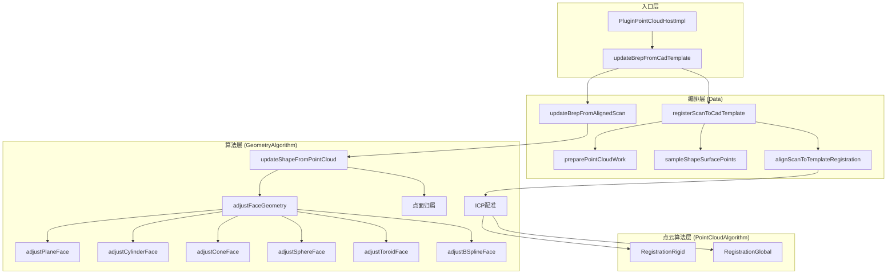
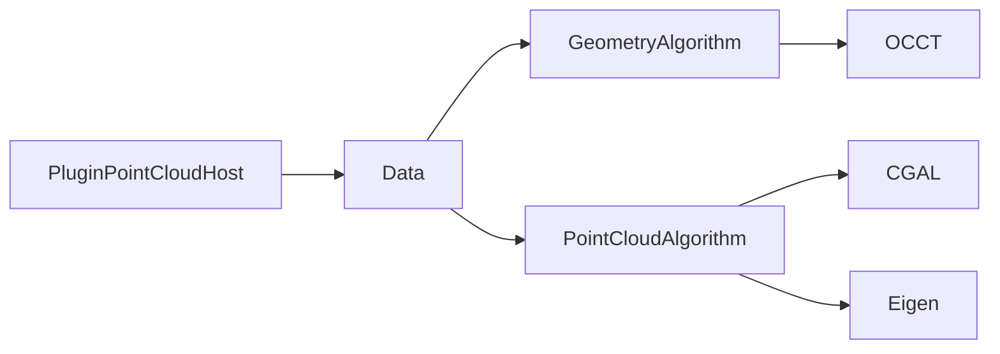
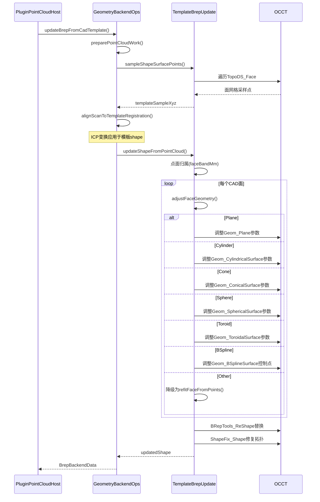

# B-rep 重构逻辑优化 - 设计文档

## 1. 整体架构图



## 2. 分层设计

### 2.1 入口层（PluginPointCloudHost）

**职责**：UI交互、坐标变换、Job调度

**关键修改**：
- 无需修改（保持现有接口）

### 2.2 编排层（Data/GeometryBackendOps）

**职责**：ICP流水线编排、模板shape管理

**关键修改**：

```cpp
// 修改1：反向配准 - 变换模板而非扫描点云
// 当前：
applyIsometryInPlace(workXyz, icpStep);

// 目标：
TopoDS_Shape transformTemplate(
    const TopoDS_Shape& templateShape,
    const Eigen::Isometry3d& transform);
```

### 2.3 算法层（GeometryAlgorithm）

**职责**：面更新、特征类型驱动调整

**关键修改**：

```cpp
// 新增：根据面类型选择调整策略
bool adjustFaceGeometry(
    const TopoDS_Face& originalFace,
    const std::vector<Vec3>& assignedPoints,
    TopoDS_Face& adjustedFace,
    FaceUpdateAction& action);

// 修改：updateShapeFromPointCloud 调用 adjustFaceGeometry 而非 refitFaceFromPoints
```

## 3. 模块依赖关系图



## 4. 接口契约定义

### 4.1 新增枚举（TemplateBrepUpdate.h）

```cpp
enum class FaceUpdateAction
{
    // 保留向后兼容
    Unchanged,
    PlaneRefit,
    CylinderRefit,
    FreeformRefit,
    SkippedNoPoints,
    
    // 新增：调整模式
    ConeRefit,
    SphereRefit,
    ToroidRefit,
    PlaneAdjusted,
    CylinderAdjusted,
    ConeAdjusted,
    SphereAdjusted,
    ToroidAdjusted,
    BSplineAdjusted
};
```

### 4.2 新增函数（TemplateBrepUpdate.h）

```cpp
/// 根据面类型调整原始B-rep几何定义
/// @param originalFace 原始CAD面
/// @param assignedPoints 归属到该面的扫描点
/// @param adjustedFace 输出：调整后的面
/// @param action 输出：执行的调整类型
/// @return 成功/失败
GEOMETRY_ALGORITHM_API bool adjustFaceGeometry(
    const TopoDS_Face& originalFace,
    const std::vector<Vec3>& assignedPoints,
    TopoDS_Face& adjustedFace,
    FaceUpdateAction& action);
```

### 4.3 修改函数签名（可选）

```cpp
// 当前签名（保持不变，向后兼容）
GEOMETRY_ALGORITHM_API bool updateShapeFromPointCloud(
    const ShapeHandle& templateShape,
    const std::vector<float>& scanXyz,
    const std::vector<float>& scanNormalsNxNyNz,
    const TemplateBrepUpdateParams& params,
    TemplateBrepUpdateResult& out,
    std::string* errMsg = nullptr);

// 内部实现修改：调用 adjustFaceGeometry 替代 refitFaceFromPoints
```

## 5. 数据流向图



## 6. 异常处理策略

### 6.1 面调整失败

**场景**：扫描点不足或调整算法失败

**处理**：
1. 记录`FaceUpdateAction::SkippedNoPoints`或`Unchanged`
2. 保持原始面不变
3. 继续处理其他面
4. 在`TemplateBrepUpdateResult.perFace`中记录

### 6.2 拓扑修复失败

**场景**：`ShapeFix_Shape`无法修复拓扑

**处理**：
1. 记录错误日志
2. 返回`qualityPassed = false`
3. 返回原始shape（`updatedShape`为空）

### 6.3 ICP配准失败

**场景**：ICP收敛失败或RMSE超限

**处理**：
1. 保持现有逻辑（`maxIcpRmseToFaceBandRatio`门控）
2. 返回错误，不执行面更新

## 7. 关键算法设计

### 7.1 Plane调整算法

```cpp
bool adjustPlaneFace(const TopoDS_Face& face, const std::vector<Vec3>& pts, TopoDS_Face& out)
{
    // 1. 获取原始平面参数
    Handle(Geom_Plane) geomPlane = Handle(Geom_Plane)::DownCast(BRep_Tool::Surface(face));
    gp_Pln origPln = geomPlane->Pln();
    
    // 2. 用扫描点拟合新平面
    gp_Pln fittedPln;
    if (!fitPlaneFromPoints(pts, fittedPln)) return false;
    
    // 3. 计算变换：原始平面 → 拟合平面
    // 保持原始wire，只调整平面几何
    
    // 4. 创建新面
    TopoDS_Wire wire = BRepTools::OuterWire(face);
    BRepBuilderAPI_MakeFace maker(fittedPln, wire, true);
    if (!maker.IsDone()) return false;
    out = maker.Face();
    return true;
}
```

### 7.2 Cylinder调整算法

```cpp
bool adjustCylinderFace(const TopoDS_Face& face, const std::vector<Vec3>& pts, TopoDS_Face& out)
{
    // 1. 获取原始圆柱参数
    Handle(Geom_CylindricalSurface) geomCyl = ...;
    gp_Ax1 origAxis = geomCyl->Axis();
    double origRadius = geomCyl->Radius();
    
    // 2. 用扫描点拟合新轴线和半径
    gp_Ax1 fittedAxis;
    double fittedRadius;
    if (!fitCylinderFromPoints(pts, fittedAxis, fittedRadius)) return false;
    
    // 3. 创建新圆柱面（保持原始UV范围）
    gp_Cylinder newCyl(fittedAxis, fittedRadius);
    Handle(Geom_CylindricalSurface) newSurf = new Geom_CylindricalSurface(newCyl);
    
    // 4. 创建新面
    BRepBuilderAPI_MakeFace maker(newSurf, u1, u2, v1, v2, tol);
    if (!maker.IsDone()) return false;
    out = maker.Face();
    return true;
}
```

### 7.3 BSpline调整算法

```cpp
bool adjustBSplineFace(const TopoDS_Face& face, const std::vector<Vec3>& pts, TopoDS_Face& out)
{
    // 1. 获取原始B样条曲面
    Handle(Geom_BSplineSurface) geomBSpline = ...;
    
    // 2. 将扫描点投影到UV参数域
    std::vector<gp_Pnt2d> uvPoints;
    for (const auto& pt : pts) {
        GeomAPI_ProjectPointOnSurf proj(gp_Pnt(pt.x(), pt.y(), pt.z()), geomBSpline);
        if (proj.NbPoints() > 0) {
            Standard_Real u, v;
            proj.LowerDistanceParameters(u, v);
            uvPoints.emplace_back(u, v);
        }
    }
    
    // 3. 用投影点优化控制点（最小二乘）
    // 这是一个约束优化问题：保持原始控制点拓扑，微调位置
    // 实现细节需要数值优化库或OCCT内置功能
    
    // 4. 创建新面
    // ...
}
```

## 8. 性能考虑

### 8.1 计算复杂度

| 操作 | 复杂度 | 优化策略 |
|------|--------|----------|
| 点面归属 | O(N×M) | KD树加速（现有实现） |
| Plane调整 | O(N) | 最小二乘拟合 |
| Cylinder调整 | O(N) | PCA + 最小二乘 |
| BSpline调整 | O(N×K) | 控制点子集优化 |

### 8.2 内存使用

- 扫描点集：保持现有
- 模型面：保持现有
- 临时UV投影：新增，O(N)

## 9. 相关源码索引

| 文件 | 修改内容 |
|------|----------|
| `Geometry/GeometryAlgorithm/inc/TemplateBrepUpdate.h` | 新增枚举值、新增函数声明 |
| `Geometry/GeometryAlgorithm/source/TemplateBrepUpdate.cpp` | 实现`adjustFaceGeometry`及各面类型调整函数 |
| `Data/source/GeometryBackendOps.cpp` | 修改配准编排，实现反向配准 |
| `docs/template_brep_pointcloud_update.md` | 更新流程文档 |
