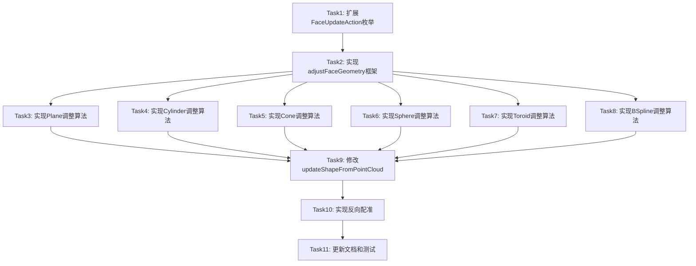

# B-rep 重构逻辑优化 - 任务分解文档

## 1. 任务依赖图



## 2. 原子任务定义

### Task 1: 扩展FaceUpdateAction枚举

**输入契约**：
- 前置依赖：无
- 输入数据：现有`FaceUpdateAction`枚举定义
- 环境依赖：无

**输出契约**：
- 输出数据：扩展后的`FaceUpdateAction`枚举
- 交付物：修改后的`TemplateBrepUpdate.h`
- 验收标准：枚举值完整，向后兼容

**实现约束**：
- 技术栈：C++17
- 接口规范：保持现有枚举值不变
- 质量要求：向后兼容

**依赖关系**：
- 后置任务：Task 2-9
- 并行任务：无

**实现内容**：

```cpp
// TemplateBrepUpdate.h
enum class FaceUpdateAction
{
    // 保留向后兼容
    Unchanged,
    PlaneRefit,
    CylinderRefit,
    FreeformRefit,
    SkippedNoPoints,
    
    // 新增：拟合模式（向后兼容）
    ConeRefit,
    SphereRefit,
    ToroidRefit,
    
    // 新增：调整模式
    PlaneAdjusted,
    CylinderAdjusted,
    ConeAdjusted,
    SphereAdjusted,
    ToroidAdjusted,
    BSplineAdjusted
};
```

---

### Task 2: 实现adjustFaceGeometry框架

**输入契约**：
- 前置依赖：Task 1
- 输入数据：现有`refitFaceFromPoints`函数
- 环境依赖：无

**输出契约**：
- 输出数据：`adjustFaceGeometry`函数框架
- 交付物：修改后的`TemplateBrepUpdate.cpp`
- 验收标准：函数框架完整，能够根据面类型分派

**实现约束**：
- 技术栈：C++17、OCCT 7.9
- 接口规范：遵循现有代码风格
- 质量要求：可扩展、易维护

**依赖关系**：
- 后置任务：Task 3-8
- 并行任务：无

**实现内容**：

```cpp
// TemplateBrepUpdate.cpp
bool adjustFaceGeometry(
    const TopoDS_Face& originalFace,
    const std::vector<Vec3>& assignedPoints,
    TopoDS_Face& adjustedFace,
    FaceUpdateAction& action)
{
    if (assignedPoints.size() < 3U) {
        action = FaceUpdateAction::SkippedNoPoints;
        return false;
    }
    
    BRepAdaptor_Surface adapt(originalFace, true);
    const GeomAbs_SurfaceType surfType = adapt.GetType();
    
    switch (surfType) {
        case GeomAbs_Plane:
            return adjustPlaneFace(originalFace, assignedPoints, adjustedFace, action);
        case GeomAbs_Cylinder:
            return adjustCylinderFace(originalFace, assignedPoints, adjustedFace, action);
        case GeomAbs_Cone:
            return adjustConeFace(originalFace, assignedPoints, adjustedFace, action);
        case GeomAbs_Sphere:
            return adjustSphereFace(originalFace, assignedPoints, adjustedFace, action);
        case GeomAbs_Torus:
            return adjustToroidFace(originalFace, assignedPoints, adjustedFace, action);
        case GeomAbs_BSplineSurface:
            return adjustBSplineFace(originalFace, assignedPoints, adjustedFace, action);
        default:
            // 降级为拟合方式
            return refitFaceFromPoints(originalFace, assignedPoints, adjustedFace, action);
    }
}
```

---

### Task 3: 实现Plane调整算法

**输入契约**：
- 前置依赖：Task 2
- 输入数据：现有`fitPlaneFromPoints`函数
- 环境依赖：无

**输出契约**：
- 输出数据：`adjustPlaneFace`函数
- 交付物：修改后的`TemplateBrepUpdate.cpp`
- 验收标准：能够用扫描点调整平面几何定义

**实现约束**：
- 技术栈：C++17、OCCT 7.9
- 接口规范：遵循现有代码风格
- 质量要求：数值稳定

**依赖关系**：
- 后置任务：Task 9
- 并行任务：Task 4-8

**实现内容**：

```cpp
bool adjustPlaneFace(
    const TopoDS_Face& face,
    const std::vector<Vec3>& pts,
    TopoDS_Face& out,
    FaceUpdateAction& action)
{
    // 1. 用扫描点拟合新平面
    gp_Pln fittedPln;
    if (!fitPlaneFromPoints(pts, fittedPln)) {
        return false;
    }
    
    // 2. 获取原始wire
    TopoDS_Wire wire = BRepTools::OuterWire(face);
    if (wire.IsNull()) {
        return false;
    }
    
    // 3. 创建新面（使用拟合平面 + 原始wire）
    BRepBuilderAPI_MakeFace maker(fittedPln, wire, true);
    if (!maker.IsDone()) {
        return false;
    }
    out = maker.Face();
    action = FaceUpdateAction::PlaneAdjusted;
    return true;
}
```

---

### Task 4: 实现Cylinder调整算法

**输入契约**：
- 前置依赖：Task 2
- 输入数据：现有`fitCylinderFromPoints`函数
- 环境依赖：无

**输出契约**：
- 输出数据：`adjustCylinderFace`函数
- 交付物：修改后的`TemplateBrepUpdate.cpp`
- 验收标准：能够用扫描点调整圆柱几何定义

**实现约束**：
- 技术栈：C++17、OCCT 7.9
- 接口规范：遵循现有代码风格
- 质量要求：数值稳定

**依赖关系**：
- 后置任务：Task 9
- 并行任务：Task 3, 5-8

**实现内容**：

```cpp
bool adjustCylinderFace(
    const TopoDS_Face& face,
    const std::vector<Vec3>& pts,
    TopoDS_Face& out,
    FaceUpdateAction& action)
{
    // 1. 用扫描点拟合新轴线和半径
    gp_Ax1 fittedAxis;
    double fittedRadius;
    if (!fitCylinderFromPoints(pts, fittedAxis, fittedRadius)) {
        return false;
    }
    
    // 2. 获取原始UV范围
    BRepAdaptor_Surface adapt(face, true);
    const Standard_Real u1 = adapt.FirstUParameter();
    const Standard_Real u2 = adapt.LastUParameter();
    const Standard_Real v1 = adapt.FirstVParameter();
    const Standard_Real v2 = adapt.LastVParameter();
    
    // 3. 创建新圆柱面
    const gp_Ax3 cylAx3(fittedAxis.Location(), gp_Dir(fittedAxis.Direction()));
    const gp_Cylinder cyl(cylAx3, fittedRadius);
    Handle(Geom_CylindricalSurface) surf = new Geom_CylindricalSurface(cyl);
    
    // 4. 创建新面
    BRepBuilderAPI_MakeFace maker(surf, u1, u2, v1, v2, 1e-6);
    if (!maker.IsDone()) {
        return false;
    }
    out = maker.Face();
    action = FaceUpdateAction::CylinderAdjusted;
    return true;
}
```

---

### Task 5: 实现Cone调整算法

**输入契约**：
- 前置依赖：Task 2
- 输入数据：无（新功能）
- 环境依赖：无

**输出契约**：
- 输出数据：`adjustConeFace`函数
- 交付物：修改后的`TemplateBrepUpdate.cpp`
- 验收标准：能够用扫描点调整圆锥几何定义

**实现约束**：
- 技术栈：C++17、OCCT 7.9
- 接口规范：遵循现有代码风格
- 质量要求：数值稳定

**依赖关系**：
- 后置任务：Task 9
- 并行任务：Task 3-4, 6-8

**实现内容**：

```cpp
bool adjustConeFace(
    const TopoDS_Face& face,
    const std::vector<Vec3>& pts,
    TopoDS_Face& out,
    FaceUpdateAction& action)
{
    // 1. 获取原始圆锥参数
    Handle(Geom_ConicalSurface) geomCone = 
        Handle(Geom_ConicalSurface)::DownCast(BRep_Tool::Surface(face));
    if (geomCone.IsNull()) {
        return false;
    }
    
    // 2. 用扫描点拟合新圆锥参数
    // 需要实现 fitConeFromPoints 函数
    gp_Ax1 fittedAxis;
    double fittedHalfAngle;
    double fittedRadius;
    if (!fitConeFromPoints(pts, fittedAxis, fittedHalfAngle, fittedRadius)) {
        return false;
    }
    
    // 3. 创建新圆锥面
    const gp_Ax3 coneAx3(fittedAxis.Location(), gp_Dir(fittedAxis.Direction()));
    const gp_Cone cone(coneAx3, fittedHalfAngle, fittedRadius);
    Handle(Geom_ConicalSurface) surf = new Geom_ConicalSurface(cone);
    
    // 4. 创建新面
    // ...
    out = maker.Face();
    action = FaceUpdateAction::ConeAdjusted;
    return true;
}
```

---

### Task 6: 实现Sphere调整算法

**输入契约**：
- 前置依赖：Task 2
- 输入数据：无（新功能）
- 环境依赖：无

**输出契约**：
- 输出数据：`adjustSphereFace`函数
- 交付物：修改后的`TemplateBrepUpdate.cpp`
- 验收标准：能够用扫描点调整球面几何定义

**实现约束**：
- 技术栈：C++17、OCCT 7.9
- 接口规范：遵循现有代码风格
- 质量要求：数值稳定

**依赖关系**：
- 后置任务：Task 9
- 并行任务：Task 3-5, 7-8

**实现内容**：

```cpp
bool adjustSphereFace(
    const TopoDS_Face& face,
    const std::vector<Vec3>& pts,
    TopoDS_Face& out,
    FaceUpdateAction& action)
{
    // 1. 用扫描点拟合新球心和半径
    gp_Pnt fittedCenter;
    double fittedRadius;
    if (!fitSphereFromPoints(pts, fittedCenter, fittedRadius)) {
        return false;
    }
    
    // 2. 创建新球面
    const gp_Sphere sphere(gp_Ax3(fittedCenter), fittedRadius);
    Handle(Geom_SphericalSurface) surf = new Geom_SphericalSurface(sphere);
    
    // 3. 创建新面
    // ...
    out = maker.Face();
    action = FaceUpdateAction::SphereAdjusted;
    return true;
}
```

---

### Task 7: 实现Toroid调整算法

**输入契约**：
- 前置依赖：Task 2
- 输入数据：无（新功能）
- 环境依赖：无

**输出契约**：
- 输出数据：`adjustToroidFace`函数
- 交付物：修改后的`TemplateBrepUpdate.cpp`
- 验收标准：能够用扫描点调整圆环面几何定义

**实现约束**：
- 技术栈：C++17、OCCT 7.9
- 接口规范：遵循现有代码风格
- 质量要求：数值稳定

**依赖关系**：
- 后置任务：Task 9
- 并行任务：Task 3-6, 8

**实现内容**：

```cpp
bool adjustToroidFace(
    const TopoDS_Face& face,
    const std::vector<Vec3>& pts,
    TopoDS_Face& out,
    FaceUpdateAction& action)
{
    // 1. 获取原始圆环面参数
    Handle(Geom_ToroidalSurface) geomToroid = ...;
    
    // 2. 用扫描点拟合新圆环面参数
    // 需要实现 fitToroidFromPoints 函数
    gp_Ax1 fittedAxis;
    double fittedMajorRadius;
    double fittedMinorRadius;
    if (!fitToroidFromPoints(pts, fittedAxis, fittedMajorRadius, fittedMinorRadius)) {
        return false;
    }
    
    // 3. 创建新圆环面
    const gp_Torus torus(gp_Ax3(fittedAxis.Location(), gp_Dir(fittedAxis.Direction())),
                         fittedMajorRadius, fittedMinorRadius);
    Handle(Geom_ToroidalSurface) surf = new Geom_ToroidalSurface(torus);
    
    // 4. 创建新面
    // ...
    out = maker.Face();
    action = FaceUpdateAction::ToroidAdjusted;
    return true;
}
```

---

### Task 8: 实现BSpline调整算法

**输入契约**：
- 前置依赖：Task 2
- 输入数据：无（新功能）
- 环境依赖：无

**输出契约**：
- 输出数据：`adjustBSplineFace`函数
- 交付物：修改后的`TemplateBrepUpdate.cpp`
- 验收标准：能够用扫描点调整B样条曲面控制点

**实现约束**：
- 技术栈：C++17、OCCT 7.9
- 接口规范：遵循现有代码风格
- 质量要求：数值稳定、保持连续性

**依赖关系**：
- 后置任务：Task 9
- 并行任务：Task 3-7

**实现内容**：

```cpp
bool adjustBSplineFace(
    const TopoDS_Face& face,
    const std::vector<Vec3>& pts,
    TopoDS_Face& out,
    FaceUpdateAction& action)
{
    // 1. 获取原始B样条曲面
    Handle(Geom_BSplineSurface) geomBSpline = 
        Handle(Geom_BSplineSurface)::DownCast(BRep_Tool::Surface(face));
    if (geomBSpline.IsNull()) {
        return false;
    }
    
    // 2. 将扫描点投影到UV参数域
    std::vector<gp_Pnt2d> uvPoints;
    for (const auto& pt : pts) {
        GeomAPI_ProjectPointOnSurf proj(gp_Pnt(pt.x(), pt.y(), pt.z()), geomBSpline);
        if (proj.NbPoints() > 0) {
            Standard_Real u, v;
            proj.LowerDistanceParameters(u, v);
            uvPoints.emplace_back(u, v);
        }
    }
    
    // 3. 用投影点优化控制点
    // 这是一个约束优化问题：保持原始控制点拓扑，微调位置
    // 实现方式：最小二乘拟合
    
    // 4. 创建新面
    // ...
    out = maker.Face();
    action = FaceUpdateAction::BSplineAdjusted;
    return true;
}
```

---

### Task 9: 修改updateShapeFromPointCloud

**输入契约**：
- 前置依赖：Task 3-8
- 输入数据：现有`updateShapeFromPointCloud`函数
- 环境依赖：无

**输出契约**：
- 输出数据：修改后的`updateShapeFromPointCloud`函数
- 交付物：修改后的`TemplateBrepUpdate.cpp`
- 验收标准：调用`adjustFaceGeometry`替代`refitFaceFromPoints`

**实现约束**：
- 技术栈：C++17、OCCT 7.9
- 接口规范：保持函数签名不变
- 质量要求：向后兼容

**依赖关系**：
- 后置任务：Task 10
- 并行任务：无

**实现内容**：

```cpp
// 修改 updateShapeFromPointCloud 函数
// 将：
if (!refitFaceFromPoints(faces[fi], facePoints[fi], newFace, action))

// 改为：
if (!adjustFaceGeometry(faces[fi], facePoints[fi], newFace, action))
{
    // 降级为拟合方式
    if (!refitFaceFromPoints(faces[fi], facePoints[fi], newFace, action))
    {
        // ...
    }
}
```

---

### Task 10: 实现反向配准

**输入契约**：
- 前置依赖：Task 9
- 输入数据：现有`alignScanToTemplateRegistration`函数
- 环境依赖：无

**输出契约**：
- 输出数据：修改后的配准编排逻辑
- 交付物：修改后的`GeometryBackendOps.cpp`
- 验收标准：ICP变换应用于模板而非扫描点云

**实现约束**：
- 技术栈：C++17、Eigen、OCCT 7.9
- 接口规范：保持函数签名不变
- 质量要求：数值稳定

**依赖关系**：
- 后置任务：Task 11
- 并行任务：无

**实现内容**：

```cpp
// GeometryBackendOps.cpp
// 修改1：添加模板变换函数
TopoDS_Shape transformTemplate(
    const TopoDS_Shape& templateShape,
    const Eigen::Isometry3d& transform)
{
    gp_Trsf trsf;
    trsf.SetValues(
        transform(0,0), transform(0,1), transform(0,2), transform(0,3),
        transform(1,0), transform(1,1), transform(1,2), transform(1,3),
        transform(2,0), transform(2,1), transform(2,2), transform(2,3));
    BRepBuilderAPI_Transform transformer(templateShape, trsf, true);
    return transformer.Shape();
}

// 修改2：修改alignScanToTemplateRegistration
// 将变换应用于模板而非扫描点云
// 当前：
applyIsometryInPlace(workXyz, icpStep);
applyIsometryInPlaceNormals(workNormals, icpStep);

// 目标：
templateShape = transformTemplate(templateShape, icpStep.inverse());
// 重新采样模板表面点
sampleShapeSurfacePoints(templateShape, params.sampleSpacingMm, templateSampleXyz);
```

---

### Task 11: 更新文档和测试

**输入契约**：
- 前置依赖：Task 10
- 输入数据：现有文档和测试
- 环境依赖：无

**输出契约**：
- 输出数据：更新后的文档和测试
- 交付物：
  - 更新`template_brep_pointcloud_update.md`
  - 更新`GeometryAlgorithm/DEVELOPER_GUIDE.md`
  - 添加单元测试
- 验收标准：文档准确、测试通过

**实现约束**：
- 技术栈：Markdown、C++ Test
- 接口规范：遵循现有文档风格
- 质量要求：清晰、准确

**依赖关系**：
- 后置任务：无
- 并行任务：无

## 3. 任务复杂度评估

| 任务 | 复杂度 | 预计时间 | 风险 |
|------|--------|----------|------|
| Task 1 | 低 | 0.5h | 低 |
| Task 2 | 中 | 1h | 低 |
| Task 3 | 低 | 1h | 低 |
| Task 4 | 低 | 1h | 低 |
| Task 5 | 中 | 2h | 中 |
| Task 6 | 低 | 1h | 低 |
| Task 7 | 高 | 3h | 高 |
| Task 8 | 高 | 4h | 高 |
| Task 9 | 中 | 2h | 中 |
| Task 10 | 高 | 4h | 高 |
| Task 11 | 低 | 2h | 低 |
| **总计** | - | **21.5h** | - |
