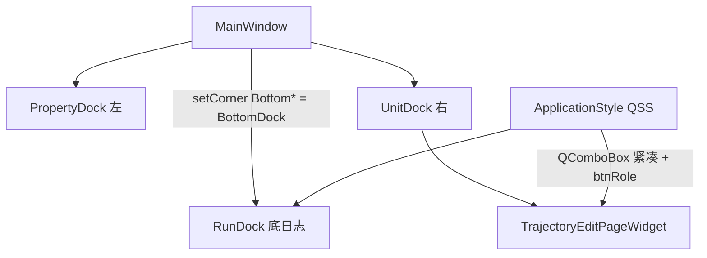

# DESIGN：UI 布局与样式修复

## 架构

## 布局契约

- 底角归属 `BottomDockWidgetArea` → 日志全宽，左右 Dock 高度 = 中央区高度
- 轨迹页仍由 `RobotSimulationDockWidget::wrapInScrollArea` 包裹，矮窗口可滚

## 样式契约

| 选择器 | 行为 |
|--------|------|
| `QComboBox` | padding 2×6，min/max-height ~26 |
| `QComboBox QAbstractItemView::item` | min-height 24，可滚动 |
| `QPushButton[btnRole="primary"]` | 实心强调色 |
| `QPushButton[btnRole="secondary"]` | 浅底/描边 |
| `QPushButton[btnRole="danger"]` | 警示红系 |

## 异常

- 角区设置须在 `addDockWidget` 之后；主题切换后 btnRole 仍由属性驱动，无需重设
