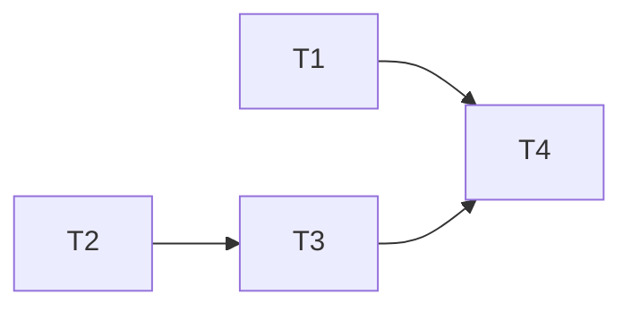

# TASK：UI 布局与样式修复

## T1 Dock 角区

- 输入：`MainWindowUiSetup.cpp`
- 输出：底角 → BottomDock；日志默认高度合理
- 验收：A1/A2
- 依赖：无

## T2 全局 ComboBox / 按钮 QSS

- 输入：`ApplicationStyle.cpp` 亮暗两套
- 输出：紧凑下拉 + btnRole 样式
- 验收：B1/B2/C1（样式侧）
- 依赖：无（可与 T1 并行）

## T3 轨迹页控件标注

- 输入：`TrajectoryEditPageWidget.cpp`
- 输出：Combo 定高；按钮 btnRole
- 验收：B1/C1（页面侧）
- 依赖：T2

## T4 文档同步

- 更新 Widget / RobotWidget DEVELOPER_GUIDE 短注
- ACCEPTANCE / FINAL / TODO

