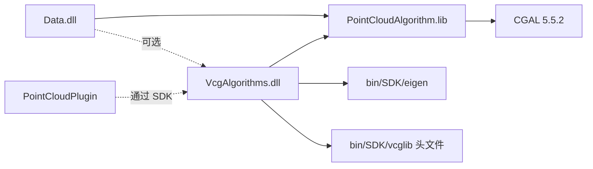

# vcglib 集成 - 共识文档

## 1. 明确的需求描述

### 1.1 核心目标

引入 vcglib 为 CloudSim 提供网格后处理能力（简化、平滑、修复、重网格），并增强点云→mesh 重建管线（CGAL 重建 → vcglib 后处理）。

### 1.2 模块定位

新建独立 DLL 模块 `VcgAlgorithms`，位于 `src/Geometry/VcgAlgorithms/`，遵循项目现有的 `inc/` + `source/` 目录结构。

---

## 2. 技术实现方案

### 2.1 模块架构

```text
VcgAlgorithms.dll (x64)
├─ VcgMeshAdapter.h/cpp    — std::vector<float> ↔ vcg mesh 双向转换
├─ MeshSimplify.h/cpp       — quadric-error edge collapse 简化
├─ MeshSmooth.h/cpp         — Laplacian / implicit fairing 平滑
├─ MeshRepair.h/cpp         — 去重/退化面/孔洞填充
├─ MeshRemesh.h/cpp         — 各向同性重网格
├─ MeshReconstruct.h/cpp    — CGAL 重建 + vcglib 后处理管线
└─ vcg_algorithms_global.h  — DLL 导出宏
```

### 2.2 数据契约

与 `PointCloudAlgorithm` 完全对齐：

| 缓冲 | 布局 |
|------|------|
| 点云 xyz | `3*N` float，单位 mm |
| 网格 soup | `9*T` float，每三角 3 顶点 xyz |
| 法线 | `3*N` float，与 xyz 同序 |

### 2.3 依赖关系

```text
VcgAlgorithms.dll
├─ vcglib (头文件，bin/SDK/vcglib)
├─ Eigen (bin/SDK/eigen)
├─ CGAL 5.5.2 (仅 MeshReconstruct 中调用 pclalgo)
└─ PointCloudAlgorithm.lib (调用现有重建)
```

### 2.4 核心 API 设计

```cpp
namespace vcgalgo {

// 网格简化
bool simplifyQuadricEdgeCollapse(
    const std::vector<float>& triangleSoup,
    int targetFaceCount,
    std::vector<float>& outSoup,
    double qualityThreshold = 0.3,
    std::string* errMsg = nullptr);

// 网格平滑
bool smoothLaplacian(
    const std::vector<float>& triangleSoup,
    int iterations,
    std::vector<float>& outSoup,
    std::string* errMsg = nullptr);

bool smoothImplicitFairing(
    const std::vector<float>& triangleSoup,
    double lambda,
    std::vector<float>& outSoup,
    std::string* errMsg = nullptr);

// 网格修复
bool repairMesh(
    const std::vector<float>& triangleSoup,
    std::vector<float>& outSoup,
    bool removeDegenerate = true,
    bool removeDuplicate = true,
    bool fillHoles = true,
    std::string* errMsg = nullptr);

// 各向同性重网格
bool isotropicRemesh(
    const std::vector<float>& triangleSoup,
    double targetEdgeLengthMm,
    std::vector<float>& outSoup,
    int iterations = 3,
    std::string* errMsg = nullptr);

// 重建管线增强：CGAL Poisson + vcglib 后处理
bool reconstructAndPostProcess(
    const std::vector<float>& xyz,
    const std::vector<float>& normals,
    std::vector<float>& outSoup,
    int targetFaceCount = 0,  // 0=不简化
    bool doRepair = true,
    bool doSmooth = false,
    std::string* errMsg = nullptr);

} // namespace vcgalgo
```

---

## 3. 与现有模块的集成

### 3.1 依赖方向



### 3.2 Data.dll 集成

- `VcgAlgorithms` 是独立 DLL，`Data.dll` 可选链接
- `PointCloudBackendOps` 新增薄包装：`simplifyMesh`、`smoothMesh`、`repairMesh`、`remeshMesh`

### 3.3 Plugin SDK 集成

- `IPluginPointCloudHost` 扩展新方法（Phase 2）
- 或通过 `IPluginGeometryHost` 暴露

---

## 4. 技术约束

| 约束 | 说明 |
|------|------|
| vcglib 是头文件库 | 仅需 include path，无 .lib 链接 |
| vcglib 模板深度嵌套 | 封装层 .cpp 内部使用，.h 不暴露 vcglib 类型 |
| GPL-3.0 | 已确认可接受 |
| C++17 | 与项目一致 |
| x64 only | 与项目一致 |
| vcglib 依赖 Eigen | 项目已有 Eigen，路径对齐 |

---

## 5. 验收标准

### 5.1 功能验收

- [ ] `VcgAlgorithms.dll` 独立编译通过（Debug/Release x64）
- [ ] 简化 API：输入 10 万面 mesh，简化到 1 万面，输出正确
- [ ] 平滑 API：输入噪声 mesh，平滑后拓扑保持
- [ ] 修复 API：输入含退化面 mesh，输出干净 mesh
- [ ] 重网格 API：输入非均匀 mesh，输出均匀三角形
- [ ] 管线 API：点云 → CGAL Poisson → vcglib 简化+修复 → 输出可用 mesh

### 5.2 性能验收

- [ ] 简化 10 万面 < 2 秒
- [ ] 平滑 10 万面 < 5 秒
- [ ] 修复 10 万面 < 3 秒
- [ ] 重网格 10 万面 < 5 秒

### 5.3 集成验收

- [ ] `Data.dll` 可选链接 `VcgAlgorithms.dll`
- [ ] `PointCloudPlugin` 可通过 SDK 调用新能力
- [ ] 现有 `PointCloudAlgorithm` 自检不受影响

---

## 6. 风险评估

| 风险 | 影响 | 缓解 |
|------|------|------|
| vcglib 模板编译慢 | 开发体验差 | 仅 .cpp include，.h 不暴露 |
| vcglib 与 CGAL 类型冲突 | 编译错误 | 命名空间隔离，VcgMeshAdapter 转换 |
| GPL 传染性 | 法律风险 | DLL 边界隔离，已确认可接受 |
| vcglib 版本更新 | API 变化 | 封装层隔离，仅改内部实现 |

---

## 7. 确认清单

- [x] 需求边界清晰无歧义
- [x] 技术方案与现有架构对齐
- [x] 验收标准具体可测试
- [x] 所有关键假设已确认
- [x] 许可证已确认
