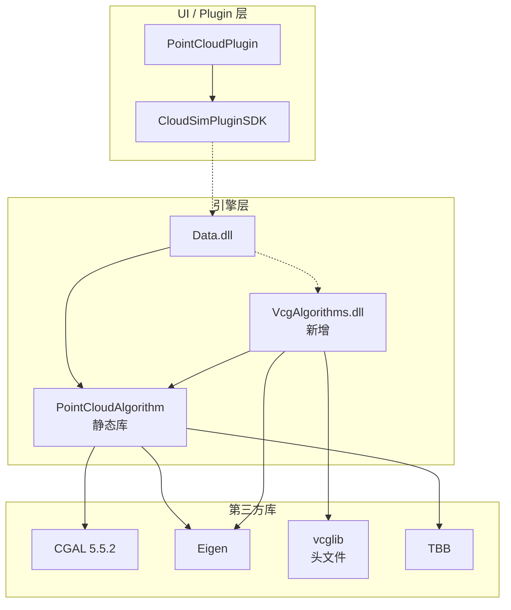
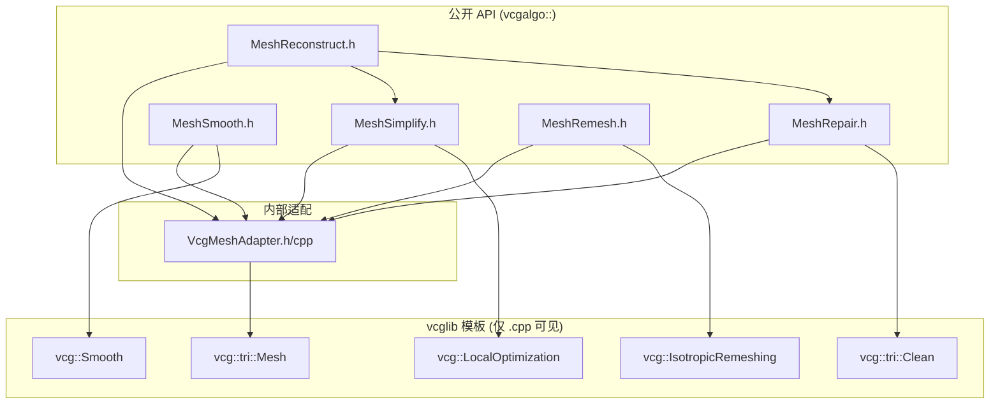
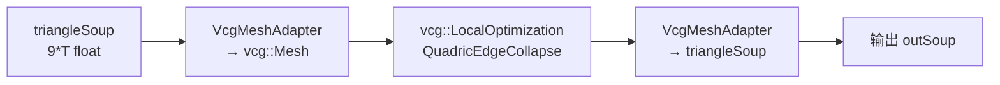
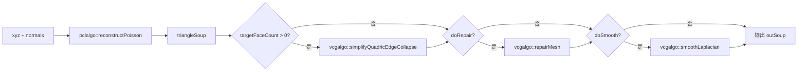

# vcglib 集成 - 设计文档

## 1. 整体架构



## 2. VcgAlgorithms 模块内部分层



## 3. 数据流向图

### 3.1 网格简化流程



### 3.2 重建管线增强流程



## 4. 核心组件设计

### 4.1 VcgMeshAdapter（数据适配层）

**职责**：`std::vector<float>` ↔ `vcg::tri::Mesh` 双向转换

**设计要点**：
- 仅在 `VcgMeshAdapter.cpp` 中 include vcglib 头文件
- `.h` 中不暴露任何 vcglib 类型，仅声明转换函数
- 支持 triangleSoup → vcg mesh（含法线可选）
- 支持 vcg mesh → triangleSoup
- 支持 vcg mesh → indexed mesh（顶点+索引，内部优化用）

```cpp
// VcgMeshAdapter.h — 无 vcglib 类型泄漏
namespace vcgalgo {

struct IndexedMesh {
    std::vector<float> vertices;  // 3*N
    std::vector<int> faces;       // 3*F
};

bool triangleSoupToIndexedMesh(
    const std::vector<float>& soup,
    IndexedMesh& out);

bool indexedMeshToTriangleSoup(
    const IndexedMesh& mesh,
    std::vector<float>& outSoup);

} // namespace vcgalgo
```

### 4.2 MeshSimplify（网格简化）

**算法**：vcg::LocalOptimization + Quadric Edge Collapse

**参数**：
- `targetFaceCount`：目标面数
- `qualityThreshold`：质量阈值（0-1，越大越慢但质量越高）
- `preserveBoundary`：是否保留边界边
- `preserveTopology`：是否保持拓扑

### 4.3 MeshSmooth（网格平滑）

**算法**：
- Laplacian 平滑：快速，适合轻度噪声
- Implicit Fairing：保形，适合重度噪声

**参数**：
- `iterations`：迭代次数
- `lambda`：平滑强度（仅 implicit fairing）

### 4.4 MeshRepair（网格修复）

**操作序列**（按 vcg::tri::Clean 标准流程）：
1. 去除重复顶点
2. 去除退化面（面积≈0）
3. 去除非流形边/顶点
4. 填充孔洞（可选）

### 4.5 MeshRemesh（各向同性重网格）

**算法**：vcg::IsotropicRemeshing

**参数**：
- `targetEdgeLengthMm`：目标边长
- `iterations`：迭代次数
- `protectCreases`：是否保护折痕边

### 4.6 MeshReconstruct（重建管线增强）

**流程**：
1. 调用 `pclalgo::reconstructPoisson`（CGAL）
2. 可选：`vcgalgo::simplifyQuadricEdgeCollapse`
3. 可选：`vcgalgo::repairMesh`
4. 可选：`vcgalgo::smoothLaplacian`

## 5. 异常处理策略

| 场景 | 处理 |
|------|------|
| 输入为空 | 返回 false + errMsg |
| vcglib 算法失败 | 返回 false + errMsg |
| 目标面数 > 输入面数 | 跳过简化，返回原 mesh |
| 内存不足 | 捕获 std::bad_alloc，返回 false |
| vcglib 内部断言 | 编译时定义 NDEBUG 避免断言退出 |

## 6. 编译配置

### 6.1 vcxproj 配置

```xml
<!-- Additional Include Directories -->
$(SolutionDir)..\bin\SDK\vcglib
$(SolutionDir)..\bin\SDK\eigen

<!-- Preprocessor Definitions -->
VCGLIB_USE_EIGEN
NDEBUG  <!-- Release 时 -->
_CRT_SECURE_NO_WARNINGS

<!-- 输出 -->
bin/x64(d)/VcgAlgorithms.dll
bin/x64(d)/VcgAlgorithms.lib
```

### 6.2 vcglib 编译注意事项

- vcglib 是头文件库，无 .lib 输出
- 需要定义 `VCGLIB_USE_EIGEN` 启用 Eigen 后端
- `wrap/io_trimesh/` 中的 I/O 头文件可能拉入 OpenGL 依赖，仅 include `vcg/` 核心头文件
- 编译时间较长（模板展开），建议预编译头

## 7. 修改检查清单

1. `VcgMeshAdapter.h` 不 include 任何 vcglib 头文件
2. 所有 vcglib 头文件仅在 `.cpp` 中 include
3. 公开 API 使用 `std::vector<float>`，不暴露 vcglib 类型
4. 新增 DLL 导出宏 `VCg_ALGORITHMS_API`
5. vcglib 许可证 GPL-3.0 在模块 README 中声明
