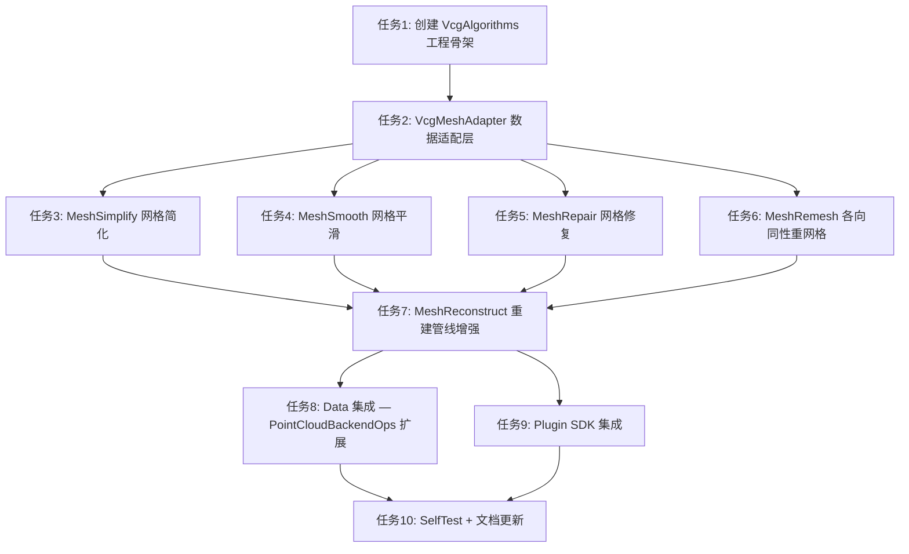

# vcglib 集成 - 任务文档

## 任务依赖图

---

## 任务1：创建 VcgAlgorithms 工程骨架

**输入契约**：
- vcglib 已部署到 `bin/SDK/vcglib/`
- Eigen 已部署到 `bin/SDK/eigen/`
- CGAL 5.5.2 已部署到 `bin/SDK/CGAL5.5.2/`

**输出契约**：
- `src/Geometry/VcgAlgorithms/` 目录结构（`inc/` + `source/`）
- `VcgAlgorithms.vcxproj` + `.filters`
- `vcg_algorithms_global.h` 导出宏
- Debug/Release x64 编译通过

**实现约束**：
- 遵循项目现有 vcxproj 模式（参考 `PointCloudAlgorithm.vcxproj`）
- Additional Include: `$(SolutionDir)..\bin\SDK\vcglib`、`$(SolutionDir)..\bin\SDK\eigen`
- 输出到 `$(CloudSimBinDir)VcgAlgorithms.dll`
- 添加到 `CloudSim.sln`

**验收标准**：
- [ ] 空 DLL 编译通过（Debug/Release x64）
- [ ] 无链接错误
- [ ] `.vcxproj.filters` 结构清晰

---

## 任务2：VcgMeshAdapter 数据适配层

**输入契约**：任务1完成

**输出契约**：
- `VcgMeshAdapter.h`：`IndexedMesh` 结构 + 转换函数声明（无 vcglib 类型）
- `VcgMeshAdapter.cpp`：实现双向转换
- `inc/MeshAdapterTypes.h`：`IndexedMesh` 定义

**实现约束**：
- `.h` 不 include 任何 vcglib 头文件
- triangleSoup → IndexedMesh：去重顶点 + 构建索引
- IndexedMesh → triangleSoup：展开索引
- 使用 Eigen 做顶点去重（`std::unordered_map` + 量化精度）

**验收标准**：
- [ ] 正向转换：1000 面 triangleSoup → IndexedMesh，顶点去重率 > 50%
- [ ] 反向转换：IndexedMesh → triangleSoup，与原始 soup 等价
- [ ] SelfTest 通过

---

## 任务3：MeshSimplify 网格简化

**输入契约**：任务2完成

**输出契约**：
- `MeshSimplify.h/cpp`
- API：`simplifyQuadricEdgeCollapse(soup, targetFaces, outSoup, ...)`

**实现约束**：
- 使用 `vcg::LocalOptimization` + Quadric Edge Collapse
- 支持 `qualityThreshold`、`preserveBoundary`、`preserveTopology` 参数
- 仅在 `.cpp` 中 include vcglib

**验收标准**：
- [ ] 输入 10 万面 mesh，简化到 1 万面，拓扑正确
- [ ] 简化后无退化面
- [ ] SelfTest 通过

---

## 任务4：MeshSmooth 网格平滑

**输入契约**：任务2完成

**输出契约**：
- `MeshSmooth.h/cpp`
- API：`smoothLaplacian(soup, iterations, outSoup)` + `smoothImplicitFairing(soup, lambda, outSoup)`

**实现约束**：
- Laplacian：使用 `vcg::Smooth::VertexCoordLaplacian`
- Implicit Fairing：使用 `vcg::ImplicitSmooth`

**验收标准**：
- [ ] Laplacian 平滑后顶点位置变化合理
- [ ] Implicit Fairing 保持拓扑
- [ ] SelfTest 通过

---

## 任务5：MeshRepair 网格修复

**输入契约**：任务2完成

**输出契约**：
- `MeshRepair.h/cpp`
- API：`repairMesh(soup, outSoup, removeDegenerate, removeDuplicate, fillHoles)`

**实现约束**：
- 使用 `vcg::tri::Clean` 系列函数
- 操作顺序：去重 → 去退化 → 去非流形 → 填孔

**验收标准**：
- [ ] 输入含退化面 mesh，输出无退化面
- [ ] 输入含重复顶点 mesh，输出顶点已去重
- [ ] SelfTest 通过

---

## 任务6：MeshRemesh 各向同性重网格

**输入契约**：任务2完成

**输出契约**：
- `MeshRemesh.h/cpp`
- API：`isotropicRemesh(soup, targetEdgeLength, outSoup, iterations)`

**实现约束**：
- 使用 `vcg::IsotropicRemeshing`

**验收标准**：
- [ ] 输出三角形边长均匀（标准差 < 目标边长的 30%）
- [ ] 拓扑保持
- [ ] SelfTest 通过

---

## 任务7：MeshReconstruct 重建管线增强

**输入契约**：任务3-6全部完成

**输出契约**：
- `MeshReconstruct.h/cpp`
- API：`reconstructAndPostProcess(xyz, normals, outSoup, targetFaces, doRepair, doSmooth)`

**实现约束**：
- 内部调用 `pclalgo::reconstructPoisson`（需链接 `PointCloudAlgorithm.lib`）
- 后处理按参数组合调用简化/修复/平滑

**验收标准**：
- [ ] 点云 → Poisson 重建 → 简化 → 修复，端到端通过
- [ ] 简化后面数符合目标
- [ ] SelfTest 通过

---

## 任务8：Data 集成 — PointCloudBackendOps 扩展

**输入契约**：任务7完成

**输出契约**：
- `PointCloudBackendOps.h` 新增方法：`simplifyMesh`、`smoothMesh`、`repairMesh`、`remeshMesh`
- `PointCloudBackendOps.cpp` 实现

**实现约束**：
- 遵循现有 `point_cloud_backend_ops` 命名空间风格
- `Data.dll` 可选链接 `VcgAlgorithms.lib`（条件编译或运行时加载）

**验收标准**：
- [ ] 通过 `PointCloudBackendOps` 调用 vcglib 能力
- [ ] 现有功能不受影响

---

## 任务9：Plugin SDK 集成

**输入契约**：任务8完成

**输出契约**：
- `IPluginPointCloudHost` 新增方法（可选，Phase 2）
- 或通过 `IPluginGeometryHost` 暴露

**实现约束**：
- 不破坏现有 SDK ABI
- 新方法有默认空实现

**验收标准**：
- [ ] `PointCloudPlugin` 可调用新能力
- [ ] 现有插件不受影响

---

## 任务10：SelfTest + 文档更新

**输入契约**：任务8-9完成

**输出契约**：
- `SelfTest.h/cpp`：vcglib 能力自检
- `DEVELOPER_GUIDE.md` 更新
- `docs/README.md` 更新

**验收标准**：
- [ ] SelfTest 全部通过
- [ ] 文档完整、准确
