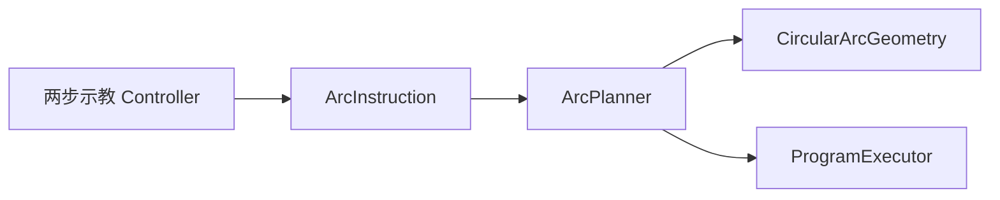

# DESIGN：三点圆弧指令（CIRC / ARC）

## 整体架构

## 分层

| 层 | 组件 | 职责 |
|----|------|------|
| UI | `SimulationCommandWidget` + Controller 状态机 | ARC 按钮、Via/End 捕获、pending 提示 |
| 模型 | `ArcInstruction` | Via/End 位姿、speed/accel/blend、轴配置 |
| 几何 | `fitCircle3Points` / `sampleArcByChord` | 定圆与采样（mm） |
| 规划 | `ArcPlanner` | 弧上笛卡尔样本 + IK → `PlanResult` |
| 执行 | `RobotProgramExecutor` | 与 LINE 相同轨迹插帧 |

## 接口契约

### CircularArcGeometry

- `fitCircle3Points(p0,p1,p2, out)` → center/normal/r/θ0/θ1/θ2；共线 false
- `sampleArcByChord(...)` → 位置列（经 Via 角单调）

### ArcInstruction

- End：`pose` / `eulerDeg`（与 LINE 同键）
- Via：`viaPose` / `viaEulerDeg`；扩展 `context.viaTransformQuatCsv` / `TransMmCsv`

### 两步示教

1. `addInstructionRequested(ARC)` + `!pending` → 缓存 Via，设 pending
2. 再次 → 捕获 End，`appendArcInstructionFromPoses`，清 pending

## 异常

| 条件 | 行为 |
|------|------|
| 三点共线 / 半径过小 | `plan` 失败，可读错误 |
| 无 URDF 笛卡尔上下文 | 退化为 End IK + 关节插值（降级） |
| 样本 IK 失败 | 整段 plan 失败 |
