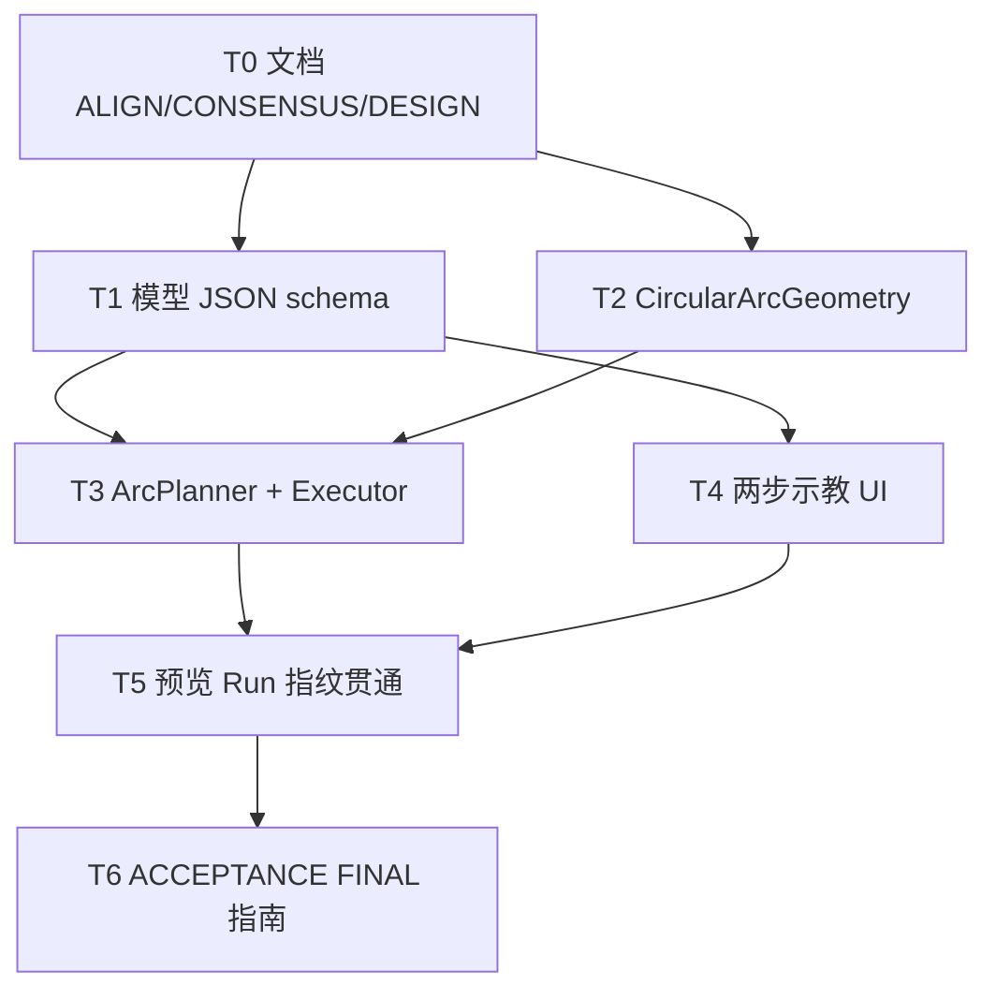

# TASK：三点圆弧指令（CIRC / ARC）

## 依赖图

## T1 模型

- **输入**：现有 PTP/LINE 模型模式
- **输出**：`Type::ARC`、`ArcInstruction`、via transform API、factory、schema、`isMotionWaypointType`
- **验收**：JSON round-trip 含 via/end

## T2 几何

- **输出**：`CircularArcGeometry.h/.cpp` + vcxproj + DEVELOPER_GUIDE
- **验收**：直角三点可定圆；共线返回 false

## T3 规划

- **输出**：`ArcPlanner` 注册；Executor `case ARC`
- **验收**：非共线产生 `jointTrajectoryRad.size()>=2`

## T4 UI

- **输出**：ARC 按钮、pending 文案、`appendArcInstructionFromPoses`、取消路径
- **验收**：两步生成一条树节点

## T5 贯通

- **输出**：指纹/lite/路点轴/树摘要含 ARC
- **验收**：改 Via 后 fingerprint 变；预览到 End

## T6 收尾文档

- ACCEPTANCE / FINAL / TODO + 三份 DEVELOPER_GUIDE 补丁
