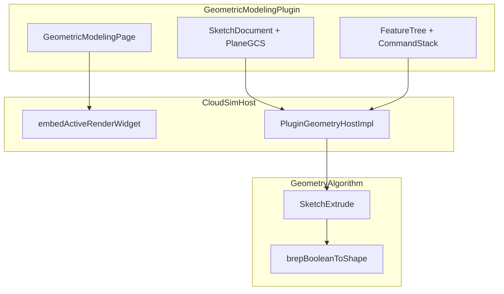

# DESIGN — 几何建模 SDK 插件

## 整体架构

## 核心组件

| 组件 | 职责 |
|------|------|
| `GeometricModelingPlugin` | 菜单、进入/退出、工程钩子 |
| `GeometricModelingPage` | 顶栏工具 + 页内特征树/属性 + 中区 3D 槽 |
| `SketchDocument` | 实体/约束；PlaneGCS 求解；DOF |
| `FeatureDocument` | Body 特征链；rebuild |
| `CommandStack` | Undo/Redo |
| `geoalgo::sketchExtrude` | Wire→Prism→Fuse/Cut |

## 接口契约（Host 追加）

- `IPluginHostContext::embedActiveRenderWidget` / `restoreActiveRenderWidget`
- `IPluginGeometryHost::queryFaceSketchPlane`
- `IPluginGeometryHost::setSketchOverlay` / `clearSketchOverlay`
- `IPluginGeometryHost::mapScreenToSketchPlane`
- `IPluginGeometryHost::extrudeSketchProfileToBrep`

## 数据流

选面 → plane → 草图编辑 → overlay → 闭合轮廓 → extrude(Pad/Pocket) → 注册/更新 BrepModel → 特征树节点

## 异常策略

- 非平面面：拒绝并提示
- 过约束/求解失败：DOF 面板标红，不写 B-rep
- extrude 失败：保留上一版 solid，日志报错
