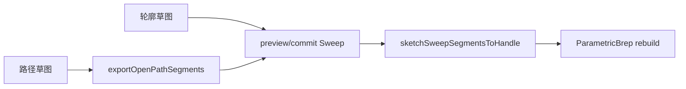

# DESIGN — 实体扫描特征（完善）

## 数据流

## 路径真弧

- 插件 `exportOpenPathSegments`：Line / Arc（起-中-终）单链，拒绝分叉与闭环
- Algo：`GC_MakeArcOfCircle` + `MakePipe`
- 特征烤 `pathSegments`；rebuild 优先段列表，否则折线

## 错误可见

- `previewSketchSweep` 返回 bool + `errOut`；Host `logWarn`
- 插件预检：双草图、id 不同、Cut 需 Body

## 版本

Host **1.31.1**（`0x00011F01`）
