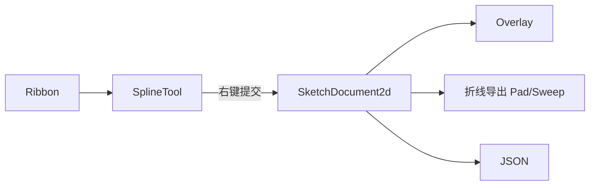

# DESIGN — 草图样条曲线

## 数据流

## 模块

| 模块 | 变更 |
|------|------|
| SketchGeom | SkSpline、采样、JSON、overlay、hit、remove、export |
| SketchTools | SketchToolKind::Spline + SplineSketchTool + previewPolyline |
| SketchEditSession | setTool / status / hitAnyCurve / refreshOverlay |
| Ribbon + Plugin | 按钮与 onToolSpline |

## 交互

- 左键：追加过点（不入文档）
- 移动：预览 Catmull-Rom（含光标）
- 右键：≥2 点写入文档并清空工具态；&lt;2 点等同取消
- Esc：清空工具态
