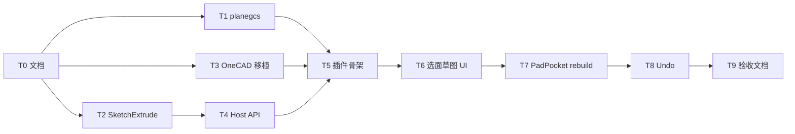

# TASK — 几何建模 SDK 插件

## 任务依赖

| ID | 任务 | 输入 | 输出 | 验收 |
|----|------|------|------|------|
| T0 | 6A 文档 | 计划共识 | ALIGNMENT/CONSENSUS/DESIGN/TASK | 文档齐全 |
| T1 | vendor planegcs | FreeCAD/planegcs | third_party + ORIGIN | 等边三角形可解 |
| T2 | SketchExtrude | FreeCAD Extrude 核 | geoalgo API + SelfTest | Pad/Pocket shape |
| T3 | OneCAD 模块复制 | OneCAD core | 插件内 sketch/feature/cmd | 可编译 |
| T4 | Host/SDK API | DESIGN 接口 | embed/plane/overlay/extrude | 版本 bump |
| T5 | 插件骨架 | ProcessFlow 模式 | 菜单+中央页+3D 槽 | 布局验收 |
| T6 | 选面草图 UI | T1+T4+T5 | 选面绘制约束 | DOF 可见 |
| T7 | 特征 rebuild | T2+T6 | BrepModel | 改参重建 |
| T8 | Undo | T3+T7 | CommandStack | ≥20 步 |
| T9 | ACCEPTANCE/FINAL/TODO | 全部 | 交付文档 | 清单全绿 |

## 复制来源清单

| 上游 | 路径 | 许可 |
|------|------|------|
| FreeCAD planegcs | `third_party/planegcs/` | LGPL-2.1+ |
| FreeCAD Extrude | `GeometryAlgorithm` SketchExtrude | LGPL-2.1+ |
| OneCAD | `ported/onecad/` | 以 LICENSE 为准 |
